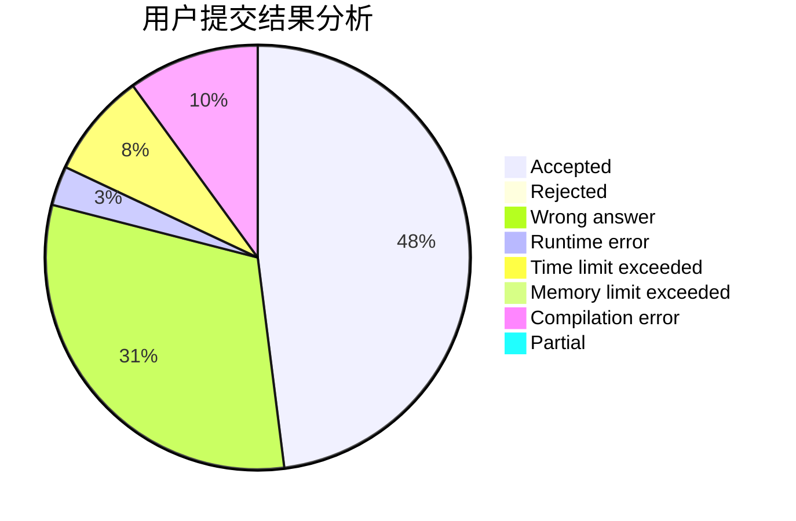
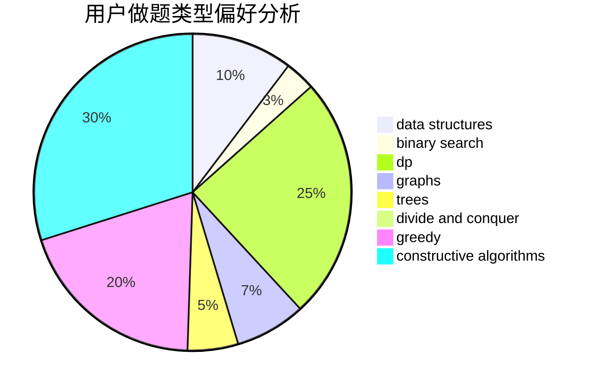

# uk224

<!-- tabs:start -->

#### **用户提交结果分析**

#### **用户做题类型偏好分析**

#### **用户错题知识点分析**

<!-- tabs:end -->
# 推荐题目
[788B](https://codeforces.com/contest/788/problem/B)		combinatorics,
                        constructive algorithms,
                        dfs and similar,
                        dsu,
                        graphs		  
[11302](https://codeforces.com/contest/1130/problem/2)		dsu,graphs,sortings,trees		  
[189E](https://codeforces.com/contest/189/problem/E)		dsu,graphs,sortings,trees		  
[33D](https://codeforces.com/contest/33/problem/D)		geometry,
                        graphs,
                        shortest paths,
                        sortings		  
[800A](https://codeforces.com/contest/800/problem/A)		dsu,graphs,sortings,trees		  
[930D](https://codeforces.com/contest/930/problem/D)		data structures,
                        games,
                        implementation		  
[918C](https://codeforces.com/contest/918/problem/C)		dsu,graphs,sortings,trees		  
[1271E](https://codeforces.com/contest/1271/problem/E)		binary search,
                        combinatorics,
                        dp,
                        math		  
[1293A](https://codeforces.com/contest/1293/problem/A)		binary search,
                        brute force,
                        implementation		  
[744A](https://codeforces.com/contest/744/problem/A)		dfs and similar,
                        graphs		  
