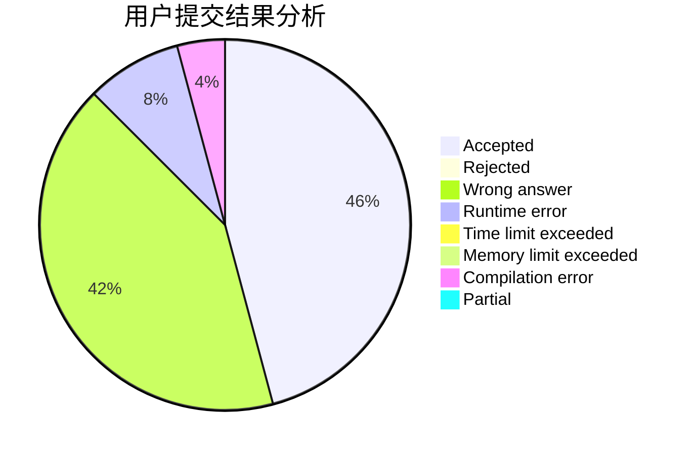
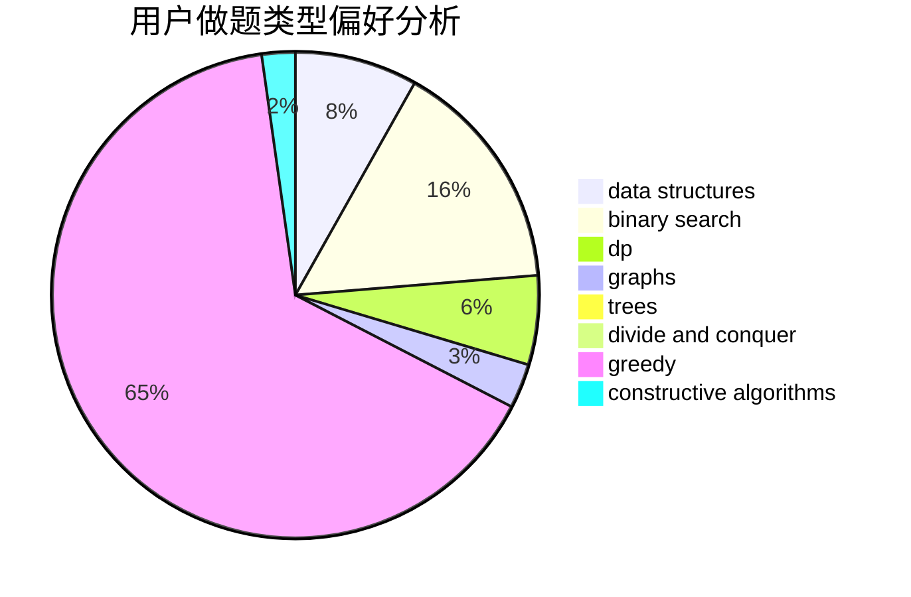

# uliahradri

<!-- tabs:start -->

#### **用户提交结果分析**

#### **用户做题类型偏好分析**

#### **用户错题知识点分析**

<!-- tabs:end -->
# 推荐题目
[1476G](https://codeforces.com/contest/1476/problem/G)		data structures,
                        hashing,
                        sortings,
                        two pointers		  
[791E](https://codeforces.com/contest/791/problem/E)		dsu,graphs,sortings,trees		  
[37B](https://codeforces.com/contest/37/problem/B)		greedy,
                        implementation		  
[1148E](https://codeforces.com/contest/1148/problem/E)		constructive algorithms,
                        greedy,
                        math,
                        sortings,
                        two pointers		  
[51A](https://codeforces.com/contest/51/problem/A)		implementation		  
[1111C](https://codeforces.com/contest/1111/problem/C)		binary search,
                        brute force,
                        divide and conquer,
                        math		  
[749E](https://codeforces.com/contest/749/problem/E)		data structures,
                        probabilities		  
[246B](https://codeforces.com/contest/246/problem/B)		greedy,
                        math		  
[1163F](https://codeforces.com/contest/1163/problem/F)		data structures,
                        graphs,
                        shortest paths		  
[1172C2](https://codeforces.com/contest/1172C/problem/2)		dp,
                        probabilities		  
