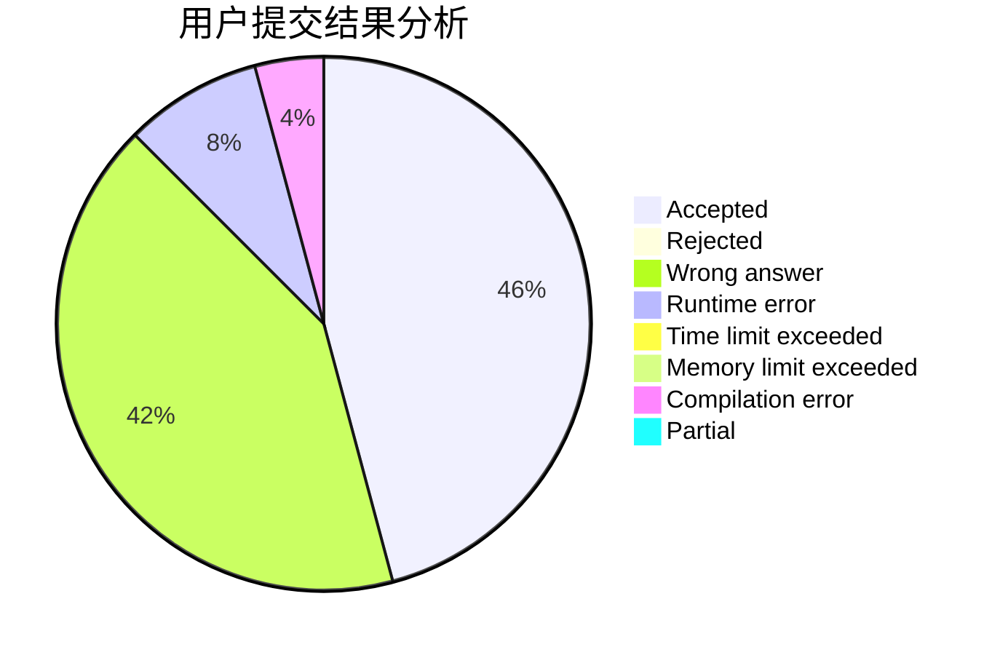
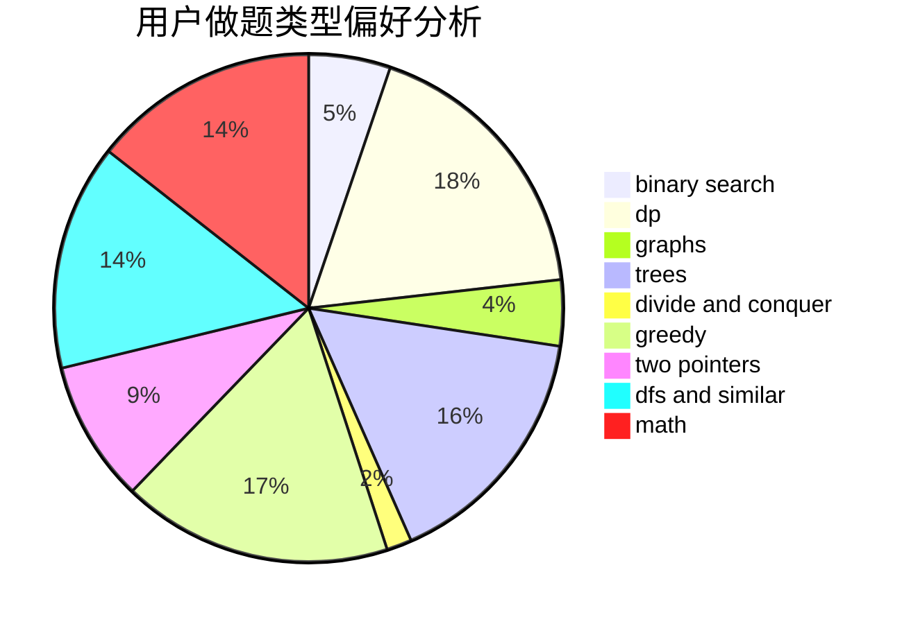

# uliahradri

<!-- tabs:start -->

#### **用户提交结果分析**

#### **用户做题类型偏好分析**

<!-- tabs:end -->
# 推荐题目
[1485E](https://codeforces.com/contest/1485/problem/E)
[807C](https://codeforces.com/contest/807/problem/C)
[409G](https://codeforces.com/contest/409/problem/G)
[114E](https://codeforces.com/contest/114/problem/E)
[545B](https://codeforces.com/contest/545/problem/B)
[1113B](https://codeforces.com/contest/1113/problem/B)
[768E](https://codeforces.com/contest/768/problem/E)
[266D](https://codeforces.com/contest/266/problem/D)
[1165B](https://codeforces.com/contest/1165/problem/B)
[1174F](https://codeforces.com/contest/1174/problem/F)
