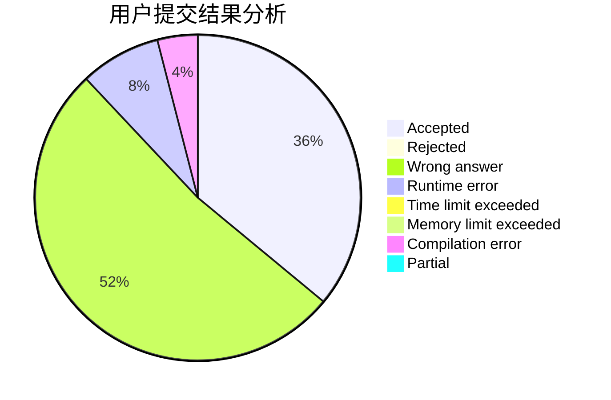
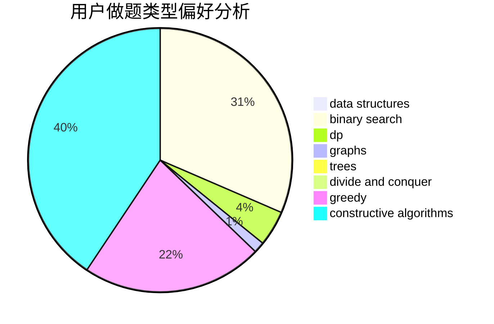
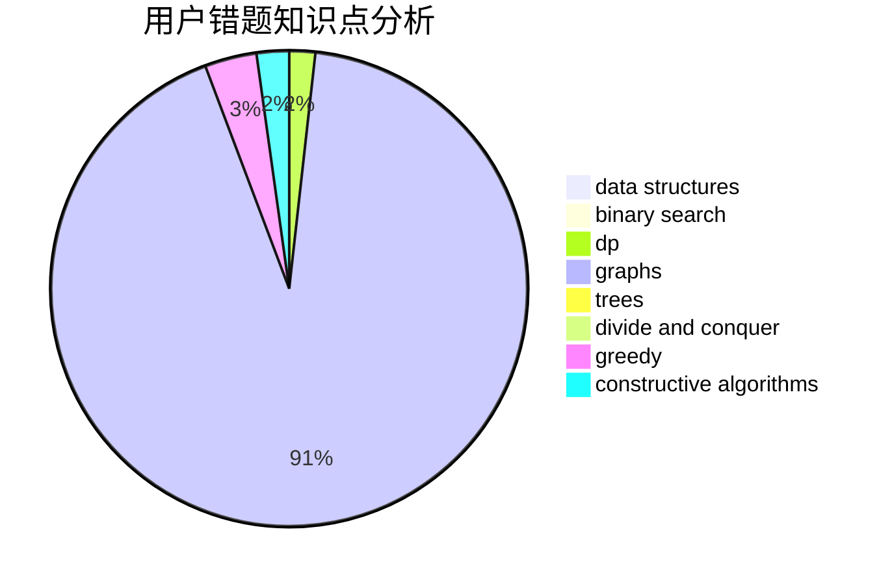

# understatementCopy

<!-- tabs:start -->

#### **用户提交结果分析**

#### **用户做题类型偏好分析**

#### **用户错题知识点分析**

<!-- tabs:end -->
# 推荐题目
[653C](https://codeforces.com/contest/653/problem/C)		brute force,
                        implementation		  
[581B](https://codeforces.com/contest/581/problem/B)		implementation,
                        math		  
[1016F](https://codeforces.com/contest/1016/problem/F)		dfs and similar,
                        dp,
                        trees		  
[1114C](https://codeforces.com/contest/1114/problem/C)		brute force,
                        implementation,
                        math,
                        number theory		  
[289E](https://codeforces.com/contest/289/problem/E)		dsu,graphs,sortings,trees		  
[199D](https://codeforces.com/contest/199/problem/D)		dsu,graphs,sortings,trees		  
[1329D](https://codeforces.com/contest/1329/problem/D)		constructive algorithms,
                        data structures		  
[766A](https://codeforces.com/contest/766/problem/A)		constructive algorithms,
                        strings		  
[848D](https://codeforces.com/contest/848/problem/D)		combinatorics,
                        dp,
                        flows,
                        graphs		  
[710A](https://codeforces.com/contest/710/problem/A)		implementation		  
