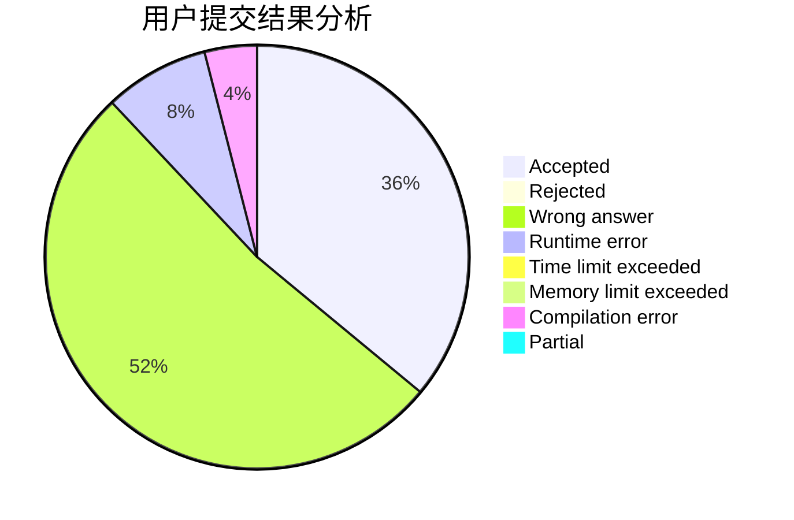
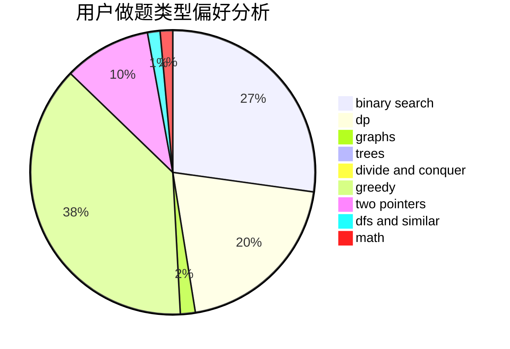

# understatementCopy

<!-- tabs:start -->

#### **用户提交结果分析**

#### **用户做题类型偏好分析**

<!-- tabs:end -->
# 推荐题目
[653C](https://codeforces.com/contest/653/problem/C)
[581B](https://codeforces.com/contest/581/problem/B)
[1016F](https://codeforces.com/contest/1016/problem/F)
[1114C](https://codeforces.com/contest/1114/problem/C)
[289E](https://codeforces.com/contest/289/problem/E)
[199D](https://codeforces.com/contest/199/problem/D)
[1329D](https://codeforces.com/contest/1329/problem/D)
[766A](https://codeforces.com/contest/766/problem/A)
[848D](https://codeforces.com/contest/848/problem/D)
[710A](https://codeforces.com/contest/710/problem/A)
