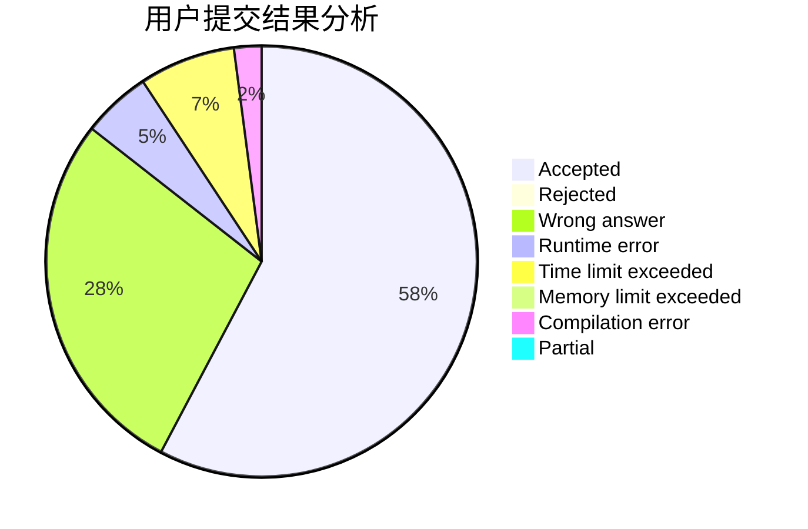
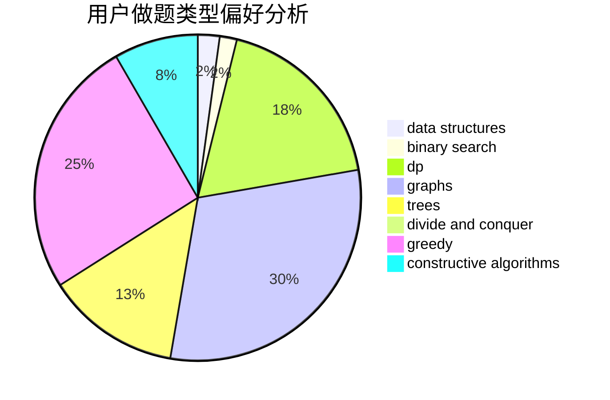
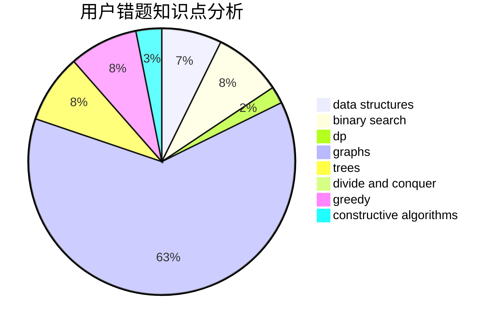

# universeofHk

<!-- tabs:start -->

#### **用户提交结果分析**

#### **用户做题类型偏好分析**

#### **用户错题知识点分析**

<!-- tabs:end -->
# 推荐题目
[1003E](https://codeforces.com/contest/1003/problem/E)		constructive algorithms,
                        graphs		  
[281A](https://codeforces.com/contest/281/problem/A)		implementation,
                        strings		  
[19A](https://codeforces.com/contest/19/problem/A)		implementation		  
[415A](https://codeforces.com/contest/415/problem/A)		implementation		  
[1772](https://codeforces.com/contest/177/problem/2)		dsu,graphs,sortings,trees		  
[528A](https://codeforces.com/contest/528/problem/A)		dsu,graphs,sortings,trees		  
[737C](https://codeforces.com/contest/737/problem/C)		dsu,graphs,sortings,trees		  
[1341E](https://codeforces.com/contest/1341/problem/E)		dsu,graphs,sortings,trees		  
[733D](https://codeforces.com/contest/733/problem/D)		data structures,
                        hashing		  
[1296D](https://codeforces.com/contest/1296/problem/D)		greedy,
                        sortings		  
