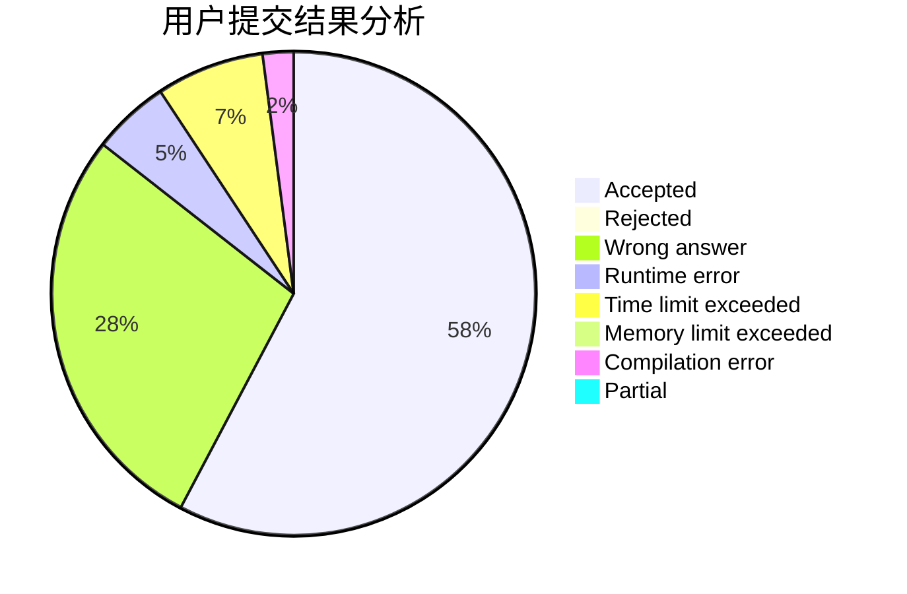
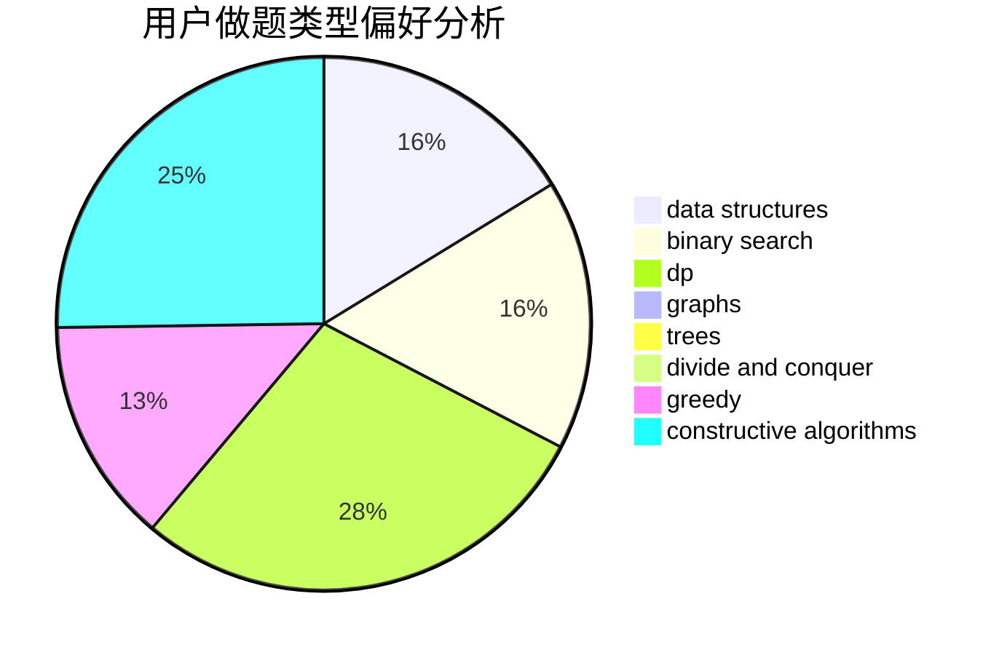
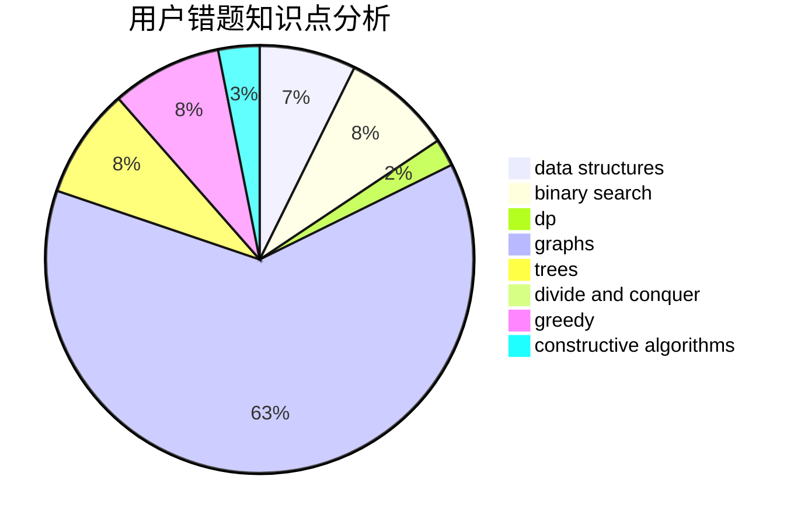

# universeofHk

<!-- tabs:start -->

#### **用户提交结果分析**

#### **用户做题类型偏好分析**

#### **用户错题知识点分析**

<!-- tabs:end -->
# 推荐题目
[1003B](https://codeforces.com/contest/1003/problem/B)		constructive algorithms		  
[265D](https://codeforces.com/contest/265/problem/D)		dsu,graphs,sortings,trees		  
[171H](https://codeforces.com/contest/171/problem/H)		*special problem,
                        implementation		  
[385E](https://codeforces.com/contest/385/problem/E)		math,
                        matrices		  
[156D](https://codeforces.com/contest/156/problem/D)		combinatorics,
                        graphs		  
[508A](https://codeforces.com/contest/508/problem/A)		brute force		  
[720C](https://codeforces.com/contest/720/problem/C)		constructive algorithms		  
[1334F](https://codeforces.com/contest/1334/problem/F)		binary search,
                        data structures,
                        dp,
                        greedy		  
[715B](https://codeforces.com/contest/715/problem/B)		binary search,
                        constructive algorithms,
                        graphs,
                        shortest paths		  
[1290B](https://codeforces.com/contest/1290/problem/B)		binary search,
                        constructive algorithms,
                        data structures,
                        strings,
                        two pointers		  
