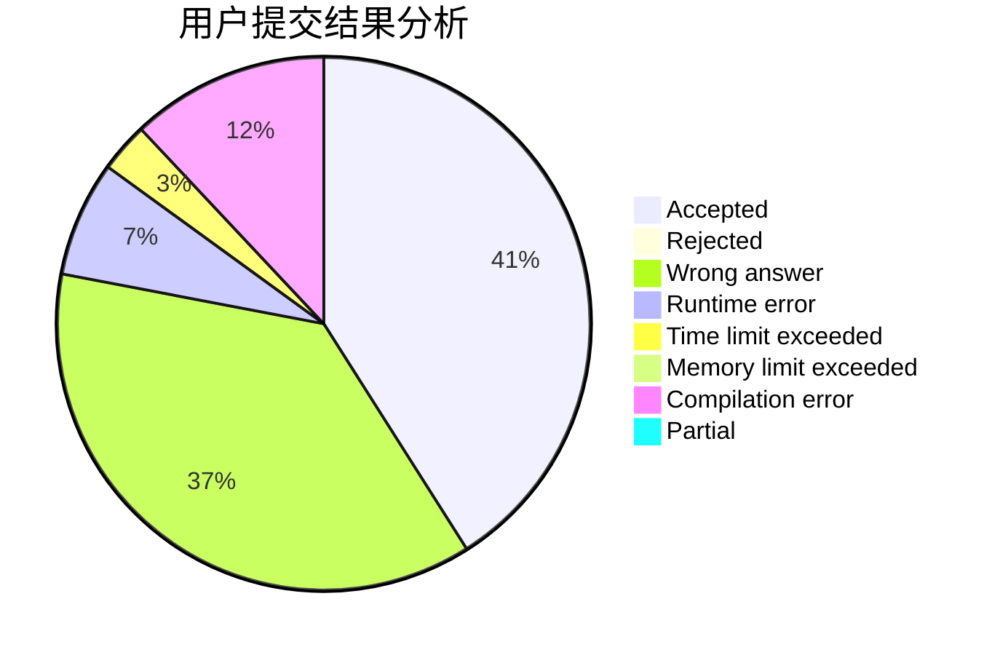
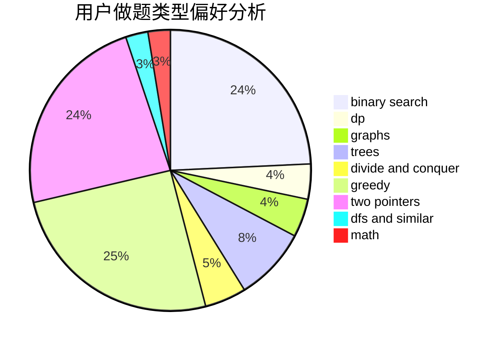

# unputdownable

<!-- tabs:start -->

#### **用户提交结果分析**

#### **用户做题类型偏好分析**

<!-- tabs:end -->
# 推荐题目
[1073C](https://codeforces.com/contest/1073/problem/C)
[429B](https://codeforces.com/contest/429/problem/B)
[822D](https://codeforces.com/contest/822/problem/D)
[1095F](https://codeforces.com/contest/1095/problem/F)
[1157G](https://codeforces.com/contest/1157/problem/G)
[437B](https://codeforces.com/contest/437/problem/B)
[1147C](https://codeforces.com/contest/1147/problem/C)
[352E](https://codeforces.com/contest/352/problem/E)
[514D](https://codeforces.com/contest/514/problem/D)
[1329B](https://codeforces.com/contest/1329/problem/B)
