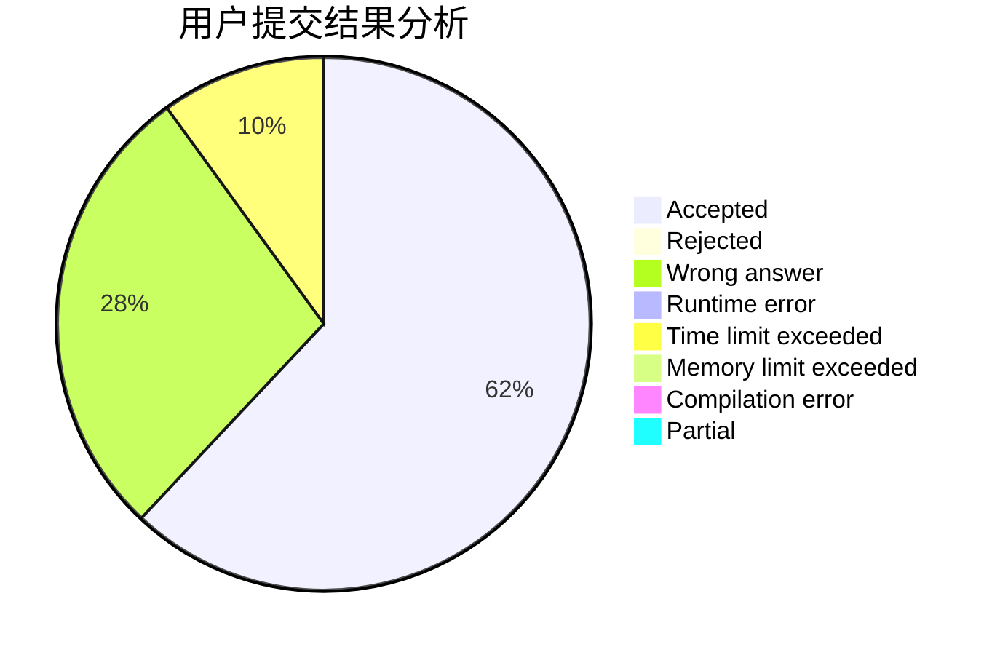
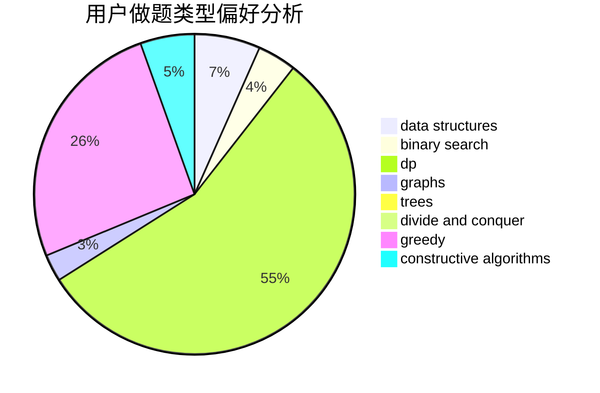
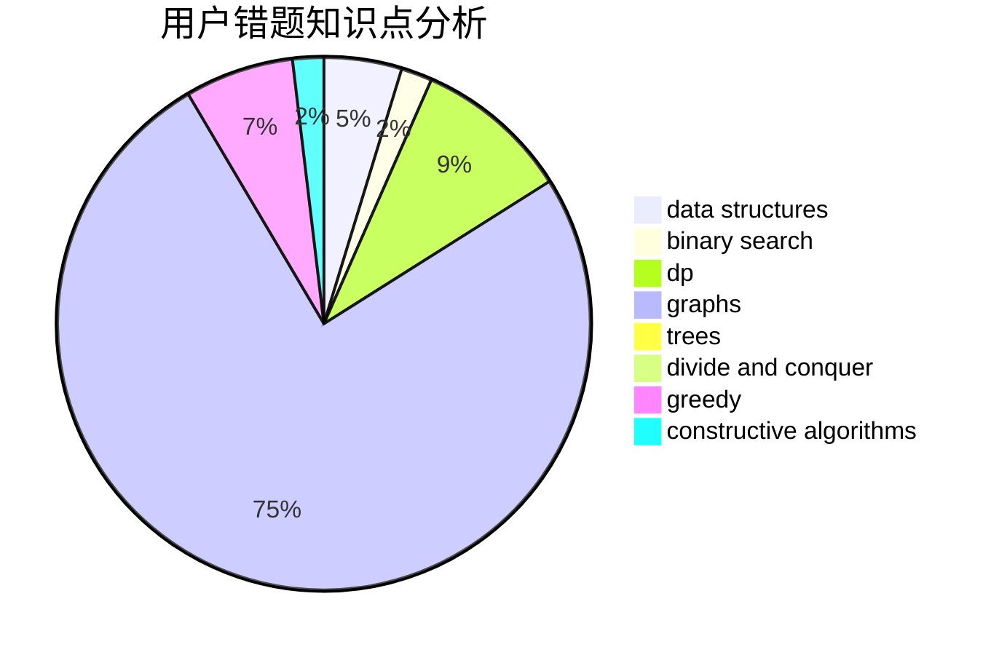

# up_to_sun

<!-- tabs:start -->

#### **用户提交结果分析**

#### **用户做题类型偏好分析**

#### **用户错题知识点分析**

<!-- tabs:end -->
# 推荐题目
[3C](https://codeforces.com/contest/3/problem/C)		brute force,
                        games,
                        implementation		  
[734E](https://codeforces.com/contest/734/problem/E)		dfs and similar,
                        dp,
                        trees		  
[622B](https://codeforces.com/contest/622/problem/B)		implementation		  
[730J](https://codeforces.com/contest/730/problem/J)		dp		  
[939B](https://codeforces.com/contest/939/problem/B)		implementation		  
[1394E](https://codeforces.com/contest/1394/problem/E)		strings		  
[868E](https://codeforces.com/contest/868/problem/E)		dp,
                        graphs,
                        trees		  
[1300A](https://codeforces.com/contest/1300/problem/A)		implementation,
                        math		  
[298D](https://codeforces.com/contest/298/problem/D)		dsu,graphs,sortings,trees		  
[1089K](https://codeforces.com/contest/1089/problem/K)		data structures		  
