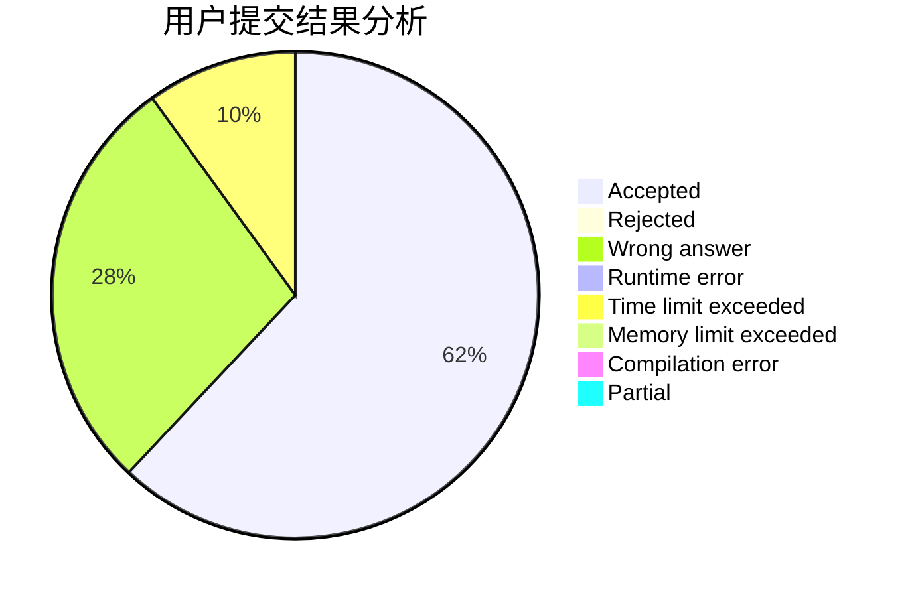
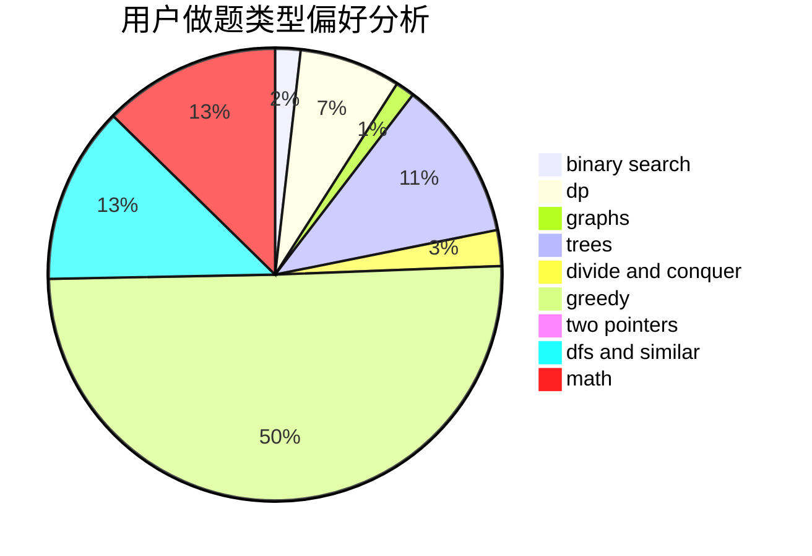

# up_to_sun

<!-- tabs:start -->

#### **用户提交结果分析**

#### **用户做题类型偏好分析**

<!-- tabs:end -->
# 推荐题目
[429D](https://codeforces.com/contest/429/problem/D)
[755D](https://codeforces.com/contest/755/problem/D)
[650B](https://codeforces.com/contest/650/problem/B)
[749A](https://codeforces.com/contest/749/problem/A)
[960E](https://codeforces.com/contest/960/problem/E)
[1403A](https://codeforces.com/contest/1403/problem/A)
[888A](https://codeforces.com/contest/888/problem/A)
[1307F](https://codeforces.com/contest/1307/problem/F)
[315C](https://codeforces.com/contest/315/problem/C)
[108C](https://codeforces.com/contest/108/problem/C)
