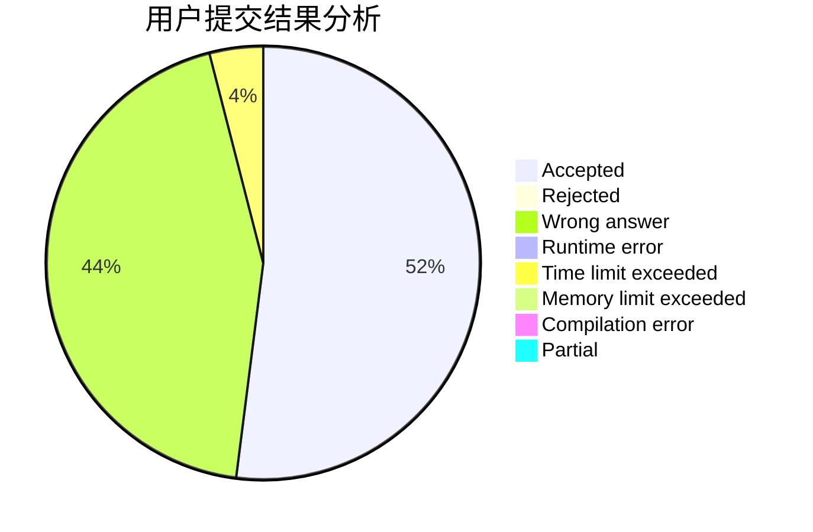
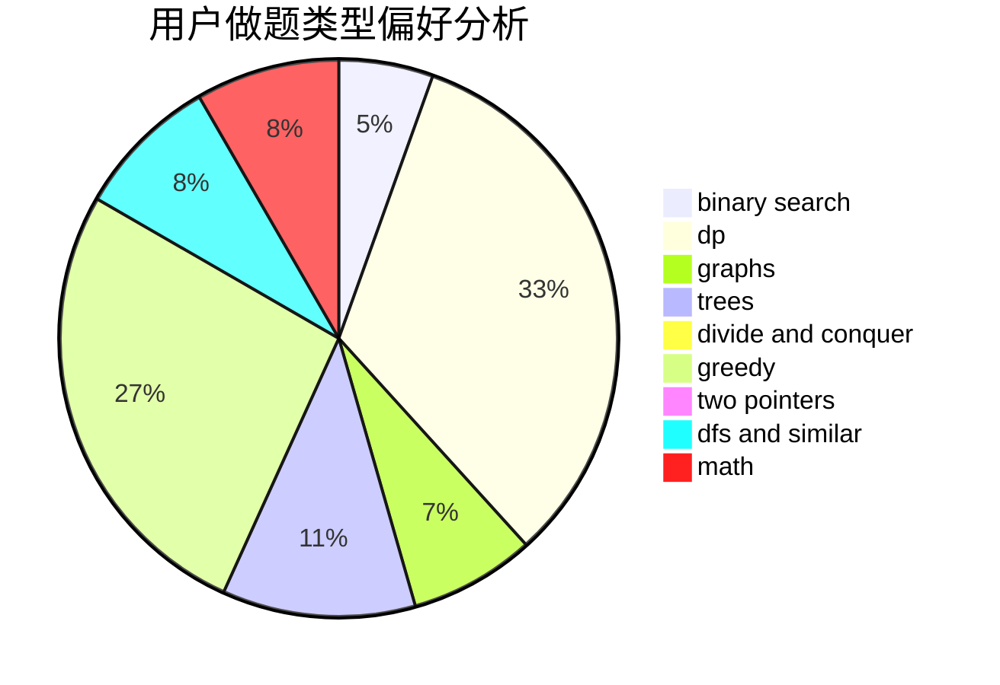

# upciotclk19

<!-- tabs:start -->

#### **用户提交结果分析**

#### **用户做题类型偏好分析**

<!-- tabs:end -->
# 推荐题目
[1168E](https://codeforces.com/contest/1168/problem/E)
[382E](https://codeforces.com/contest/382/problem/E)
[1037G](https://codeforces.com/contest/1037/problem/G)
[1009E](https://codeforces.com/contest/1009/problem/E)
[1268C](https://codeforces.com/contest/1268/problem/C)
[671E](https://codeforces.com/contest/671/problem/E)
[266B](https://codeforces.com/contest/266/problem/B)
[976B](https://codeforces.com/contest/976/problem/B)
[903A](https://codeforces.com/contest/903/problem/A)
[1154F](https://codeforces.com/contest/1154/problem/F)
