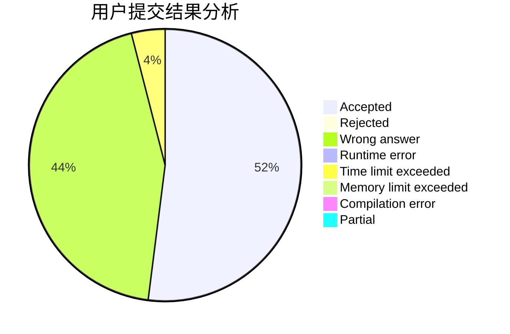
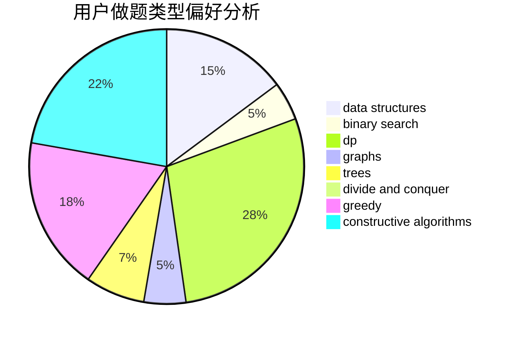
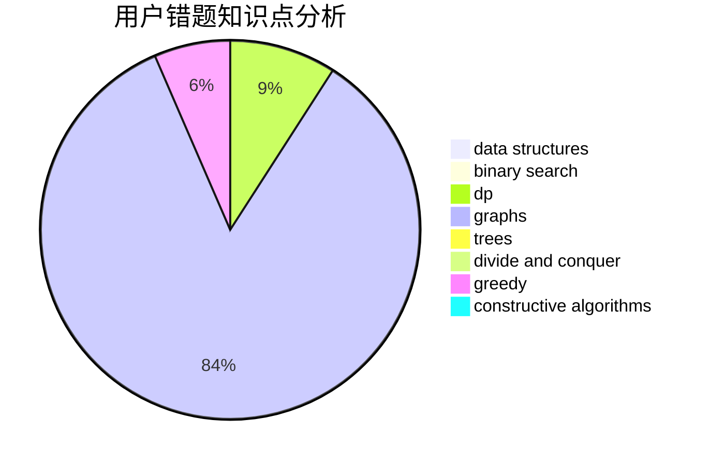

# upciotclk19

<!-- tabs:start -->

#### **用户提交结果分析**

#### **用户做题类型偏好分析**

#### **用户错题知识点分析**

<!-- tabs:end -->
# 推荐题目
[1168E](https://codeforces.com/contest/1168/problem/E)		constructive algorithms,
                        math		  
[382E](https://codeforces.com/contest/382/problem/E)		combinatorics,
                        dp		  
[1037G](https://codeforces.com/contest/1037/problem/G)		games		  
[1009E](https://codeforces.com/contest/1009/problem/E)		combinatorics,
                        math,
                        probabilities		  
[1268C](https://codeforces.com/contest/1268/problem/C)		binary search,
                        data structures		  
[671E](https://codeforces.com/contest/671/problem/E)		data structures,
                        greedy		  
[266B](https://codeforces.com/contest/266/problem/B)		constructive algorithms,
                        graph matchings,
                        implementation,
                        shortest paths		  
[976B](https://codeforces.com/contest/976/problem/B)		implementation,
                        math		  
[903A](https://codeforces.com/contest/903/problem/A)		greedy,
                        implementation		  
[1154F](https://codeforces.com/contest/1154/problem/F)		dp,
                        greedy,
                        sortings		  
