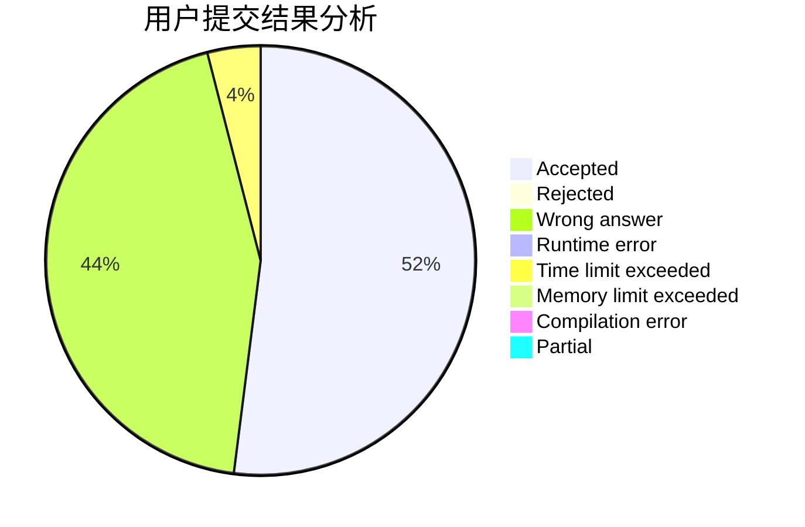
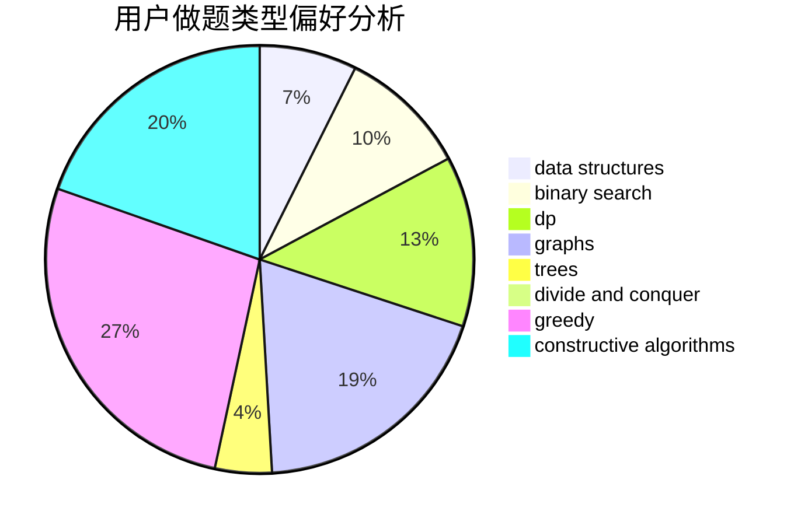
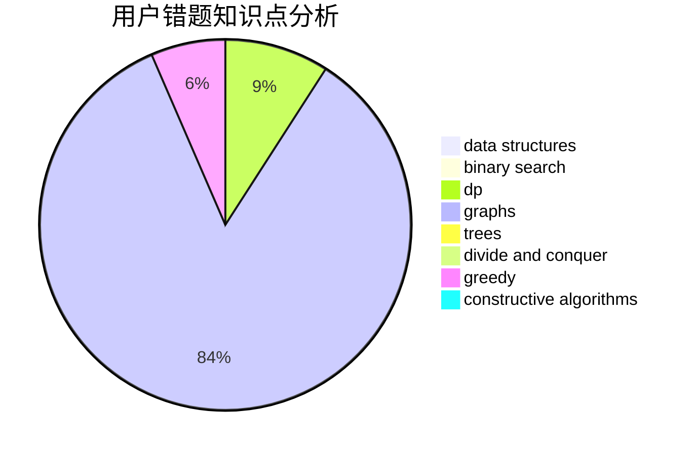

# upciotclk19

<!-- tabs:start -->

#### **用户提交结果分析**

#### **用户做题类型偏好分析**

#### **用户错题知识点分析**

<!-- tabs:end -->
# 推荐题目
[1166A](https://codeforces.com/contest/1166/problem/A)		combinatorics,
                        greedy		  
[356D](https://codeforces.com/contest/356/problem/D)		bitmasks,
                        constructive algorithms,
                        dp,
                        greedy		  
[1037D](https://codeforces.com/contest/1037/problem/D)		dfs and similar,
                        graphs,
                        shortest paths,
                        trees		  
[1009B](https://codeforces.com/contest/1009/problem/B)		greedy,
                        implementation		  
[1262F1](https://codeforces.com/contest/1262F/problem/1)		dsu,graphs,sortings,trees		  
[645D](https://codeforces.com/contest/645/problem/D)		binary search,
                        dp,
                        graphs		  
[245H](https://codeforces.com/contest/245/problem/H)		dp,
                        hashing,
                        strings		  
[954C](https://codeforces.com/contest/954/problem/C)		implementation		  
[884D](https://codeforces.com/contest/884/problem/D)		data structures,
                        greedy		  
[1152F1](https://codeforces.com/contest/1152F/problem/1)		bitmasks,
                        dp,
                        matrices		  
