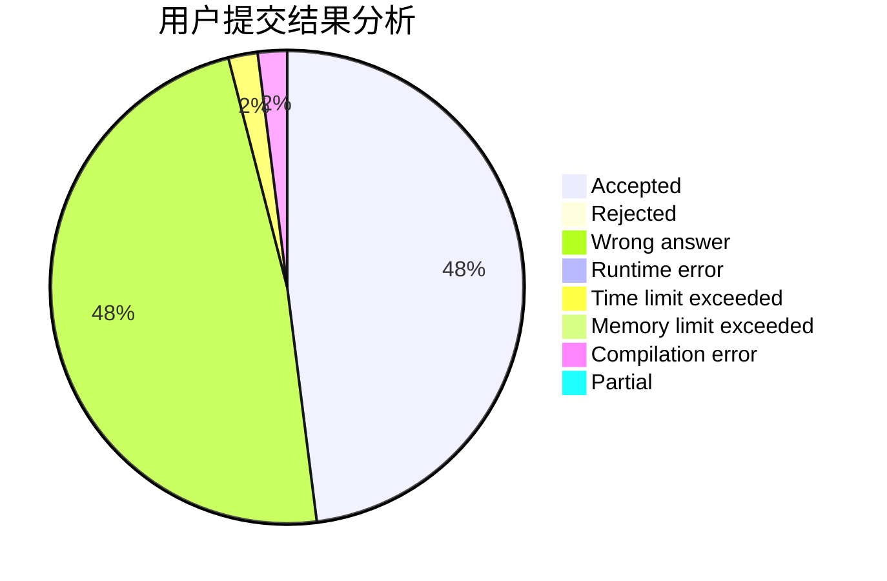
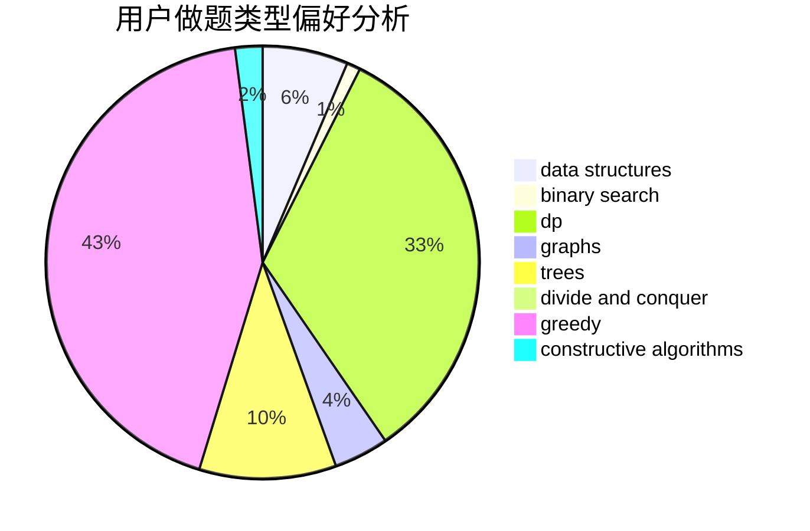
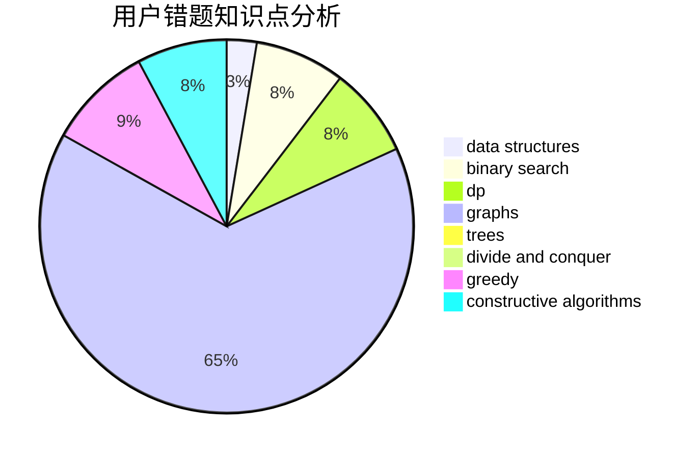

# uryu

<!-- tabs:start -->

#### **用户提交结果分析**

#### **用户做题类型偏好分析**

#### **用户错题知识点分析**

<!-- tabs:end -->
# 推荐题目
[1409D](https://codeforces.com/contest/1409/problem/D)		greedy,
                        math		  
[1463D](https://codeforces.com/contest/1463/problem/D)		binary search,
                        constructive algorithms,
                        greedy,
                        two pointers		  
[1068A](https://codeforces.com/contest/1068/problem/A)		math		  
[860D](https://codeforces.com/contest/860/problem/D)		dsu,graphs,sortings,trees		  
[879A](https://codeforces.com/contest/879/problem/A)		implementation		  
[1339E](https://codeforces.com/contest/1339/problem/E)		dsu,graphs,sortings,trees		  
[7D](https://codeforces.com/contest/7/problem/D)		hashing,
                        strings		  
[787D](https://codeforces.com/contest/787/problem/D)		dsu,graphs,sortings,trees		  
[1372B](https://codeforces.com/contest/1372/problem/B)		greedy,
                        math,
                        number theory		  
[1056B](https://codeforces.com/contest/1056/problem/B)		math,
                        number theory		  
