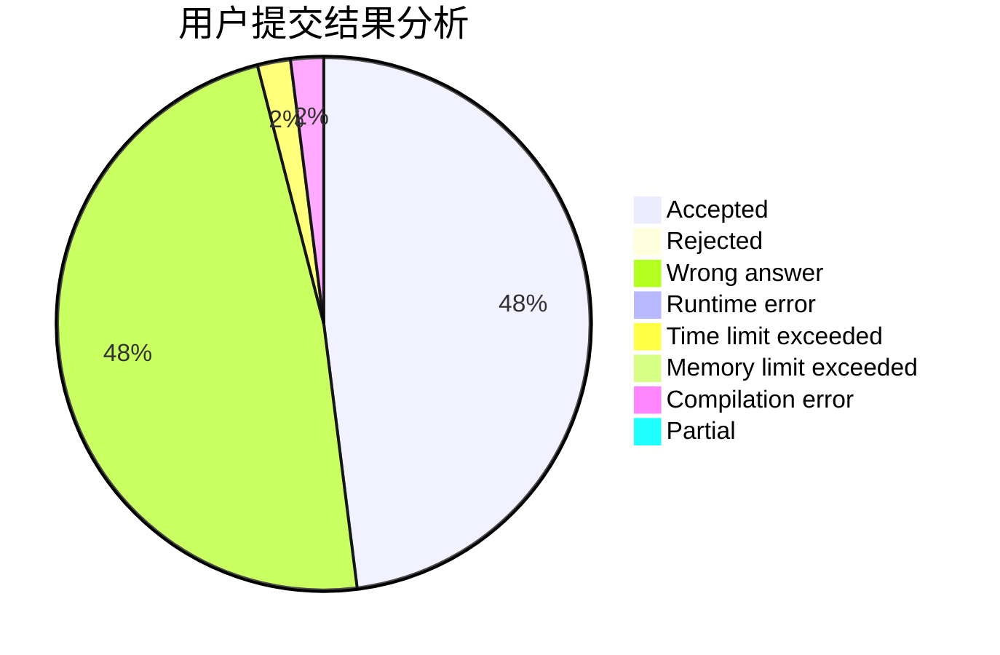
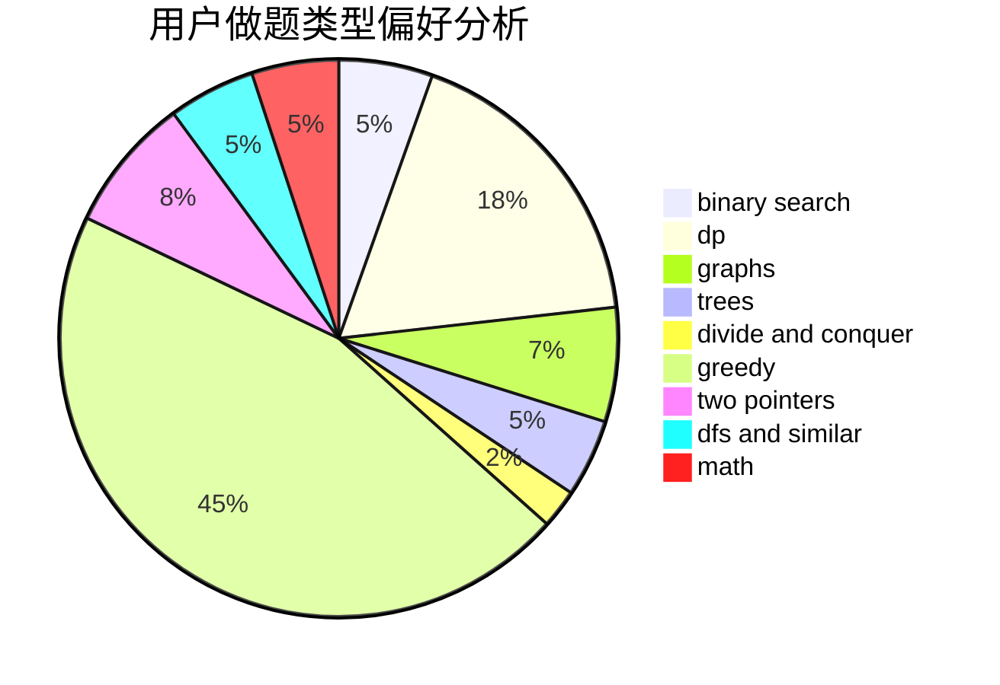

# uryu

<!-- tabs:start -->

#### **用户提交结果分析**

#### **用户做题类型偏好分析**

<!-- tabs:end -->
# 推荐题目
[14201](https://codeforces.com/contest/1420/problem/1)
[1470E](https://codeforces.com/contest/1470/problem/E)
[1068D](https://codeforces.com/contest/1068/problem/D)
[878D](https://codeforces.com/contest/878/problem/D)
[899E](https://codeforces.com/contest/899/problem/E)
[1346E](https://codeforces.com/contest/1346/problem/E)
[814E](https://codeforces.com/contest/814/problem/E)
[803D](https://codeforces.com/contest/803/problem/D)
[1380G](https://codeforces.com/contest/1380/problem/G)
[1056E](https://codeforces.com/contest/1056/problem/E)
