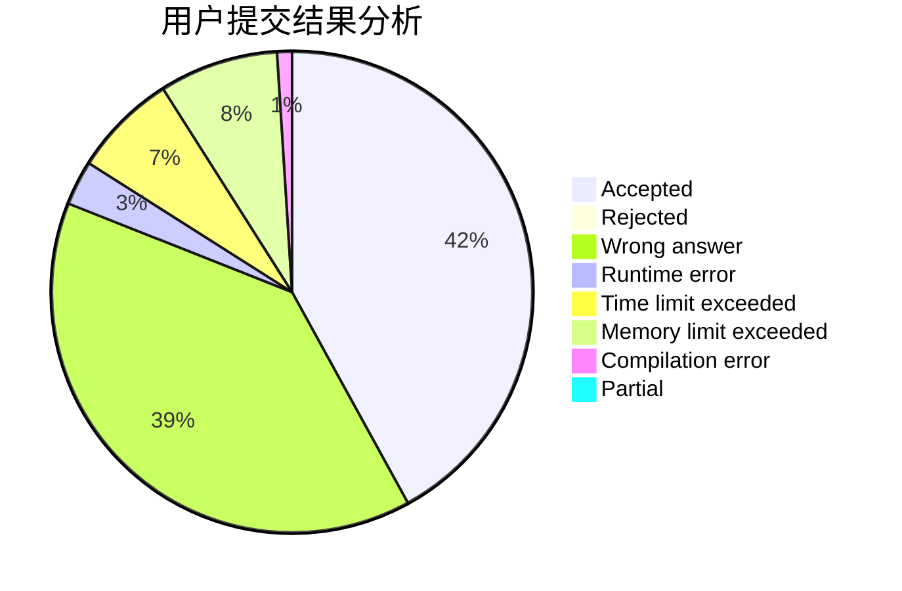
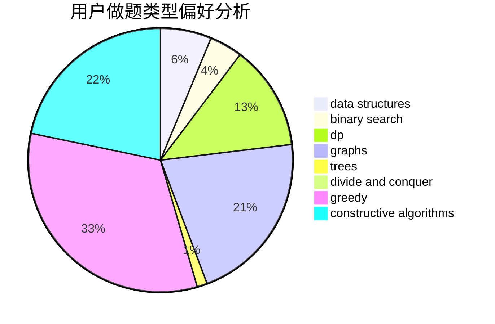
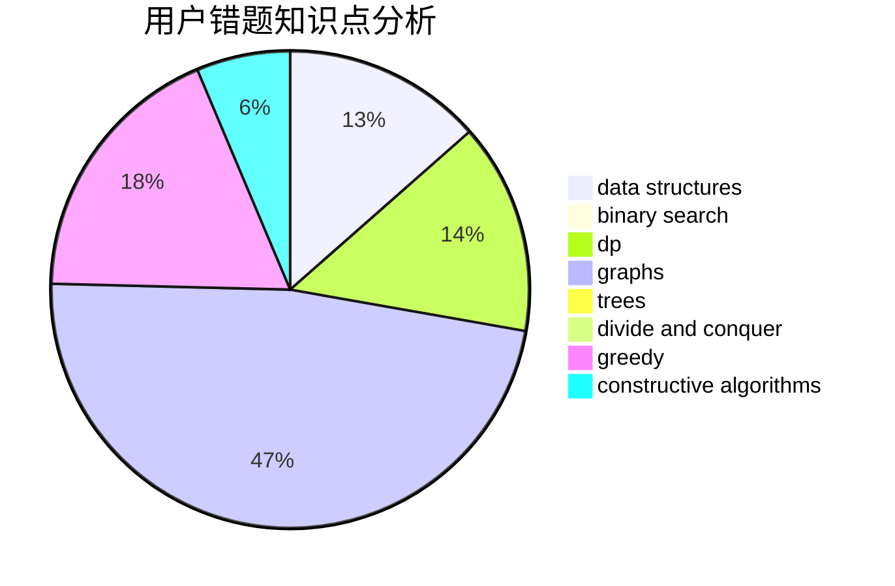

# uryuuu

<!-- tabs:start -->

#### **用户提交结果分析**

#### **用户做题类型偏好分析**

#### **用户错题知识点分析**

<!-- tabs:end -->
# 推荐题目
[380E](https://codeforces.com/contest/380/problem/E)		data structures		  
[1494E](https://codeforces.com/contest/1494/problem/E)		constructive algorithms,
                        data structures,
                        graphs,
                        hashing		  
[1372A](https://codeforces.com/contest/1372/problem/A)		constructive algorithms,
                        implementation		  
[1189D1](https://codeforces.com/contest/1189D/problem/1)		dsu,graphs,sortings,trees		  
[409H](https://codeforces.com/contest/409/problem/H)		*special problem,
                        brute force,
                        constructive algorithms,
                        dsu,
                        implementation		  
[739E](https://codeforces.com/contest/739/problem/E)		brute force,
                        data structures,
                        dp,
                        flows,
                        math,
                        probabilities,
                        sortings		  
[276E](https://codeforces.com/contest/276/problem/E)		data structures,
                        graphs,
                        trees		  
[1296E1](https://codeforces.com/contest/1296E/problem/1)		constructive algorithms,
                        dp,
                        graphs,
                        greedy,
                        sortings		  
[965D](https://codeforces.com/contest/965/problem/D)		binary search,
                        flows,
                        greedy,
                        two pointers		  
[737C](https://codeforces.com/contest/737/problem/C)		dsu,graphs,sortings,trees		  
