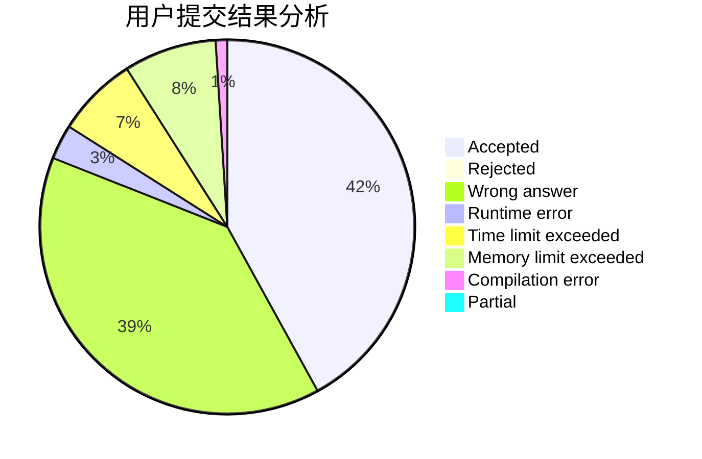
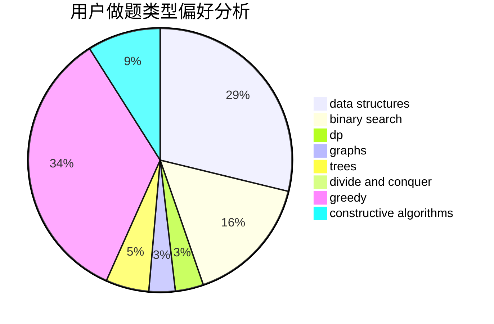
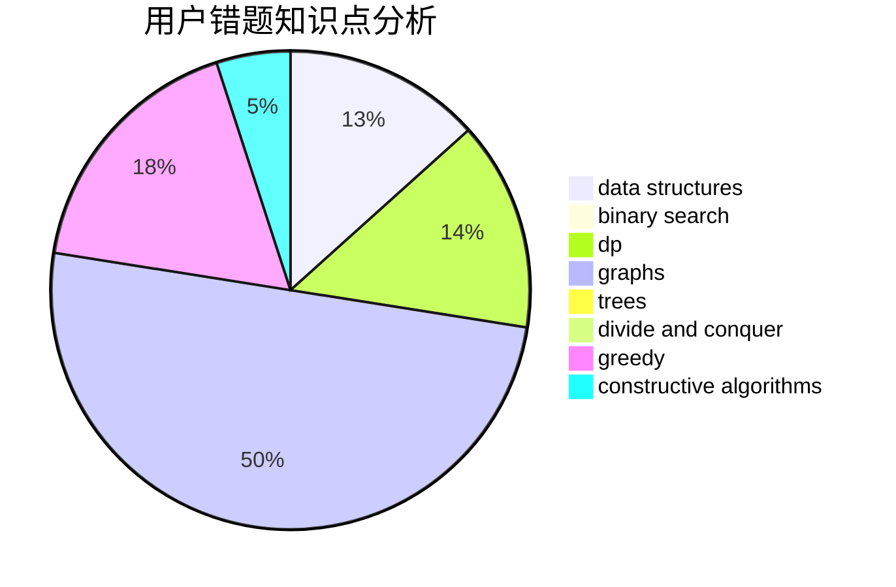

# uryuuu

<!-- tabs:start -->

#### **用户提交结果分析**

#### **用户做题类型偏好分析**

#### **用户错题知识点分析**

<!-- tabs:end -->
# 推荐题目
[412D](https://codeforces.com/contest/412/problem/D)		dfs and similar		  
[1503E](https://codeforces.com/contest/1503/problem/E)		combinatorics,
                        dp,
                        math		  
[1380F](https://codeforces.com/contest/1380/problem/F)		data structures,
                        dp,
                        matrices		  
[1194F](https://codeforces.com/contest/1194/problem/F)		combinatorics,
                        dp,
                        number theory,
                        probabilities,
                        two pointers		  
[437B](https://codeforces.com/contest/437/problem/B)		bitmasks,
                        greedy,
                        implementation,
                        sortings		  
[760A](https://codeforces.com/contest/760/problem/A)		implementation,
                        math		  
[291B](https://codeforces.com/contest/291/problem/B)		*special problem,
                        implementation,
                        strings		  
[1303G](https://codeforces.com/contest/1303/problem/G)		data structures,
                        divide and conquer,
                        geometry,
                        trees		  
[987D](https://codeforces.com/contest/987/problem/D)		dsu,graphs,sortings,trees		  
[759A](https://codeforces.com/contest/759/problem/A)		dsu,graphs,sortings,trees		  
