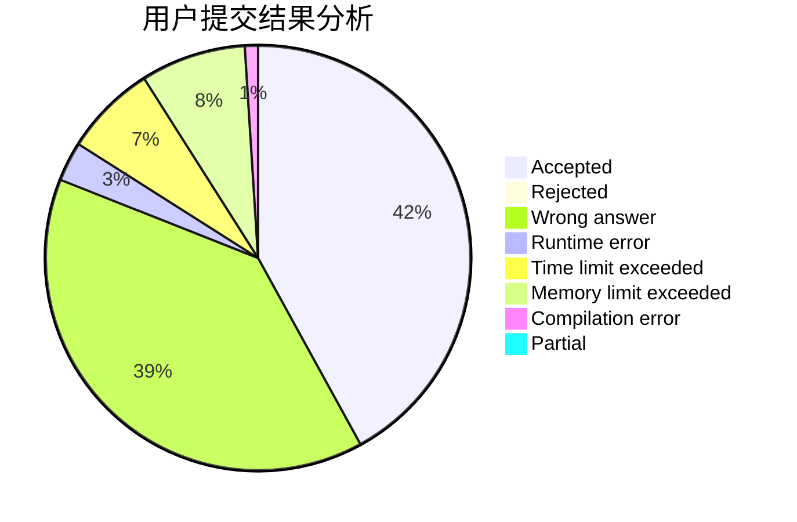
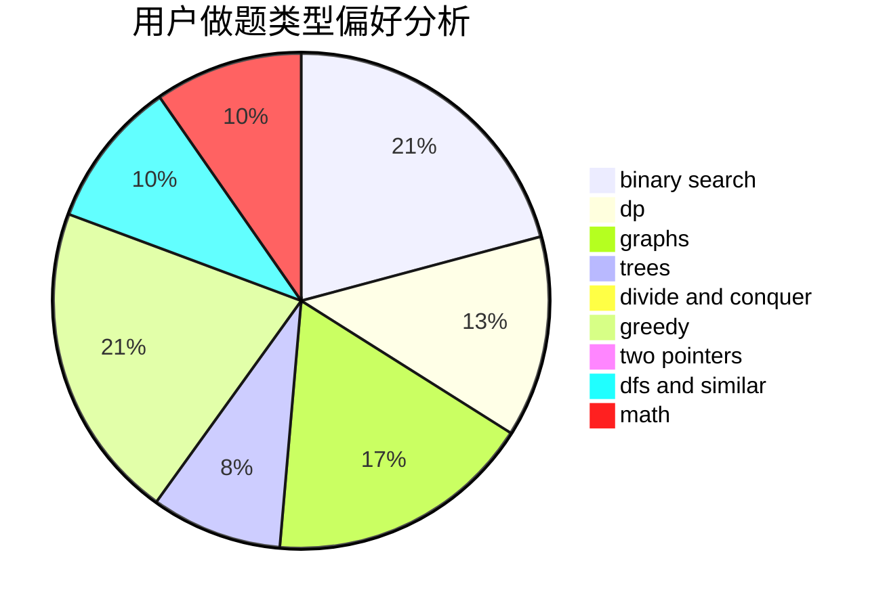

# uryuuu

<!-- tabs:start -->

#### **用户提交结果分析**

#### **用户做题类型偏好分析**

<!-- tabs:end -->
# 推荐题目
[412D](https://codeforces.com/contest/412/problem/D)
[1503E](https://codeforces.com/contest/1503/problem/E)
[1380F](https://codeforces.com/contest/1380/problem/F)
[1194F](https://codeforces.com/contest/1194/problem/F)
[437B](https://codeforces.com/contest/437/problem/B)
[760A](https://codeforces.com/contest/760/problem/A)
[291B](https://codeforces.com/contest/291/problem/B)
[1303G](https://codeforces.com/contest/1303/problem/G)
[987D](https://codeforces.com/contest/987/problem/D)
[759A](https://codeforces.com/contest/759/problem/A)
