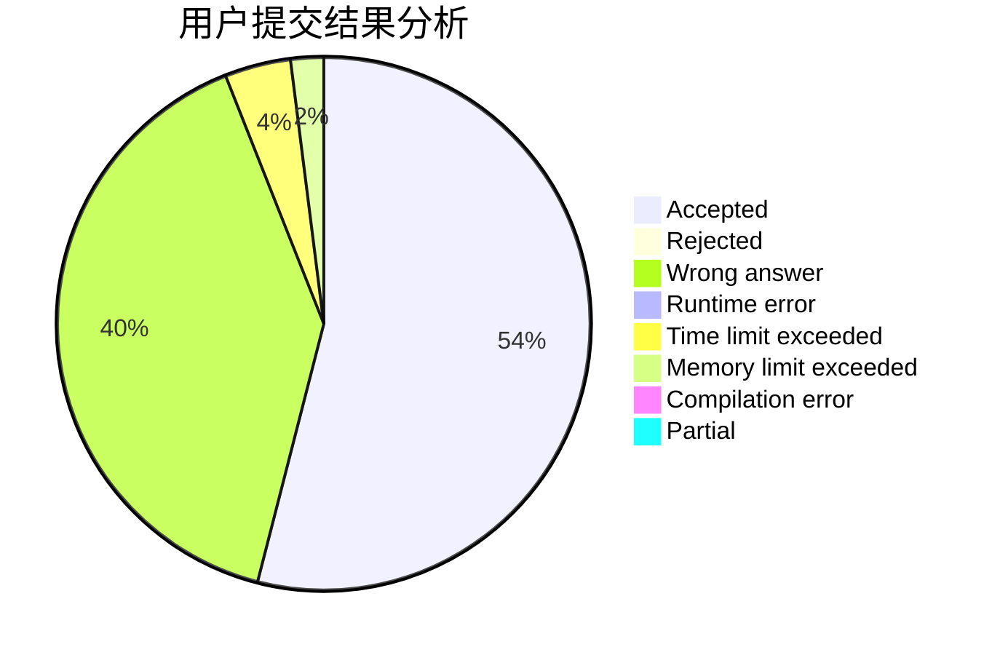
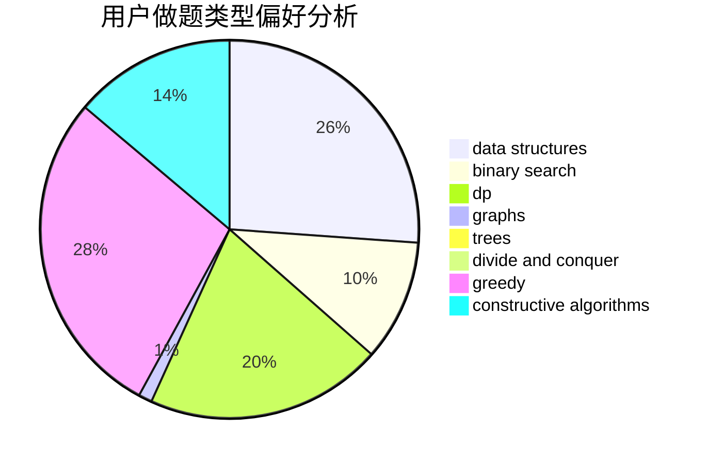

# usamoi

<!-- tabs:start -->

#### **用户提交结果分析**

#### **用户做题类型偏好分析**

#### **用户错题知识点分析**

<!-- tabs:end -->
# 推荐题目
[617E](https://codeforces.com/contest/617/problem/E)		data structures		  
[485A](https://codeforces.com/contest/485/problem/A)		implementation,
                        math,
                        matrices		  
[1020A](https://codeforces.com/contest/1020/problem/A)		math		  
[789D](https://codeforces.com/contest/789/problem/D)		dsu,graphs,sortings,trees		  
[215C](https://codeforces.com/contest/215/problem/C)		brute force,
                        implementation		  
[260A](https://codeforces.com/contest/260/problem/A)		implementation,
                        math		  
[956D](https://codeforces.com/contest/956/problem/D)		dsu,graphs,sortings,trees		  
[743D](https://codeforces.com/contest/743/problem/D)		dfs and similar,
                        dp,
                        graphs,
                        trees		  
[810B](https://codeforces.com/contest/810/problem/B)		greedy,
                        sortings		  
[837F](https://codeforces.com/contest/837/problem/F)		binary search,
                        brute force,
                        combinatorics,
                        math,
                        matrices		  
