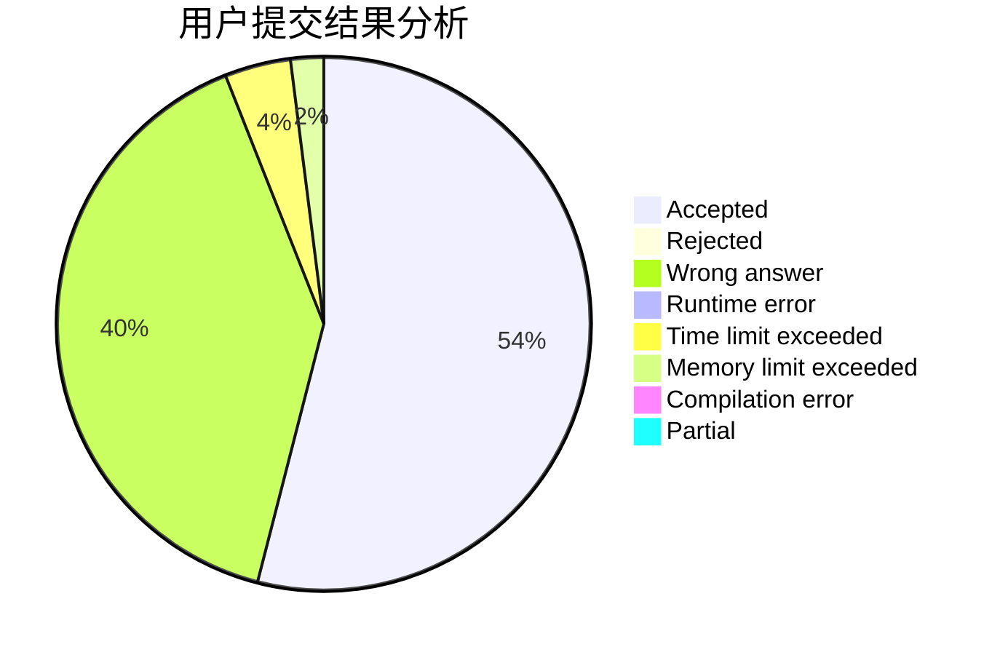
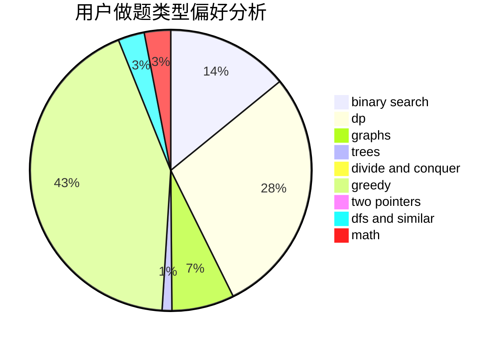

# usamoi

<!-- tabs:start -->

#### **用户提交结果分析**

#### **用户做题类型偏好分析**

<!-- tabs:end -->
# 推荐题目
[617E](https://codeforces.com/contest/617/problem/E)
[485A](https://codeforces.com/contest/485/problem/A)
[1020A](https://codeforces.com/contest/1020/problem/A)
[789D](https://codeforces.com/contest/789/problem/D)
[215C](https://codeforces.com/contest/215/problem/C)
[260A](https://codeforces.com/contest/260/problem/A)
[956D](https://codeforces.com/contest/956/problem/D)
[743D](https://codeforces.com/contest/743/problem/D)
[810B](https://codeforces.com/contest/810/problem/B)
[837F](https://codeforces.com/contest/837/problem/F)
