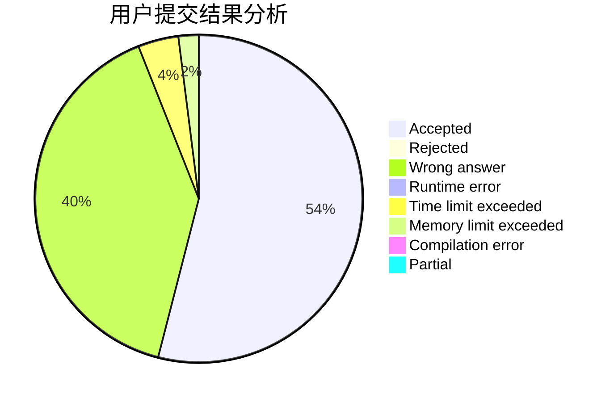
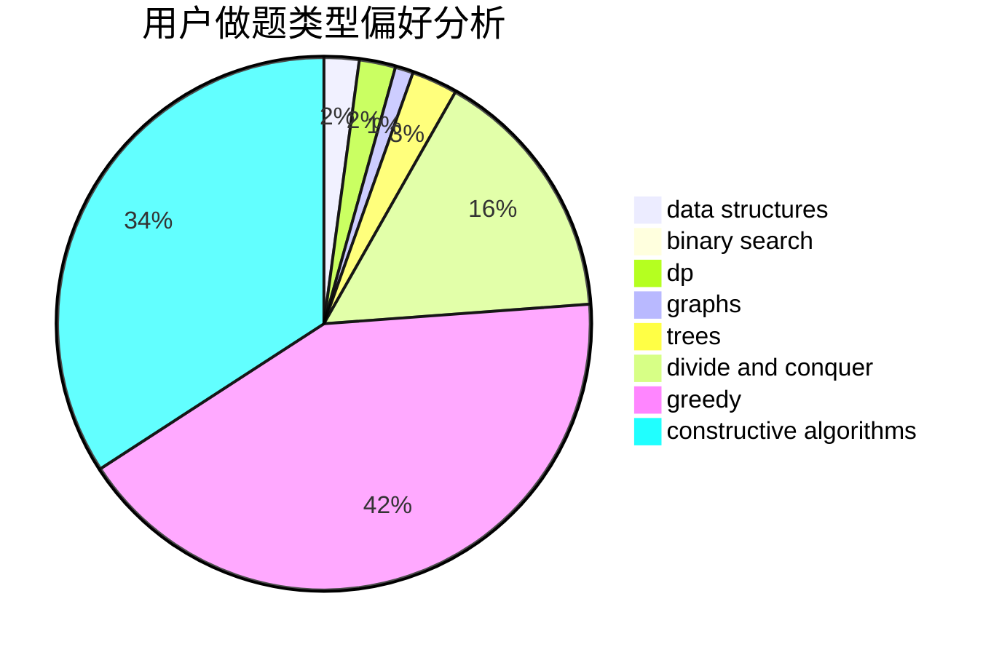

# usamoi

<!-- tabs:start -->

#### **用户提交结果分析**

#### **用户做题类型偏好分析**

#### **用户错题知识点分析**

<!-- tabs:end -->
# 推荐题目
[599D](https://codeforces.com/contest/599/problem/D)		brute force,
                        math		  
[466A](https://codeforces.com/contest/466/problem/A)		implementation		  
[1019E](https://codeforces.com/contest/1019/problem/E)		data structures,
                        divide and conquer,
                        trees		  
[76C](https://codeforces.com/contest/76/problem/C)		bitmasks,
                        dp,
                        math		  
[18E](https://codeforces.com/contest/18/problem/E)		dp		  
[238D](https://codeforces.com/contest/238/problem/D)		data structures,
                        implementation		  
[934E](https://codeforces.com/contest/934/problem/E)		dsu,graphs,sortings,trees		  
[725D](https://codeforces.com/contest/725/problem/D)		data structures,
                        greedy		  
[796A](https://codeforces.com/contest/796/problem/A)		brute force,
                        implementation		  
[817F](https://codeforces.com/contest/817/problem/F)		binary search,
                        data structures,
                        trees		  
