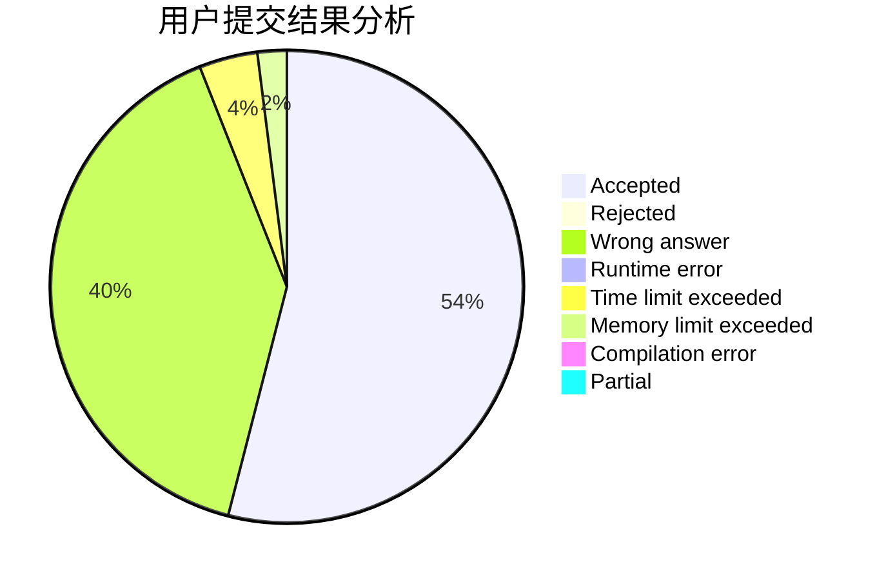
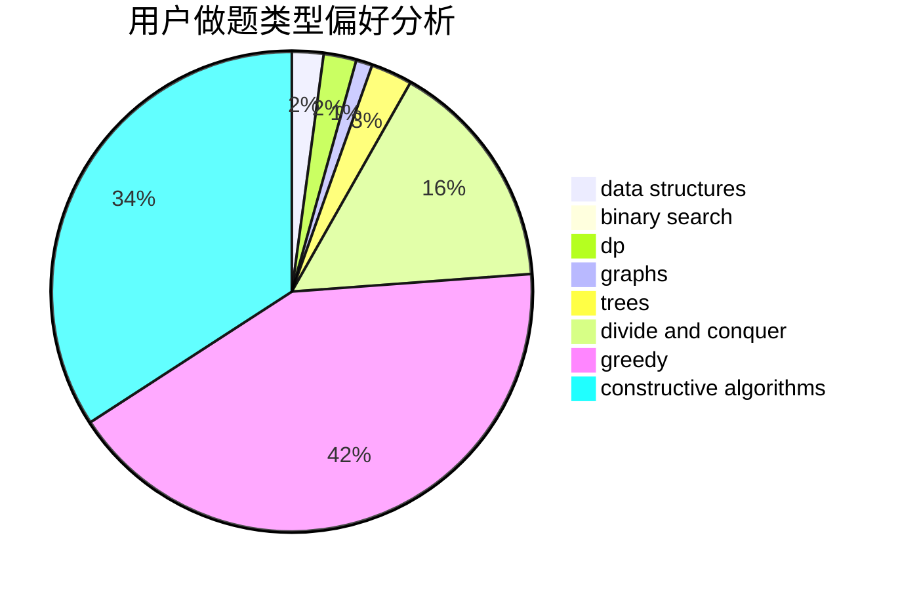

# usamoi
<!-- tabs:start -->
#### **用户提交结果分析**

#### **用户做题类型偏好分析**

#### **用户错题知识点分析**

<!-- tabs:end -->
# 推荐题目
[Cheap Travel](http://codeforces.com/problemset/problem/466/A)		implementation		  
[Spongebob and Squares](http://codeforces.com/problemset/problem/599/D)		brute force,
                        math		  
[Mutation](http://codeforces.com/problemset/problem/76/C)		bitmasks,
                        dp,
                        math		  
[Flag 2](http://codeforces.com/problemset/problem/18/E)		dp		  
[Raining season](http://codeforces.com/problemset/problem/1019/E)		data structures,
                        divide and conquer,
                        trees		  
[Enlarge GCD](http://codeforces.com/problemset/problem/1034/A)		number theory		  
[A Colourful Prospect](https://codeforces.com/contest/934/problem/E)		geometry,
                        graphs		  
[Ball](http://codeforces.com/problemset/problem/12/D)		data structures,
                        sortings		  
[Geometric Progression](http://codeforces.com/problemset/problem/567/C)		binary search,
                        data structures,
                        dp		  
[Information Reform](http://codeforces.com/problemset/problem/70/E)		dp,
                        implementation,
                        trees		  
<!-- tabs:start -->
#### **data structures**
[Cheap Travel](http://codeforces.com/problemset/problem/1019/E)		data structures,
                        divide and conquer,
                        trees		  
[Spongebob and Squares](http://codeforces.com/problemset/problem/12/D)		data structures,
                        sortings		  
[Mutation](http://codeforces.com/problemset/problem/567/C)		binary search,
                        data structures,
                        dp		  
[Flag 2](http://codeforces.com/problemset/problem/238/D)		data structures,
                        implementation		  
[Raining season](http://codeforces.com/problemset/problem/741/E)		data structures,
                        string suffix structures		  
[Enlarge GCD](http://codeforces.com/problemset/problem/527/D)		data structures,
                        dp,
                        greedy,
                        implementation,
                        sortings		  
[A Colourful Prospect](http://codeforces.com/problemset/problem/1264/C)		data structures,
                        probabilities		  
[Ball](http://codeforces.com/problemset/problem/725/D)		data structures,
                        greedy		  
[Geometric Progression](http://codeforces.com/problemset/problem/817/F)		binary search,
                        data structures,
                        trees		  
[Information Reform](http://codeforces.com/problemset/problem/1407/D)		data structures,
                        dp,
                        graphs		  
#### **binary search**
[Cheap Travel](http://codeforces.com/problemset/problem/567/C)		binary search,
                        data structures,
                        dp		  
[Spongebob and Squares](http://codeforces.com/problemset/problem/817/F)		binary search,
                        data structures,
                        trees		  
[Mutation](http://codeforces.com/problemset/problem/1011/B)		binary search,
                        brute force,
                        implementation		  
[Flag 2](http://codeforces.com/problemset/problem/1492/C)		binary search,
                        data structures,
                        dp,
                        greedy,
                        two pointers		  
[Raining season](http://codeforces.com/problemset/problem/1463/D)		binary search,
                        constructive algorithms,
                        greedy,
                        two pointers		  
[Enlarge GCD](http://codeforces.com/problemset/problem/1490/G)		binary search,
                        data structures,
                        math		  
[A Colourful Prospect](http://codeforces.com/problemset/problem/1479/D)		binary search,
                        bitmasks,
                        brute force,
                        data structures,
                        probabilities,
                        trees		  
[Ball](http://codeforces.com/problemset/problem/1436/E)		binary search,
                        data structures,
                        two pointers		  
[Geometric Progression](http://codeforces.com/problemset/problem/1461/D)		binary search,
                        brute force,
                        data structures,
                        divide and conquer,
                        implementation,
                        sortings		  
[Information Reform](http://codeforces.com/problemset/problem/1493/C)		binary search,
                        brute force,
                        constructive algorithms,
                        greedy,
                        strings		  
#### **dp**
[Cheap Travel](http://codeforces.com/problemset/problem/76/C)		bitmasks,
                        dp,
                        math		  
[Spongebob and Squares](http://codeforces.com/problemset/problem/18/E)		dp		  
[Mutation](http://codeforces.com/problemset/problem/567/C)		binary search,
                        data structures,
                        dp		  
[Flag 2](http://codeforces.com/problemset/problem/70/E)		dp,
                        implementation,
                        trees		  
[Raining season](http://codeforces.com/problemset/problem/527/D)		data structures,
                        dp,
                        greedy,
                        implementation,
                        sortings		  
[Enlarge GCD](http://codeforces.com/problemset/problem/711/C)		dp		  
[A Colourful Prospect](http://codeforces.com/problemset/problem/732/B)		dp,
                        greedy		  
[Ball](http://codeforces.com/problemset/problem/835/D)		brute force,
                        dp,
                        hashing,
                        strings		  
[Geometric Progression](http://codeforces.com/problemset/problem/1407/D)		data structures,
                        dp,
                        graphs		  
[Information Reform](http://codeforces.com/problemset/problem/1097/G)		combinatorics,
                        dp,
                        trees		  
#### **graph**
[Cheap Travel](https://codeforces.com/contest/934/problem/E)		geometry,
                        graphs		  
[Spongebob and Squares](http://codeforces.com/problemset/problem/316/C2)		flows,
                        graph matchings		  
[Mutation](http://codeforces.com/problemset/problem/546/E)		flows,
                        graphs,
                        math		  
[Flag 2](http://codeforces.com/problemset/problem/120/H)		graph matchings		  
[Raining season](http://codeforces.com/problemset/problem/1407/D)		data structures,
                        dp,
                        graphs		  
[Enlarge GCD](http://codeforces.com/problemset/problem/1205/B)		bitmasks,
                        brute force,
                        graphs,
                        shortest paths		  
[A Colourful Prospect](http://codeforces.com/problemset/problem/1369/D)		dp,
                        graphs,
                        greedy,
                        math,
                        trees		  
[Ball](http://codeforces.com/problemset/problem/1487/C)		brute force,
                        constructive algorithms,
                        dfs and similar,
                        graphs,
                        greedy,
                        implementation,
                        math		  
[Geometric Progression](http://codeforces.com/problemset/problem/1437/C)		dp,
                        flows,
                        graph matchings,
                        greedy,
                        math,
                        sortings		  
[Information Reform](http://codeforces.com/problemset/problem/1470/D)		constructive algorithms,
                        dfs and similar,
                        graph matchings,
                        graphs,
                        greedy		  
#### **trees**
[Cheap Travel](http://codeforces.com/problemset/problem/1019/E)		data structures,
                        divide and conquer,
                        trees		  
[Spongebob and Squares](http://codeforces.com/problemset/problem/70/E)		dp,
                        implementation,
                        trees		  
[Mutation](http://codeforces.com/problemset/problem/817/F)		binary search,
                        data structures,
                        trees		  
[Flag 2](http://codeforces.com/problemset/problem/1097/G)		combinatorics,
                        dp,
                        trees		  
[Raining season](http://codeforces.com/problemset/problem/1369/D)		dp,
                        graphs,
                        greedy,
                        math,
                        trees		  
[Enlarge GCD](http://codeforces.com/problemset/problem/1479/D)		binary search,
                        bitmasks,
                        brute force,
                        data structures,
                        probabilities,
                        trees		  
[A Colourful Prospect](http://codeforces.com/problemset/problem/1511/C)		brute force,
                        data structures,
                        implementation,
                        trees		  
[Ball](http://codeforces.com/problemset/problem/1499/F)		combinatorics,
                        dfs and similar,
                        dp,
                        trees		  
[Geometric Progression](http://codeforces.com/problemset/problem/1491/E)		brute force,
                        dfs and similar,
                        divide and conquer,
                        number theory,
                        trees		  
[Information Reform](http://codeforces.com/problemset/problem/1466/D)		data structures,
                        greedy,
                        sortings,
                        trees		  
#### **divide and conquer**
[Cheap Travel](http://codeforces.com/problemset/problem/1019/E)		data structures,
                        divide and conquer,
                        trees		  
[Spongebob and Squares](http://codeforces.com/problemset/problem/1373/G)		data structures,
                        divide and conquer,
                        greedy		  
[Mutation](http://codeforces.com/problemset/problem/1461/D)		binary search,
                        brute force,
                        data structures,
                        divide and conquer,
                        implementation,
                        sortings		  
[Flag 2](http://codeforces.com/problemset/problem/1466/G)		combinatorics,
                        divide and conquer,
                        hashing,
                        math,
                        string suffix structures,
                        strings		  
[Raining season](http://codeforces.com/problemset/problem/1490/D)		dfs and similar,
                        divide and conquer,
                        implementation		  
[Enlarge GCD](https://codeforces.com/contest/1483/problem/C)		data structures,
                        divide and conquer,
                        dp		  
[A Colourful Prospect](http://codeforces.com/problemset/problem/1491/E)		brute force,
                        dfs and similar,
                        divide and conquer,
                        number theory,
                        trees		  
[Ball](http://codeforces.com/problemset/problem/1303/G)		data structures,
                        divide and conquer,
                        geometry,
                        trees		  
[Geometric Progression](http://codeforces.com/problemset/problem/1494/D)		constructive algorithms,
                        data structures,
                        dfs and similar,
                        divide and conquer,
                        dsu,
                        greedy,
                        sortings,
                        trees		  
[Information Reform](http://codeforces.com/problemset/problem/1482/E)		data structures,
                        divide and conquer,
                        dp		  
#### **greedy**
[Cheap Travel](http://codeforces.com/problemset/problem/527/D)		data structures,
                        dp,
                        greedy,
                        implementation,
                        sortings		  
[Spongebob and Squares](http://codeforces.com/problemset/problem/246/A)		constructive algorithms,
                        greedy,
                        sortings		  
[Mutation](http://codeforces.com/problemset/problem/732/B)		dp,
                        greedy		  
[Flag 2](http://codeforces.com/problemset/problem/725/D)		data structures,
                        greedy		  
[Raining season](http://codeforces.com/problemset/problem/1051/G)		data structures,
                        dsu,
                        greedy		  
[Enlarge GCD](http://codeforces.com/problemset/problem/1369/D)		dp,
                        graphs,
                        greedy,
                        math,
                        trees		  
[A Colourful Prospect](http://codeforces.com/problemset/problem/1373/G)		data structures,
                        divide and conquer,
                        greedy		  
[Ball](http://codeforces.com/problemset/problem/1492/C)		binary search,
                        data structures,
                        dp,
                        greedy,
                        two pointers		  
[Geometric Progression](https://codeforces.com/contest/1496/problem/C)		geometry,
                        greedy,
                        math,
                        sortings		  
[Information Reform](http://codeforces.com/problemset/problem/1493/A)		constructive algorithms,
                        greedy		  
#### **constructive algorithms**
[Cheap Travel](http://codeforces.com/problemset/problem/246/A)		constructive algorithms,
                        greedy,
                        sortings		  
[Spongebob and Squares](http://codeforces.com/problemset/problem/1329/D)		constructive algorithms,
                        data structures		  
[Mutation](http://codeforces.com/problemset/problem/1493/A)		constructive algorithms,
                        greedy		  
[Flag 2](http://codeforces.com/problemset/problem/1463/D)		binary search,
                        constructive algorithms,
                        greedy,
                        two pointers		  
[Raining season](https://codeforces.com/contest/1456/problem/B)		bitmasks,
                        brute force,
                        constructive algorithms		  
[Enlarge GCD](http://codeforces.com/problemset/problem/1492/D)		bitmasks,
                        constructive algorithms,
                        greedy,
                        math		  
[A Colourful Prospect](https://codeforces.com/contest/1504/problem/D)		constructive algorithms,
                        games,
                        interactive		  
[Ball](https://codeforces.com/contest/1483/problem/A)		brute force,
                        constructive algorithms,
                        greedy,
                        implementation		  
[Geometric Progression](https://codeforces.com/contest/1457/problem/D)		bitmasks,
                        brute force,
                        constructive algorithms		  
[Information Reform](http://codeforces.com/problemset/problem/1513/A)		constructive algorithms,
                        implementation		  
#### **sortings**
[Cheap Travel](http://codeforces.com/problemset/problem/12/D)		data structures,
                        sortings		  
[Spongebob and Squares](http://codeforces.com/problemset/problem/527/D)		data structures,
                        dp,
                        greedy,
                        implementation,
                        sortings		  
[Mutation](http://codeforces.com/problemset/problem/246/A)		constructive algorithms,
                        greedy,
                        sortings		  
[Flag 2](https://codeforces.com/contest/1496/problem/C)		geometry,
                        greedy,
                        math,
                        sortings		  
[Raining season](http://codeforces.com/problemset/problem/1495/A)		geometry,
                        greedy,
                        math,
                        sortings		  
[Enlarge GCD](http://codeforces.com/problemset/problem/1497/A)		brute force,
                        data structures,
                        greedy,
                        sortings		  
[A Colourful Prospect](http://codeforces.com/problemset/problem/1427/A)		math,
                        sortings		  
[Ball](http://codeforces.com/problemset/problem/1461/D)		binary search,
                        brute force,
                        data structures,
                        divide and conquer,
                        implementation,
                        sortings		  
[Geometric Progression](http://codeforces.com/problemset/problem/1437/C)		dp,
                        flows,
                        graph matchings,
                        greedy,
                        math,
                        sortings		  
[Information Reform](http://codeforces.com/problemset/problem/1473/A)		greedy,
                        implementation,
                        math,
                        sortings		  
<!-- tabs:end -->
