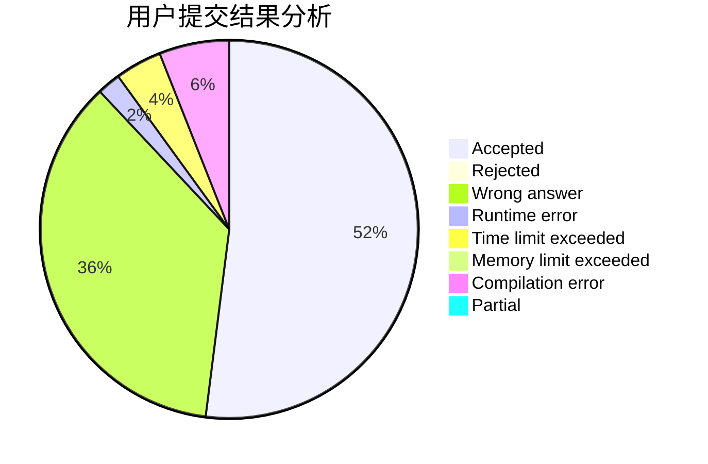
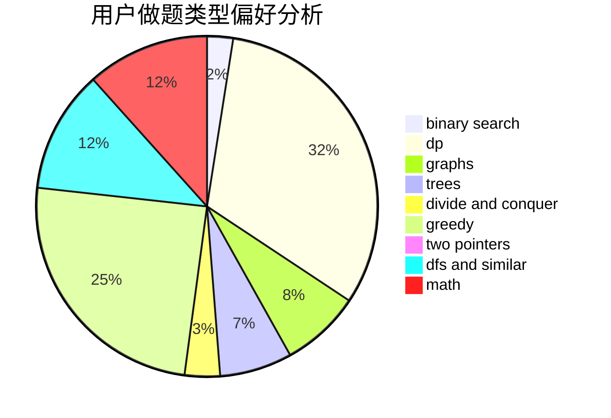

# CYJian

<!-- tabs:start -->

#### **用户提交结果分析**

#### **用户做题类型偏好分析**

<!-- tabs:end -->
# 推荐题目
[650E](https://codeforces.com/contest/650/problem/E)
[314C](https://codeforces.com/contest/314/problem/C)
[1366F](https://codeforces.com/contest/1366/problem/F)
[1329B](https://codeforces.com/contest/1329/problem/B)
[1380C](https://codeforces.com/contest/1380/problem/C)
[1145F](https://codeforces.com/contest/1145/problem/F)
[417E](https://codeforces.com/contest/417/problem/E)
[650C](https://codeforces.com/contest/650/problem/C)
[650B](https://codeforces.com/contest/650/problem/B)
[1264C](https://codeforces.com/contest/1264/problem/C)
