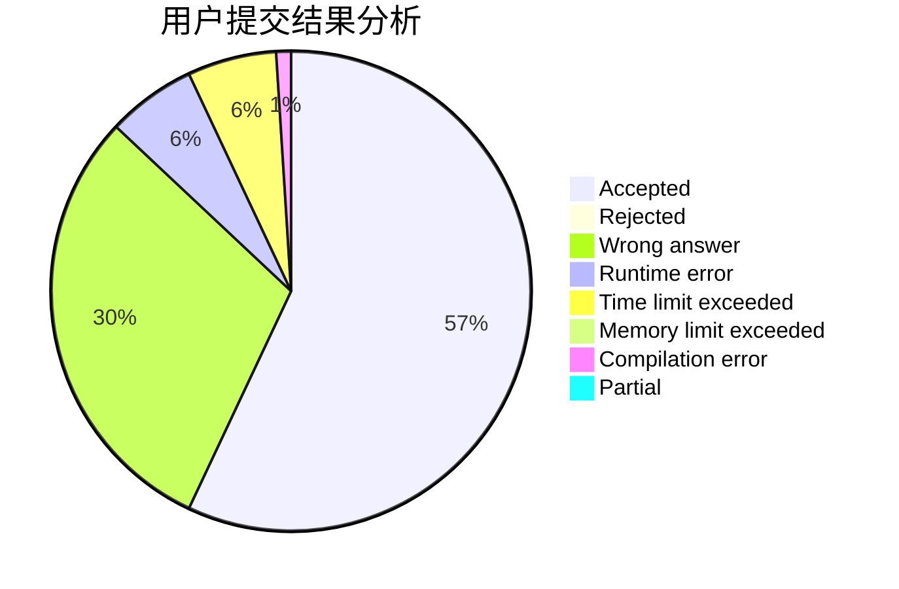
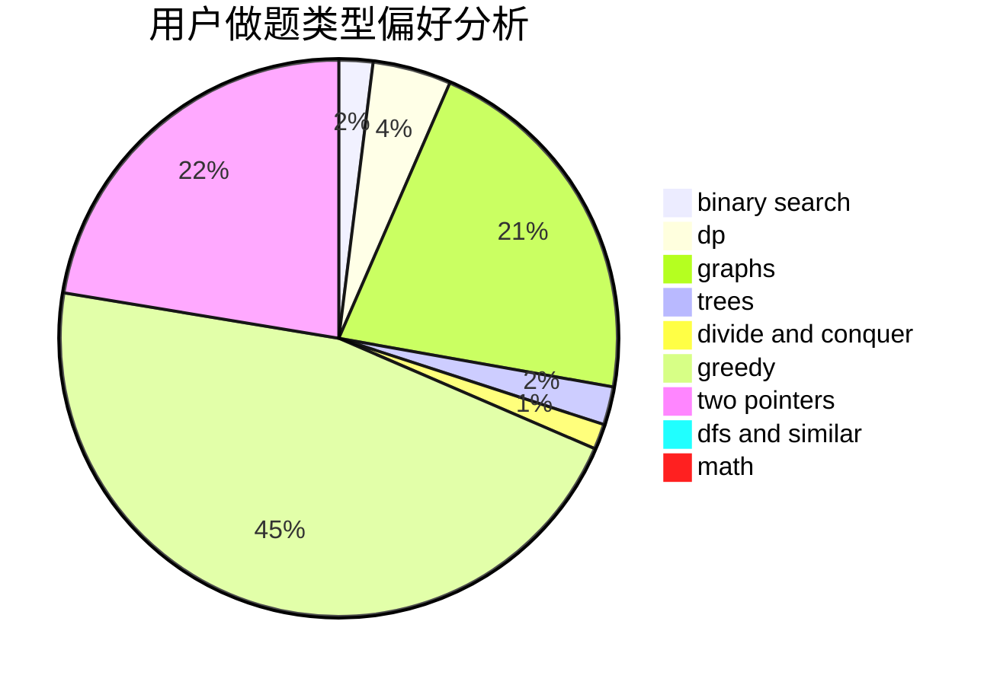

# vandoor

<!-- tabs:start -->

#### **用户提交结果分析**

#### **用户做题类型偏好分析**

<!-- tabs:end -->
# 推荐题目
[110A](https://codeforces.com/contest/110/problem/A)
[494B](https://codeforces.com/contest/494/problem/B)
[1253E](https://codeforces.com/contest/1253/problem/E)
[1109D](https://codeforces.com/contest/1109/problem/D)
[999D](https://codeforces.com/contest/999/problem/D)
[1132E](https://codeforces.com/contest/1132/problem/E)
[30C](https://codeforces.com/contest/30/problem/C)
[339A](https://codeforces.com/contest/339/problem/A)
[290B](https://codeforces.com/contest/290/problem/B)
[260B](https://codeforces.com/contest/260/problem/B)
