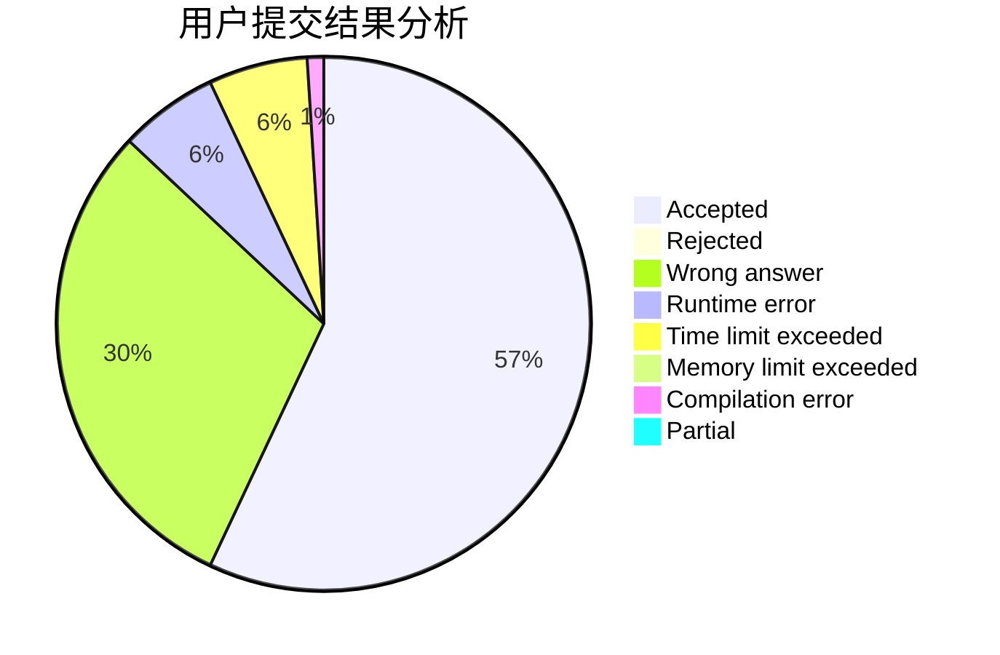
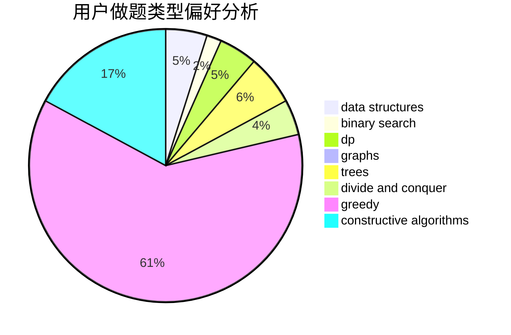
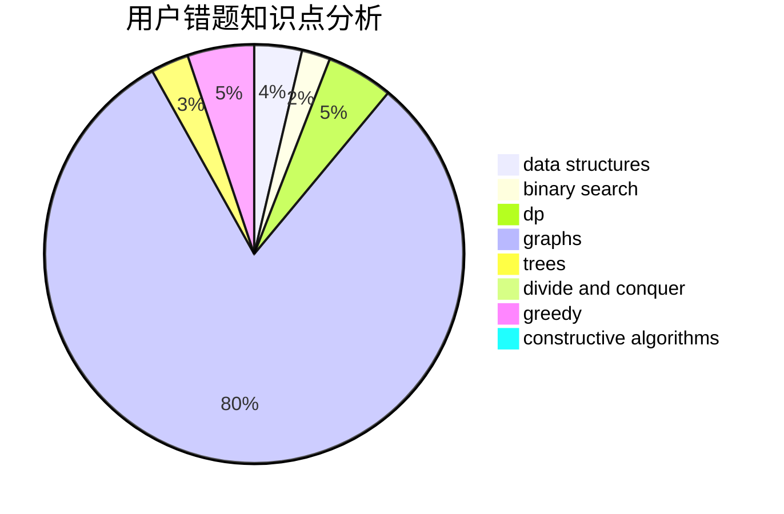

# vandoor

<!-- tabs:start -->

#### **用户提交结果分析**

#### **用户做题类型偏好分析**

#### **用户错题知识点分析**

<!-- tabs:end -->
# 推荐题目
[110A](https://codeforces.com/contest/110/problem/A)		implementation		  
[494B](https://codeforces.com/contest/494/problem/B)		dp,
                        strings		  
[1253E](https://codeforces.com/contest/1253/problem/E)		data structures,
                        dp,
                        greedy,
                        sortings		  
[1109D](https://codeforces.com/contest/1109/problem/D)		brute force,
                        combinatorics,
                        dp,
                        math,
                        trees		  
[999D](https://codeforces.com/contest/999/problem/D)		data structures,
                        greedy,
                        implementation		  
[1132E](https://codeforces.com/contest/1132/problem/E)		dfs and similar,
                        dp,
                        greedy		  
[30C](https://codeforces.com/contest/30/problem/C)		dp,
                        probabilities		  
[339A](https://codeforces.com/contest/339/problem/A)		greedy,
                        implementation,
                        sortings,
                        strings		  
[290B](https://codeforces.com/contest/290/problem/B)		*special problem,
                        implementation		  
[260B](https://codeforces.com/contest/260/problem/B)		brute force,
                        implementation,
                        strings		  
