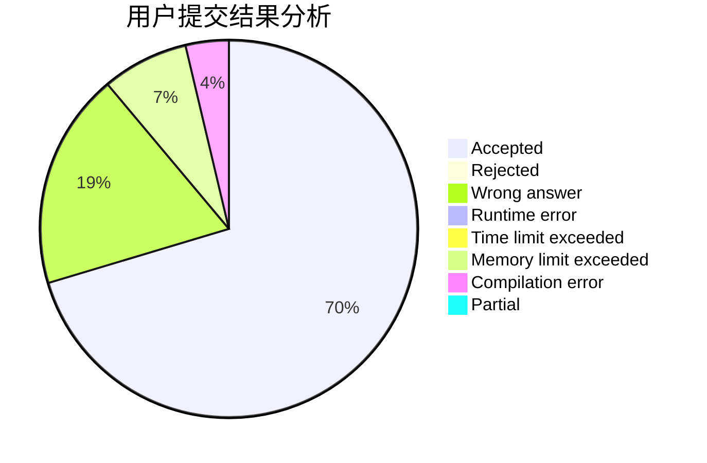
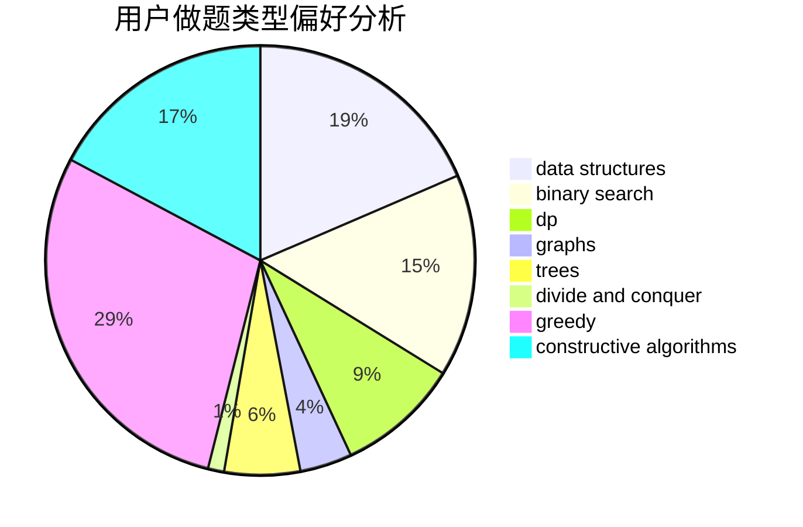
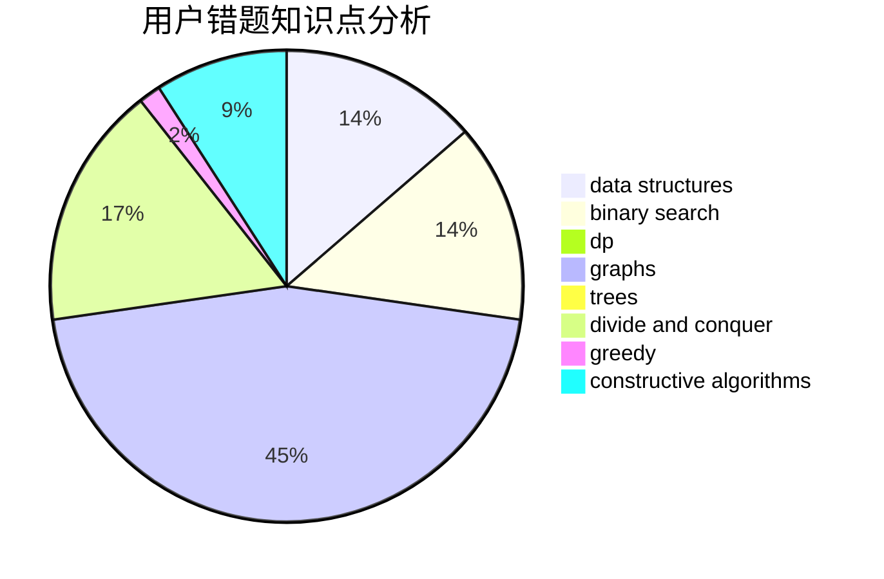

# veckoper

<!-- tabs:start -->

#### **用户提交结果分析**

#### **用户做题类型偏好分析**

#### **用户错题知识点分析**

<!-- tabs:end -->
# 推荐题目
[946D](https://codeforces.com/contest/946/problem/D)		dp		  
[1488B](https://codeforces.com/contest/1488/problem/B)		*special problem,
                        greedy		  
[266B](https://codeforces.com/contest/266/problem/B)		constructive algorithms,
                        graph matchings,
                        implementation,
                        shortest paths		  
[1197A](https://codeforces.com/contest/1197/problem/A)		greedy,
                        math,
                        sortings		  
[1070D](https://codeforces.com/contest/1070/problem/D)		greedy		  
[996B](https://codeforces.com/contest/996/problem/B)		binary search,
                        math		  
[1198F](https://codeforces.com/contest/1198/problem/F)		greedy,
                        number theory,
                        probabilities		  
[544D](https://codeforces.com/contest/544/problem/D)		dsu,graphs,sortings,trees		  
[701F](https://codeforces.com/contest/701/problem/F)		dsu,graphs,sortings,trees		  
[425C](https://codeforces.com/contest/425/problem/C)		data structures,
                        dp		  
