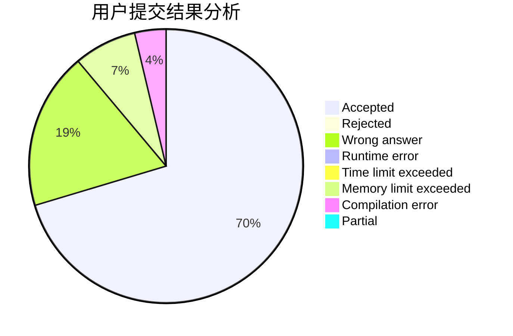
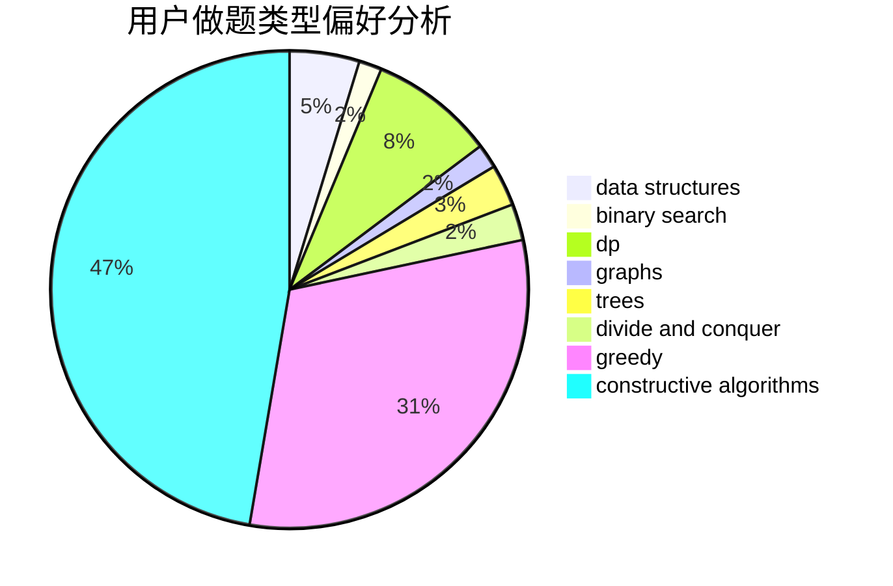
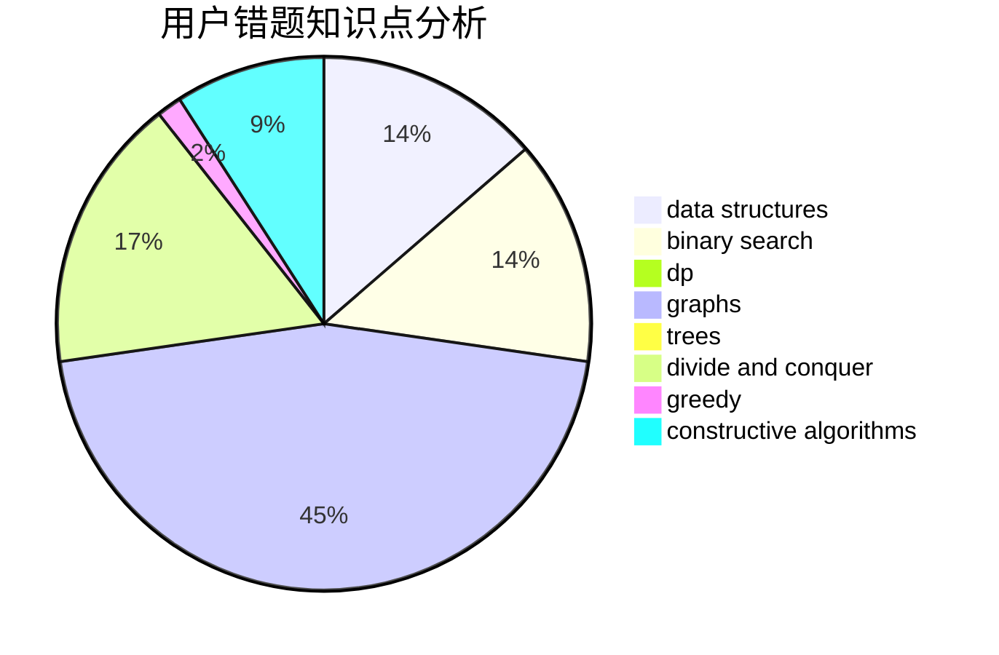

# veckoper

<!-- tabs:start -->

#### **用户提交结果分析**

#### **用户做题类型偏好分析**

#### **用户错题知识点分析**

<!-- tabs:end -->
# 推荐题目
[922D](https://codeforces.com/contest/922/problem/D)		greedy,
                        sortings		  
[1479D](https://codeforces.com/contest/1479/problem/D)		binary search,
                        bitmasks,
                        brute force,
                        data structures,
                        probabilities,
                        trees		  
[245H](https://codeforces.com/contest/245/problem/H)		dp,
                        hashing,
                        strings		  
[1191B](https://codeforces.com/contest/1191/problem/B)		brute force,
                        implementation		  
[1070A](https://codeforces.com/contest/1070/problem/A)		dp,
                        graphs,
                        number theory,
                        shortest paths		  
[981A](https://codeforces.com/contest/981/problem/A)		brute force,
                        implementation,
                        strings		  
[1194D](https://codeforces.com/contest/1194/problem/D)		games,
                        math		  
[519B](https://codeforces.com/contest/519/problem/B)		data structures,
                        implementation,
                        sortings		  
[678B](https://codeforces.com/contest/678/problem/B)		implementation		  
[39B](https://codeforces.com/contest/39/problem/B)		greedy		  
