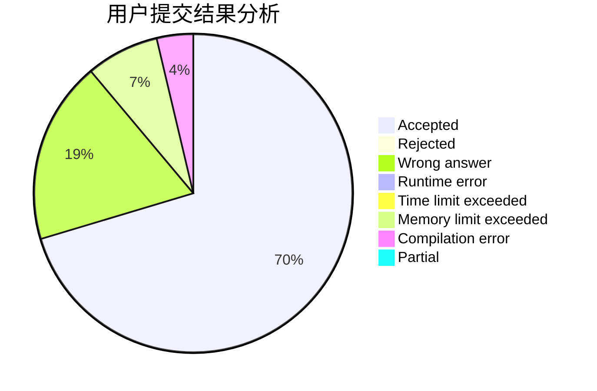
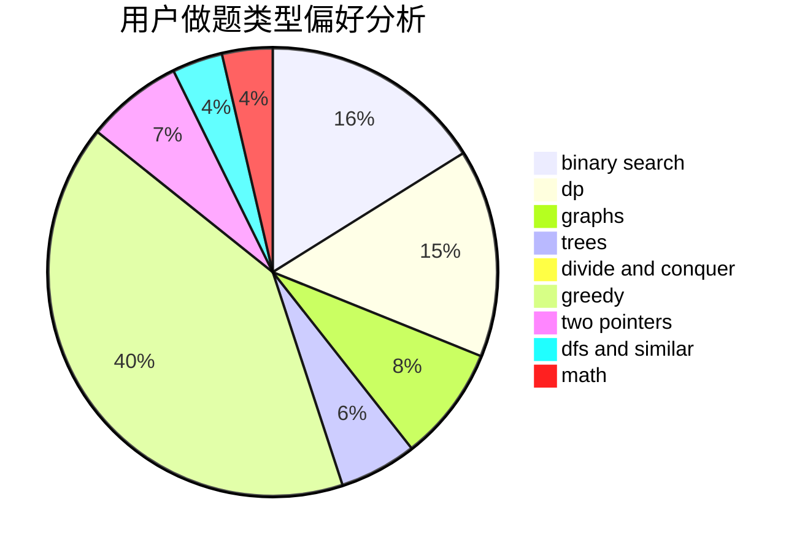

# veckoper

<!-- tabs:start -->

#### **用户提交结果分析**

#### **用户做题类型偏好分析**

<!-- tabs:end -->
# 推荐题目
[946D](https://codeforces.com/contest/946/problem/D)
[1488B](https://codeforces.com/contest/1488/problem/B)
[266B](https://codeforces.com/contest/266/problem/B)
[1197A](https://codeforces.com/contest/1197/problem/A)
[1070D](https://codeforces.com/contest/1070/problem/D)
[996B](https://codeforces.com/contest/996/problem/B)
[1198F](https://codeforces.com/contest/1198/problem/F)
[544D](https://codeforces.com/contest/544/problem/D)
[701F](https://codeforces.com/contest/701/problem/F)
[425C](https://codeforces.com/contest/425/problem/C)
