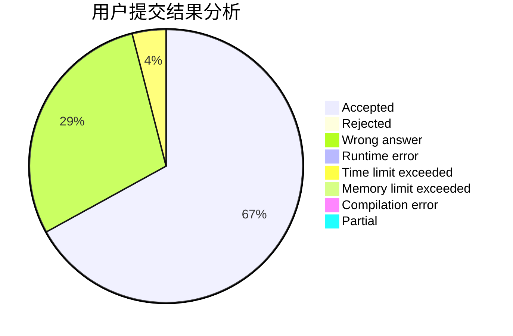
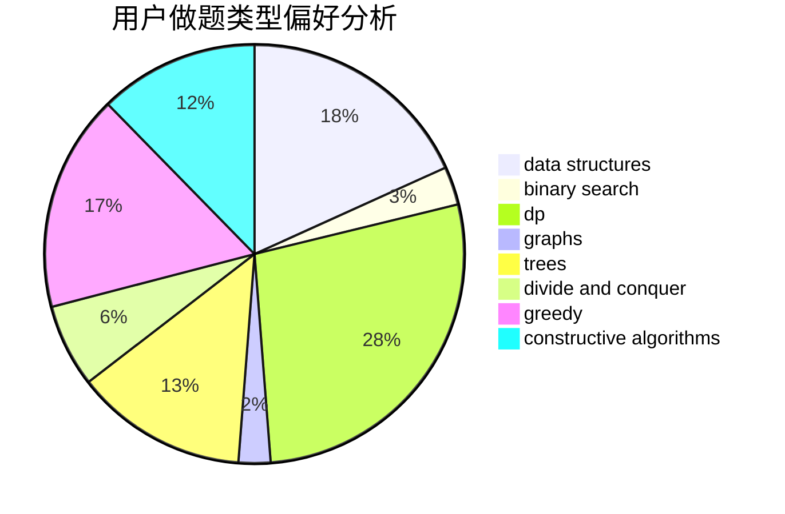
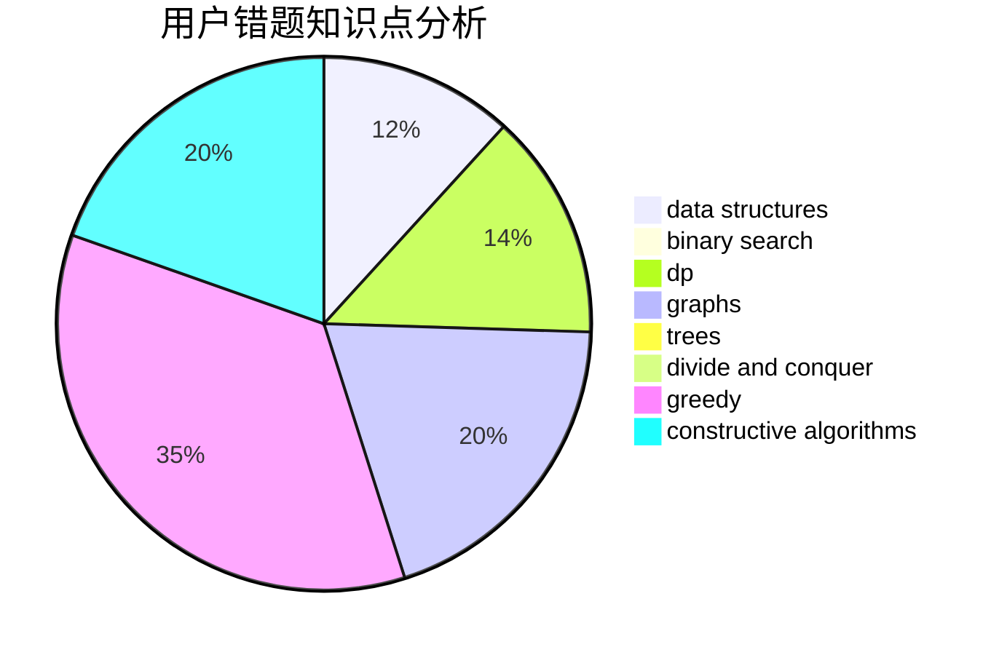

# vectorwyx

<!-- tabs:start -->

#### **用户提交结果分析**

#### **用户做题类型偏好分析**

#### **用户错题知识点分析**

<!-- tabs:end -->
# 推荐题目
[385E](https://codeforces.com/contest/385/problem/E)		math,
                        matrices		  
[67A](https://codeforces.com/contest/67/problem/A)		dp,
                        graphs,
                        greedy,
                        implementation		  
[1223A](https://codeforces.com/contest/1223/problem/A)		math		  
[475D](https://codeforces.com/contest/475/problem/D)		brute force,
                        data structures,
                        math		  
[1101E](https://codeforces.com/contest/1101/problem/E)		implementation		  
[938A](https://codeforces.com/contest/938/problem/A)		implementation		  
[1277A](https://codeforces.com/contest/1277/problem/A)		implementation		  
[436C](https://codeforces.com/contest/436/problem/C)		dsu,
                        graphs,
                        greedy,
                        trees		  
[1246C](https://codeforces.com/contest/1246/problem/C)		dsu,graphs,sortings,trees		  
[439D](https://codeforces.com/contest/439/problem/D)		binary search,
                        sortings,
                        ternary search,
                        two pointers		  
