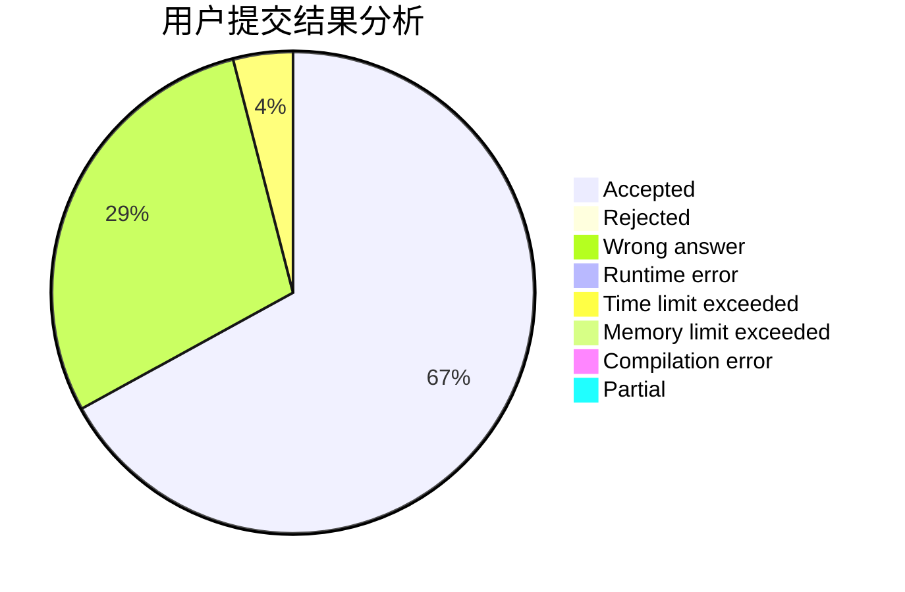
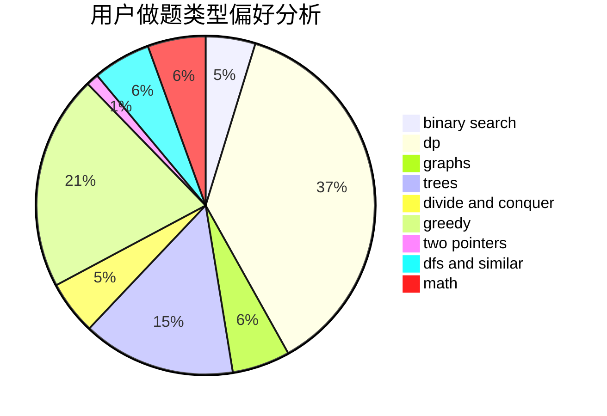

# vectorwyx

<!-- tabs:start -->

#### **用户提交结果分析**

#### **用户做题类型偏好分析**

<!-- tabs:end -->
# 推荐题目
[385E](https://codeforces.com/contest/385/problem/E)
[67A](https://codeforces.com/contest/67/problem/A)
[1223A](https://codeforces.com/contest/1223/problem/A)
[475D](https://codeforces.com/contest/475/problem/D)
[1101E](https://codeforces.com/contest/1101/problem/E)
[938A](https://codeforces.com/contest/938/problem/A)
[1277A](https://codeforces.com/contest/1277/problem/A)
[436C](https://codeforces.com/contest/436/problem/C)
[1246C](https://codeforces.com/contest/1246/problem/C)
[439D](https://codeforces.com/contest/439/problem/D)
