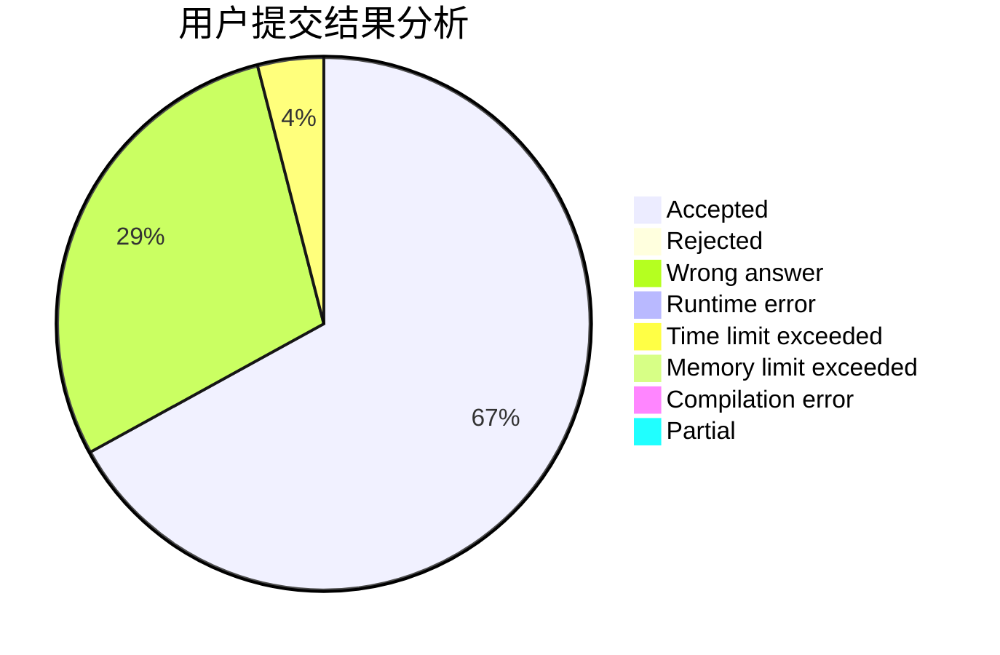
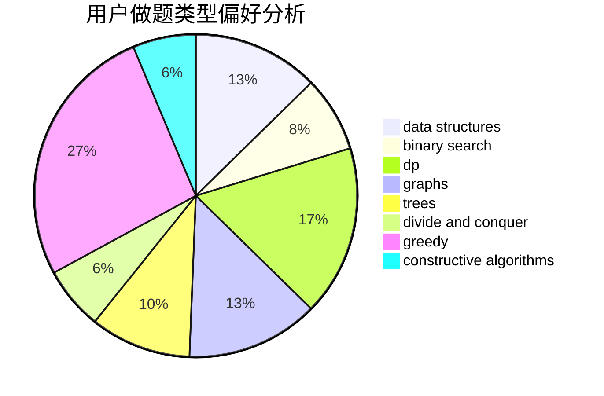
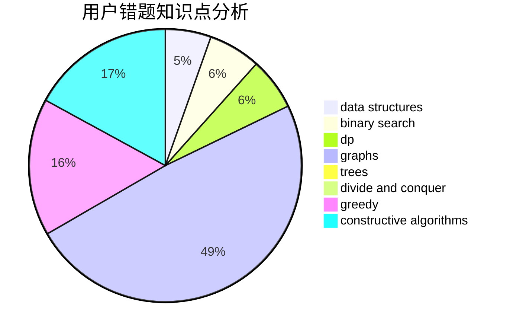

# vectorwyx

<!-- tabs:start -->

#### **用户提交结果分析**

#### **用户做题类型偏好分析**

#### **用户错题知识点分析**

<!-- tabs:end -->
# 推荐题目
[359B](https://codeforces.com/contest/359/problem/B)		constructive algorithms,
                        dp,
                        math		  
[659F](https://codeforces.com/contest/659/problem/F)		dfs and similar,
                        dsu,
                        graphs,
                        greedy,
                        sortings		  
[1216D](https://codeforces.com/contest/1216/problem/D)		math		  
[453D](https://codeforces.com/contest/453/problem/D)		dp,
                        matrices		  
[1101B](https://codeforces.com/contest/1101/problem/B)		greedy,
                        implementation		  
[917C](https://codeforces.com/contest/917/problem/C)		combinatorics,
                        dp,
                        matrices		  
[1267L](https://codeforces.com/contest/1267/problem/L)		constructive algorithms,
                        strings		  
[407E](https://codeforces.com/contest/407/problem/E)		data structures		  
[1240F](https://codeforces.com/contest/1240/problem/F)		graphs		  
[414B](https://codeforces.com/contest/414/problem/B)		combinatorics,
                        dp,
                        number theory		  
