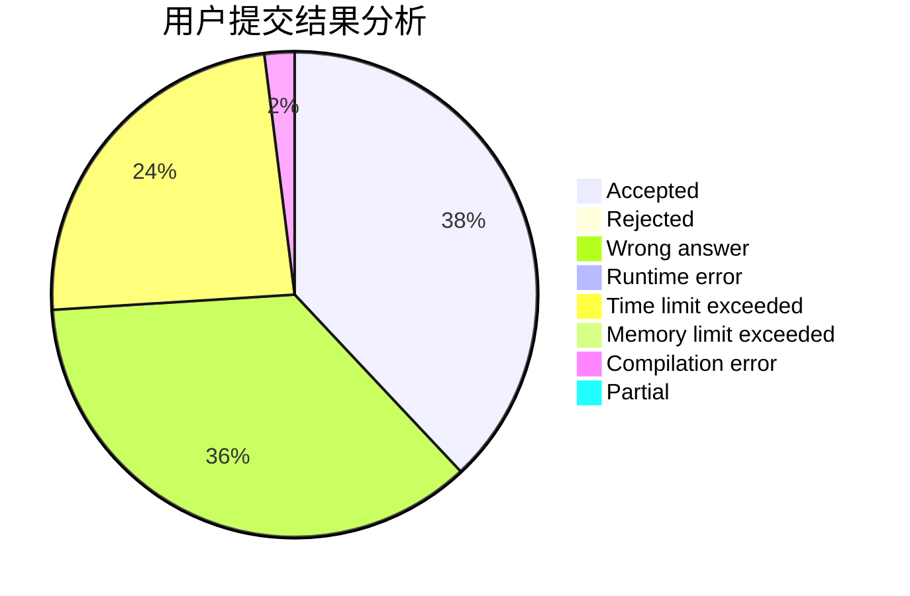
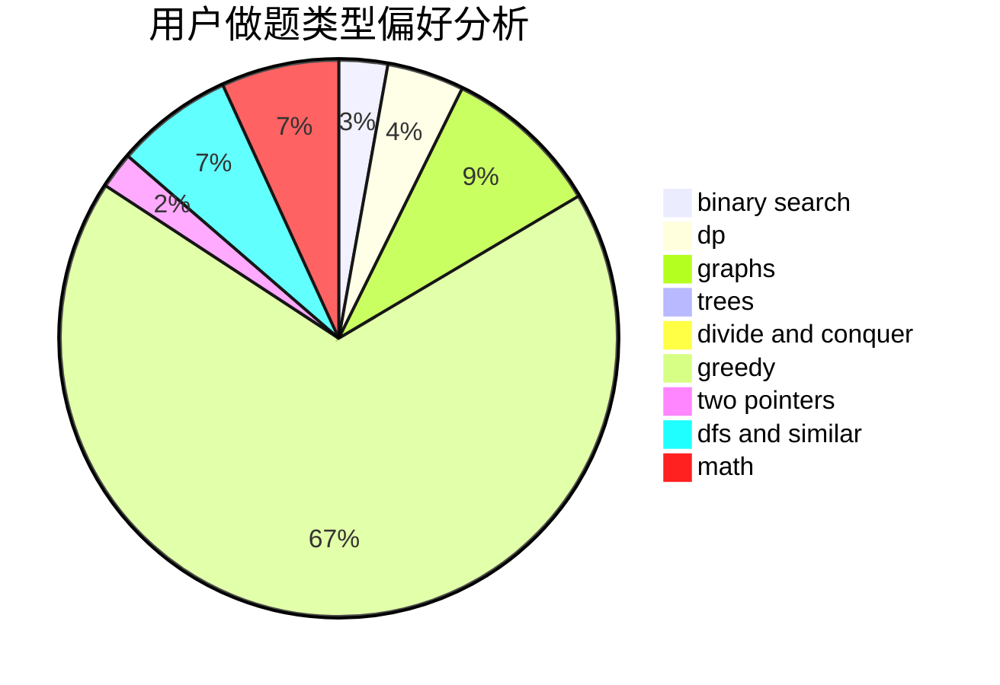

# veterfrank

<!-- tabs:start -->

#### **用户提交结果分析**

#### **用户做题类型偏好分析**

<!-- tabs:end -->
# 推荐题目
[446E](https://codeforces.com/contest/446/problem/E)
[1063B](https://codeforces.com/contest/1063/problem/B)
[828A](https://codeforces.com/contest/828/problem/A)
[760B](https://codeforces.com/contest/760/problem/B)
[993C](https://codeforces.com/contest/993/problem/C)
[1036F](https://codeforces.com/contest/1036/problem/F)
[610D](https://codeforces.com/contest/610/problem/D)
[1154A](https://codeforces.com/contest/1154/problem/A)
[1354E](https://codeforces.com/contest/1354/problem/E)
[1178E](https://codeforces.com/contest/1178/problem/E)
