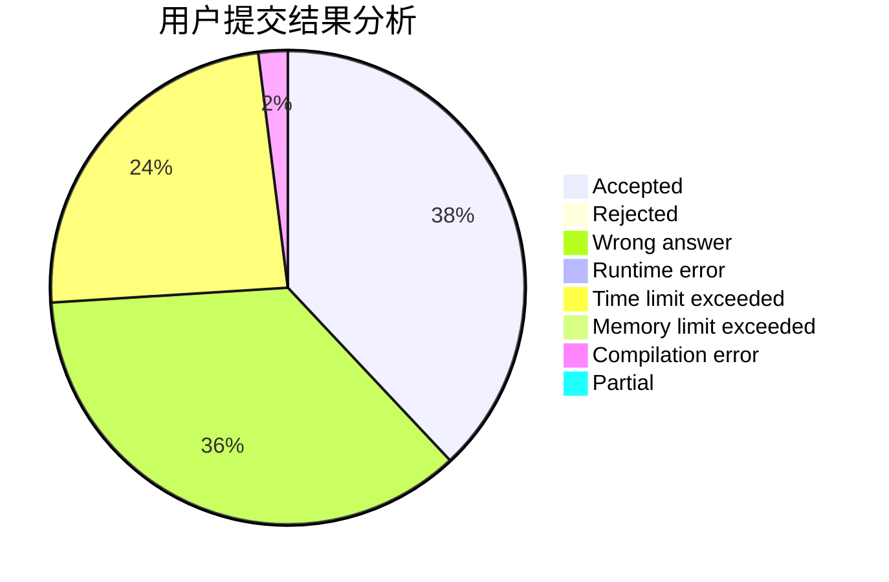
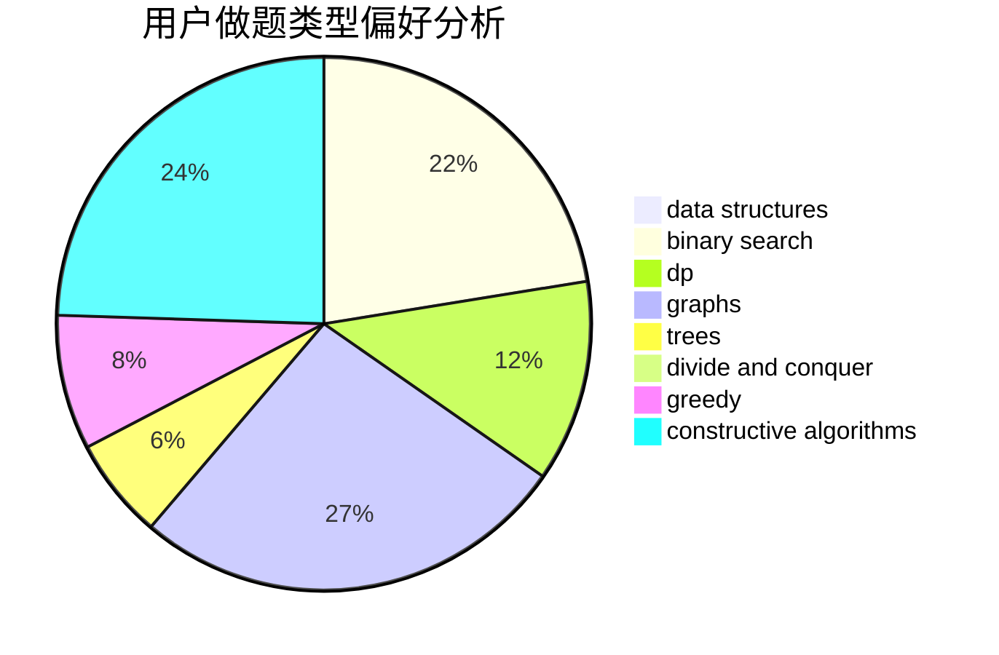
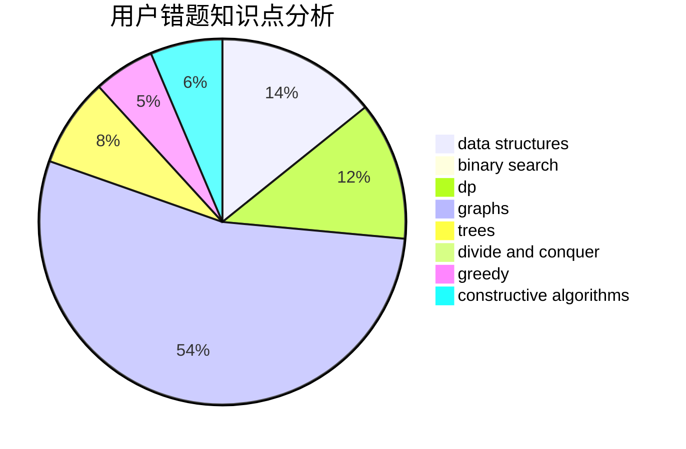

# veterfrank

<!-- tabs:start -->

#### **用户提交结果分析**

#### **用户做题类型偏好分析**

#### **用户错题知识点分析**

<!-- tabs:end -->
# 推荐题目
[446E](https://codeforces.com/contest/446/problem/E)		math,
                        matrices		  
[1063B](https://codeforces.com/contest/1063/problem/B)		graphs,
                        shortest paths		  
[828A](https://codeforces.com/contest/828/problem/A)		implementation		  
[760B](https://codeforces.com/contest/760/problem/B)		binary search,
                        greedy		  
[993C](https://codeforces.com/contest/993/problem/C)		bitmasks,
                        brute force,
                        geometry		  
[1036F](https://codeforces.com/contest/1036/problem/F)		combinatorics,
                        math,
                        number theory		  
[610D](https://codeforces.com/contest/610/problem/D)		constructive algorithms,
                        data structures,
                        geometry,
                        two pointers		  
[1154A](https://codeforces.com/contest/1154/problem/A)		math		  
[1354E](https://codeforces.com/contest/1354/problem/E)		dfs and similar,
                        dp,
                        graphs		  
[1178E](https://codeforces.com/contest/1178/problem/E)		brute force,
                        constructive algorithms,
                        greedy,
                        strings		  
