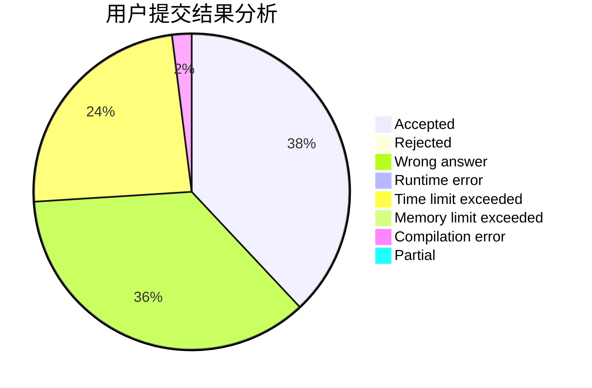
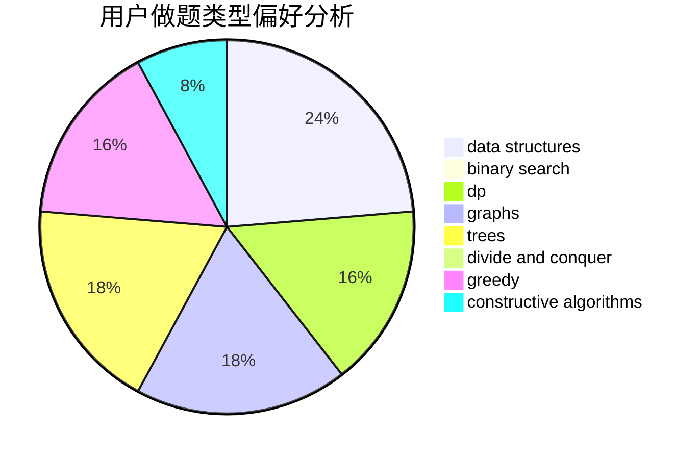
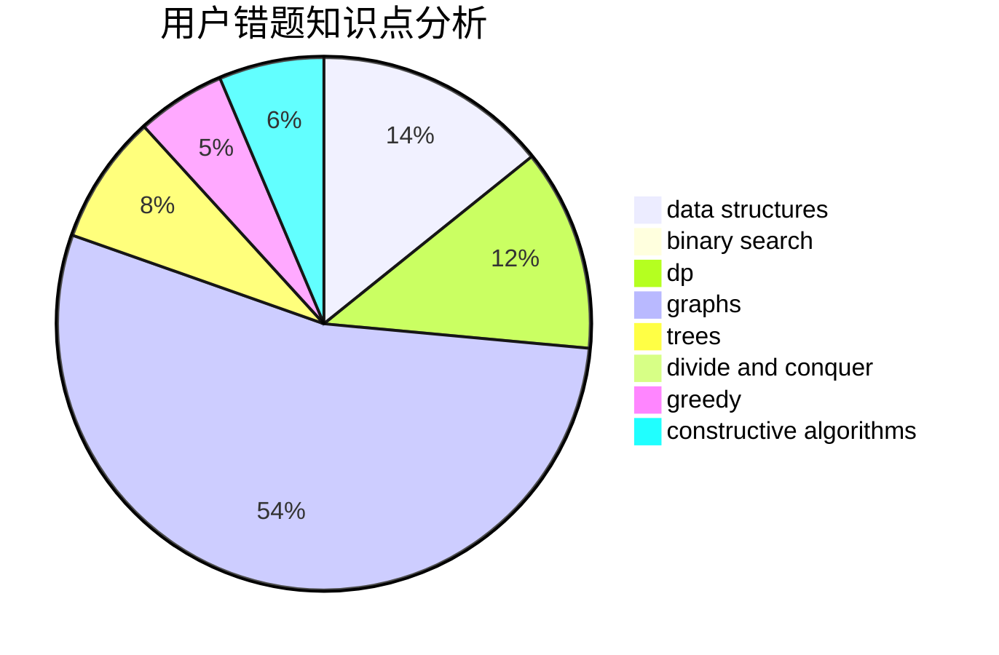

# veterfrank

<!-- tabs:start -->

#### **用户提交结果分析**

#### **用户做题类型偏好分析**

#### **用户错题知识点分析**

<!-- tabs:end -->
# 推荐题目
[424A](https://codeforces.com/contest/424/problem/A)		implementation		  
[1062E](https://codeforces.com/contest/1062/problem/E)		binary search,
                        data structures,
                        dfs and similar,
                        greedy,
                        trees		  
[810A](https://codeforces.com/contest/810/problem/A)		implementation,
                        math		  
[73B](https://codeforces.com/contest/73/problem/B)		binary search,
                        greedy,
                        sortings		  
[979C](https://codeforces.com/contest/979/problem/C)		dfs and similar,
                        trees		  
[1036C](https://codeforces.com/contest/1036/problem/C)		combinatorics,
                        dp		  
[591A](https://codeforces.com/contest/591/problem/A)		implementation,
                        math		  
[1152A](https://codeforces.com/contest/1152/problem/A)		greedy,
                        implementation,
                        math		  
[1347E](https://codeforces.com/contest/1347/problem/E)		dsu,graphs,sortings,trees		  
[1175E](https://codeforces.com/contest/1175/problem/E)		data structures,
                        dfs and similar,
                        divide and conquer,
                        dp,
                        greedy,
                        implementation,
                        trees		  
