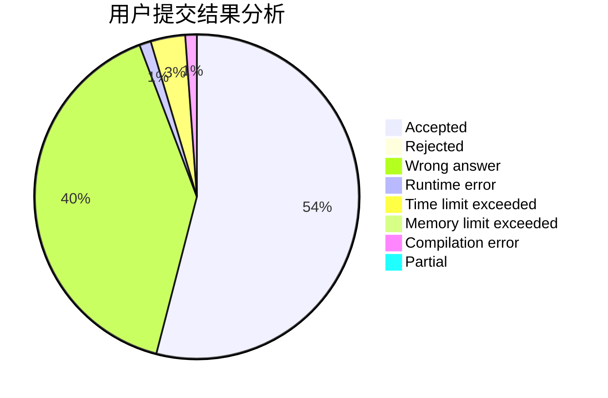
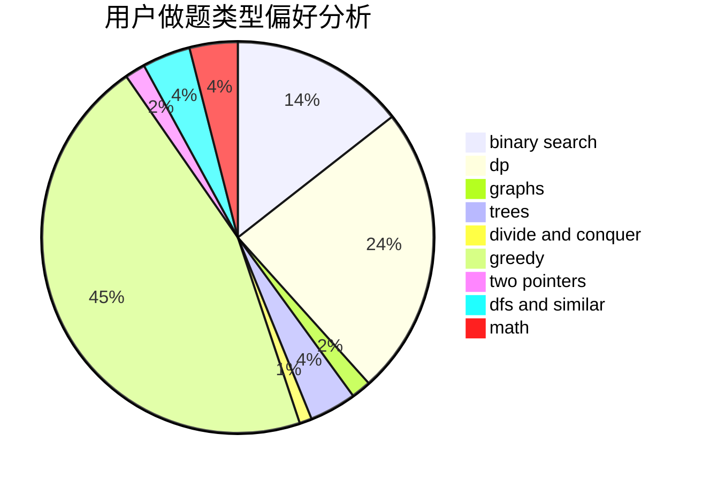

# vice_why112

<!-- tabs:start -->

#### **用户提交结果分析**

#### **用户做题类型偏好分析**

<!-- tabs:end -->
# 推荐题目
[1107C](https://codeforces.com/contest/1107/problem/C)
[1366F](https://codeforces.com/contest/1366/problem/F)
[912C](https://codeforces.com/contest/912/problem/C)
[193B](https://codeforces.com/contest/193/problem/B)
[505B](https://codeforces.com/contest/505/problem/B)
[1279F](https://codeforces.com/contest/1279/problem/F)
[360E](https://codeforces.com/contest/360/problem/E)
[837A](https://codeforces.com/contest/837/problem/A)
[699B](https://codeforces.com/contest/699/problem/B)
[291B](https://codeforces.com/contest/291/problem/B)
