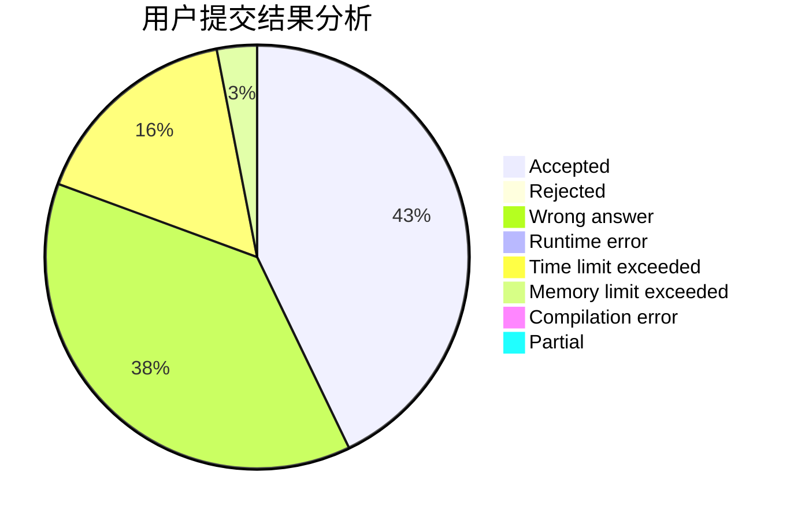
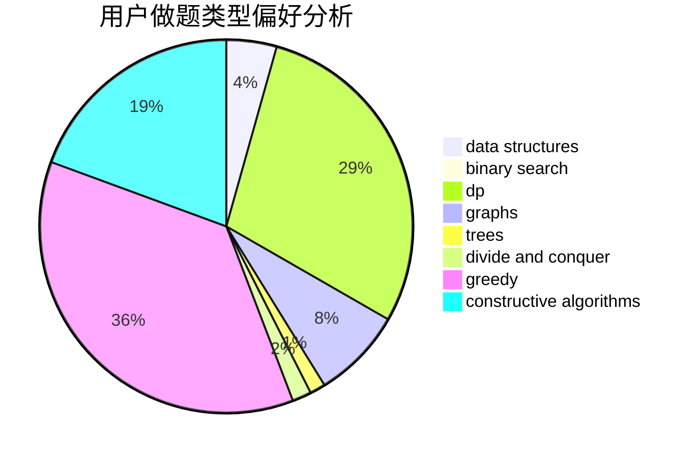
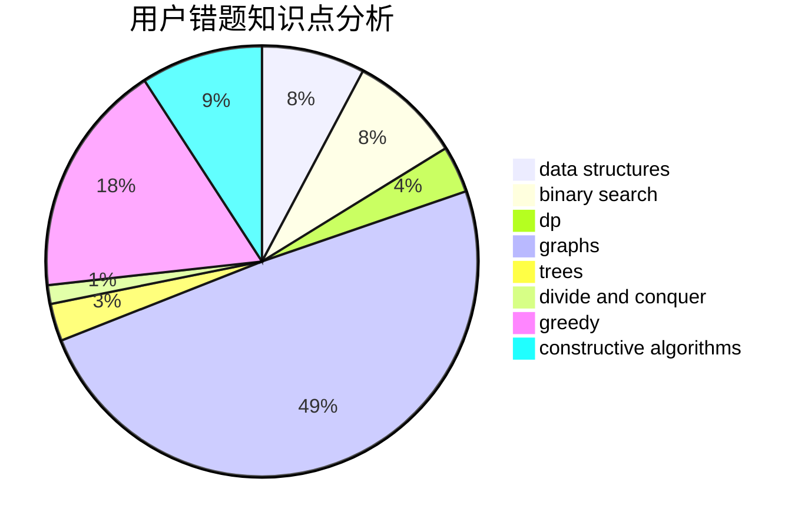

# vipjml

<!-- tabs:start -->

#### **用户提交结果分析**

#### **用户做题类型偏好分析**

#### **用户错题知识点分析**

<!-- tabs:end -->
# 推荐题目
[1453D](https://codeforces.com/contest/1453/problem/D)		brute force,
                        constructive algorithms,
                        greedy,
                        math,
                        probabilities		  
[1498B](https://codeforces.com/contest/1498/problem/B)		binary search,
                        bitmasks,
                        data structures,
                        greedy		  
[1091A](https://codeforces.com/contest/1091/problem/A)		brute force,
                        implementation,
                        math		  
[432D](https://codeforces.com/contest/432/problem/D)		dp,
                        string suffix structures,
                        strings,
                        two pointers		  
[1131A](https://codeforces.com/contest/1131/problem/A)		math		  
[860C](https://codeforces.com/contest/860/problem/C)		dsu,graphs,sortings,trees		  
[534B](https://codeforces.com/contest/534/problem/B)		dp,
                        greedy,
                        math		  
[1142C](https://codeforces.com/contest/1142/problem/C)		geometry		  
[1321A](https://codeforces.com/contest/1321/problem/A)		greedy		  
[198B](https://codeforces.com/contest/198/problem/B)		shortest paths		  
