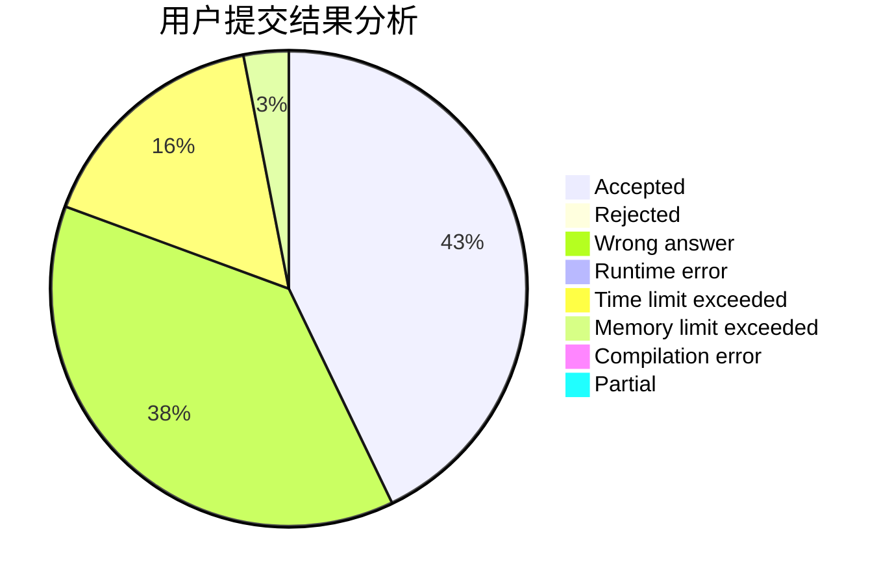
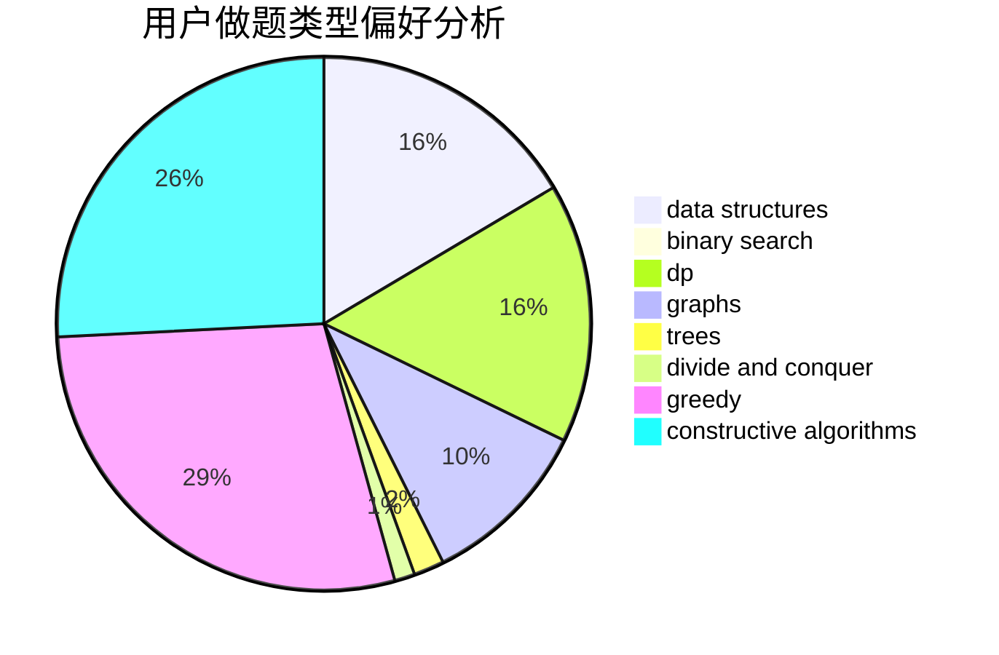
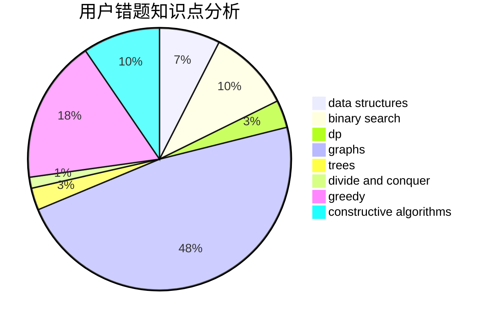

# vipjml

<!-- tabs:start -->

#### **用户提交结果分析**

#### **用户做题类型偏好分析**

#### **用户错题知识点分析**

<!-- tabs:end -->
# 推荐题目
[1443F](https://codeforces.com/contest/1443/problem/F)		dsu,graphs,sortings,trees		  
[1489G](https://codeforces.com/contest/1489/problem/G)		dsu,graphs,sortings,trees		  
[1090D](https://codeforces.com/contest/1090/problem/D)		constructive algorithms		  
[404A](https://codeforces.com/contest/404/problem/A)		implementation		  
[1129A2](https://codeforces.com/contest/1129A/problem/2)		brute force,
                        greedy		  
[841C](https://codeforces.com/contest/841/problem/C)		dsu,graphs,sortings,trees		  
[510D](https://codeforces.com/contest/510/problem/D)		bitmasks,
                        brute force,
                        dp,
                        math		  
[1140E](https://codeforces.com/contest/1140/problem/E)		combinatorics,
                        divide and conquer,
                        dp		  
[1311E](https://codeforces.com/contest/1311/problem/E)		brute force,
                        constructive algorithms,
                        trees		  
[171B](https://codeforces.com/contest/171/problem/B)		*special problem,
                        combinatorics		  
