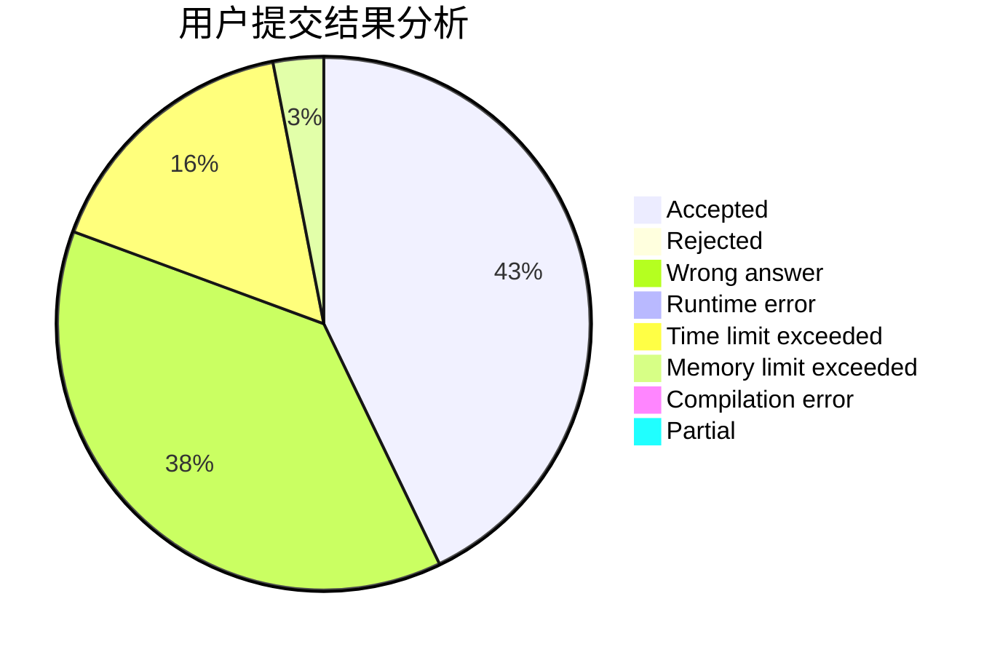
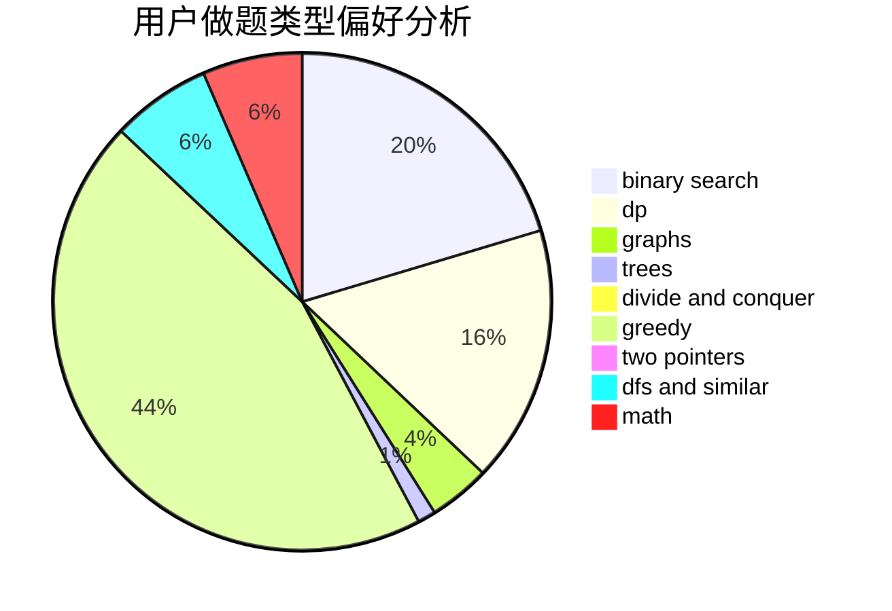

# vipjml

<!-- tabs:start -->

#### **用户提交结果分析**

#### **用户做题类型偏好分析**

<!-- tabs:end -->
# 推荐题目
[1453D](https://codeforces.com/contest/1453/problem/D)
[1498B](https://codeforces.com/contest/1498/problem/B)
[1091A](https://codeforces.com/contest/1091/problem/A)
[432D](https://codeforces.com/contest/432/problem/D)
[1131A](https://codeforces.com/contest/1131/problem/A)
[860C](https://codeforces.com/contest/860/problem/C)
[534B](https://codeforces.com/contest/534/problem/B)
[1142C](https://codeforces.com/contest/1142/problem/C)
[1321A](https://codeforces.com/contest/1321/problem/A)
[198B](https://codeforces.com/contest/198/problem/B)
