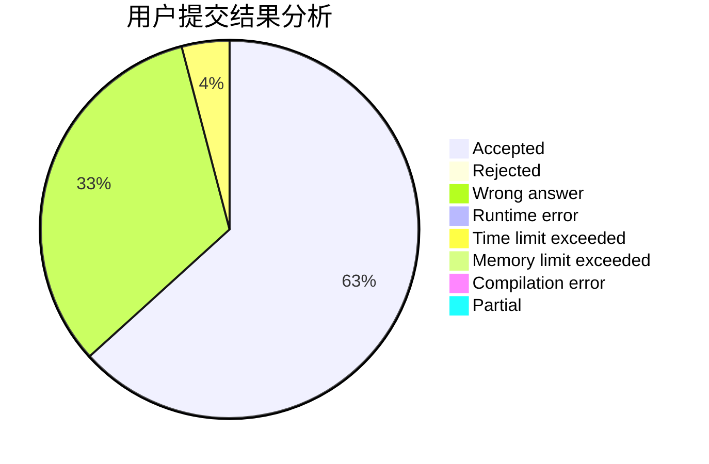
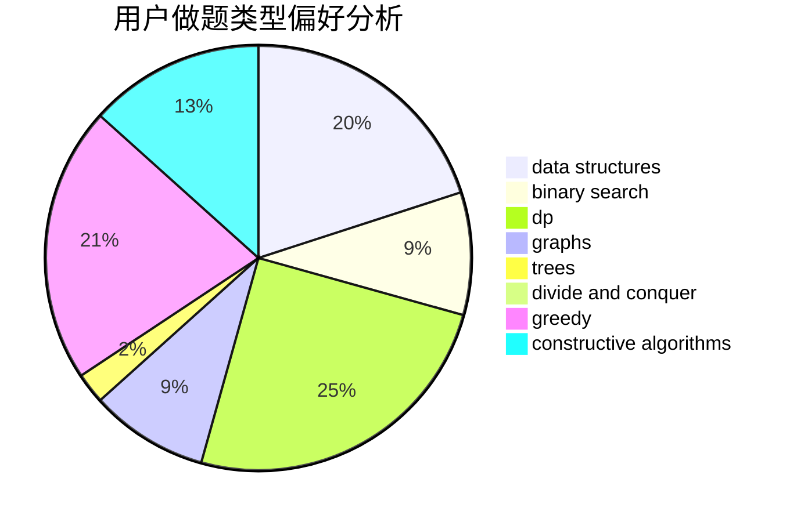
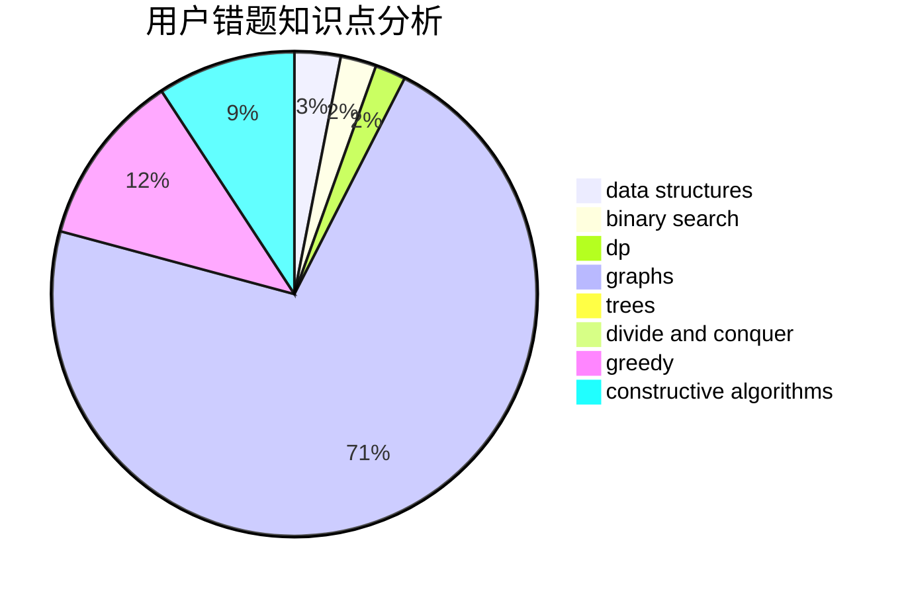

# vjudge41

<!-- tabs:start -->

#### **用户提交结果分析**

#### **用户做题类型偏好分析**

#### **用户错题知识点分析**

<!-- tabs:end -->
# 推荐题目
[1152F2](https://codeforces.com/contest/1152F/problem/2)		bitmasks,
                        dp,
                        matrices		  
[1398G](https://codeforces.com/contest/1398/problem/G)		bitmasks,
                        fft,
                        math,
                        number theory		  
[1246A](https://codeforces.com/contest/1246/problem/A)		dsu,graphs,sortings,trees		  
[800A](https://codeforces.com/contest/800/problem/A)		dsu,graphs,sortings,trees		  
[719A](https://codeforces.com/contest/719/problem/A)		implementation		  
[1156B](https://codeforces.com/contest/1156/problem/B)		dfs and similar,
                        greedy,
                        implementation,
                        sortings,
                        strings		  
[803G](https://codeforces.com/contest/803/problem/G)		data structures		  
[946C](https://codeforces.com/contest/946/problem/C)		greedy,
                        strings		  
[739E](https://codeforces.com/contest/739/problem/E)		brute force,
                        data structures,
                        dp,
                        flows,
                        math,
                        probabilities,
                        sortings		  
[41A](https://codeforces.com/contest/41/problem/A)		implementation,
                        strings		  
