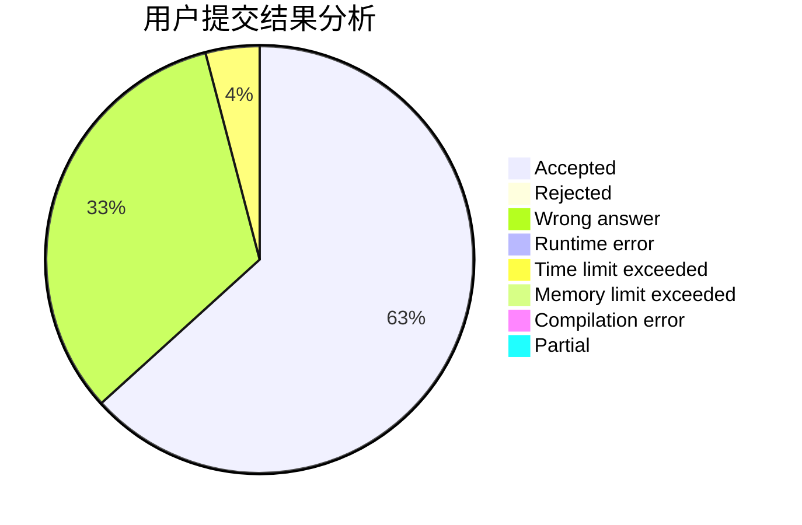
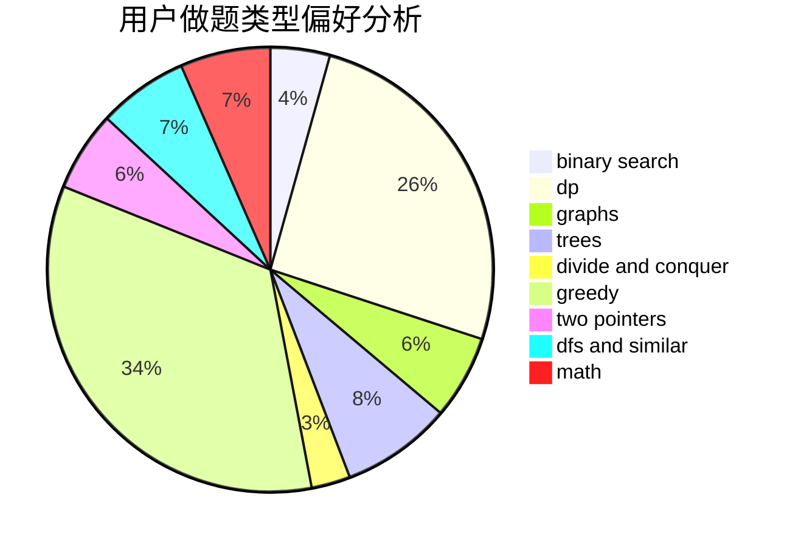

# vjudge41

<!-- tabs:start -->

#### **用户提交结果分析**

#### **用户做题类型偏好分析**

<!-- tabs:end -->
# 推荐题目
[1154G](https://codeforces.com/contest/1154/problem/G)
[1408A](https://codeforces.com/contest/1408/problem/A)
[1250I](https://codeforces.com/contest/1250/problem/I)
[815B](https://codeforces.com/contest/815/problem/B)
[736B](https://codeforces.com/contest/736/problem/B)
[1157G](https://codeforces.com/contest/1157/problem/G)
[81C](https://codeforces.com/contest/81/problem/C)
[962G](https://codeforces.com/contest/962/problem/G)
[760A](https://codeforces.com/contest/760/problem/A)
[444E](https://codeforces.com/contest/444/problem/E)
