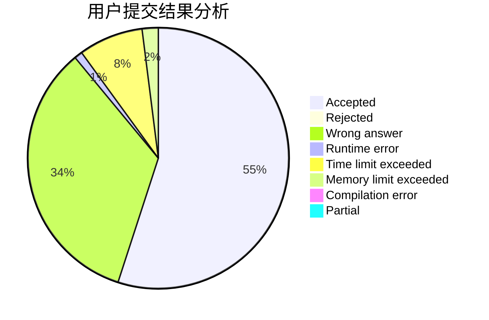
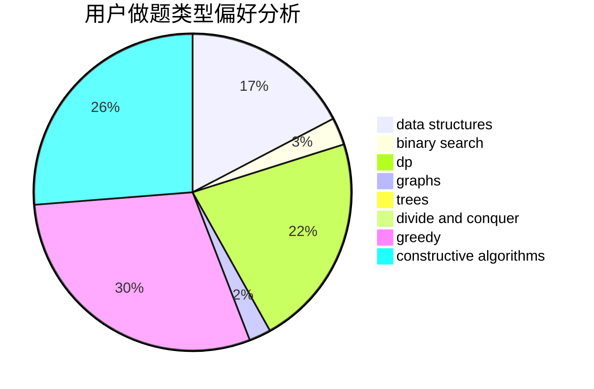
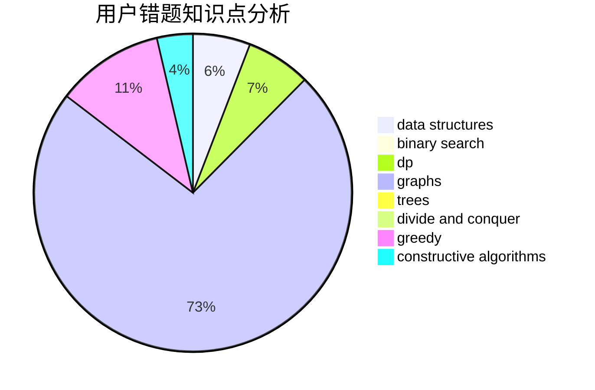

# void_basic_learner

<!-- tabs:start -->

#### **用户提交结果分析**

#### **用户做题类型偏好分析**

#### **用户错题知识点分析**

<!-- tabs:end -->
# 推荐题目
[993B](https://codeforces.com/contest/993/problem/B)		bitmasks,
                        brute force		  
[295A](https://codeforces.com/contest/295/problem/A)		data structures,
                        implementation		  
[39C](https://codeforces.com/contest/39/problem/C)		dp,
                        sortings		  
[954B](https://codeforces.com/contest/954/problem/B)		implementation,
                        strings		  
[339B](https://codeforces.com/contest/339/problem/B)		implementation		  
[981A](https://codeforces.com/contest/981/problem/A)		brute force,
                        implementation,
                        strings		  
[449D](https://codeforces.com/contest/449/problem/D)		bitmasks,
                        combinatorics,
                        dp		  
[279D](https://codeforces.com/contest/279/problem/D)		bitmasks,
                        dp		  
[1431G](https://codeforces.com/contest/1431/problem/G)		*special problem,
                        dp,
                        games,
                        greedy		  
[285A](https://codeforces.com/contest/285/problem/A)		greedy,
                        implementation		  
