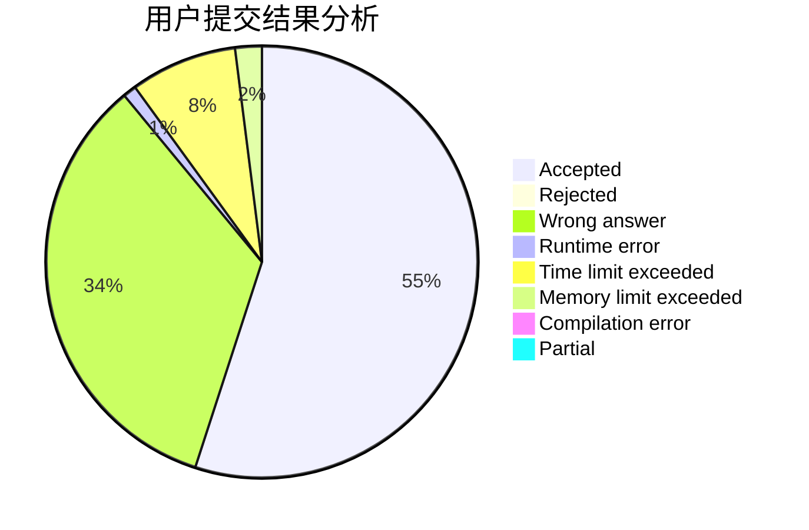
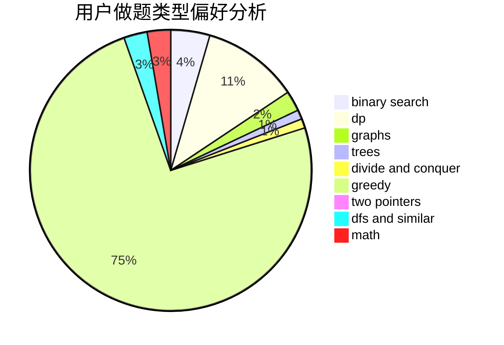

# void_basic_learner

<!-- tabs:start -->

#### **用户提交结果分析**

#### **用户做题类型偏好分析**

<!-- tabs:end -->
# 推荐题目
[993B](https://codeforces.com/contest/993/problem/B)
[295A](https://codeforces.com/contest/295/problem/A)
[39C](https://codeforces.com/contest/39/problem/C)
[954B](https://codeforces.com/contest/954/problem/B)
[339B](https://codeforces.com/contest/339/problem/B)
[981A](https://codeforces.com/contest/981/problem/A)
[449D](https://codeforces.com/contest/449/problem/D)
[279D](https://codeforces.com/contest/279/problem/D)
[1431G](https://codeforces.com/contest/1431/problem/G)
[285A](https://codeforces.com/contest/285/problem/A)
