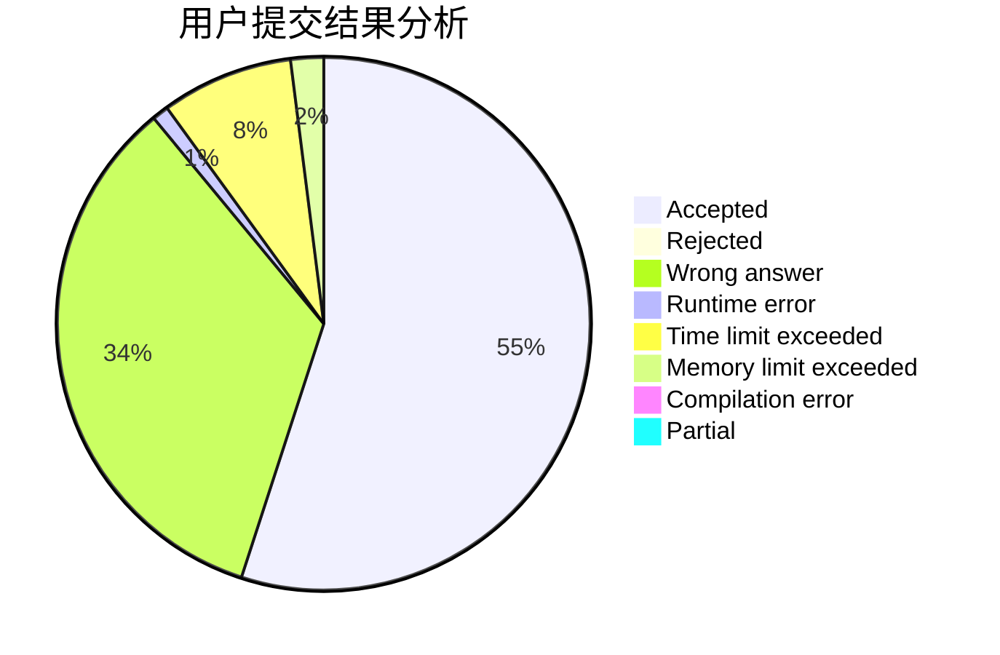
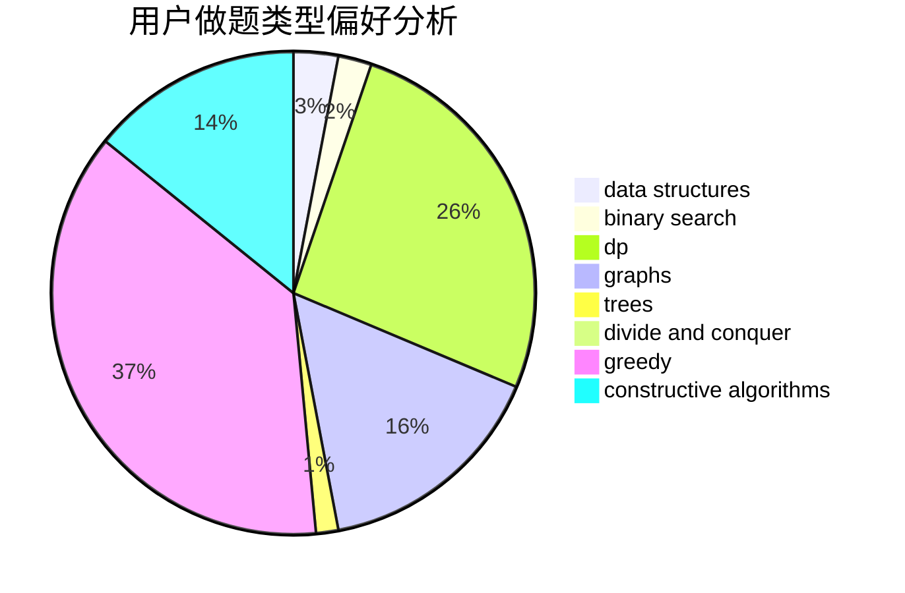
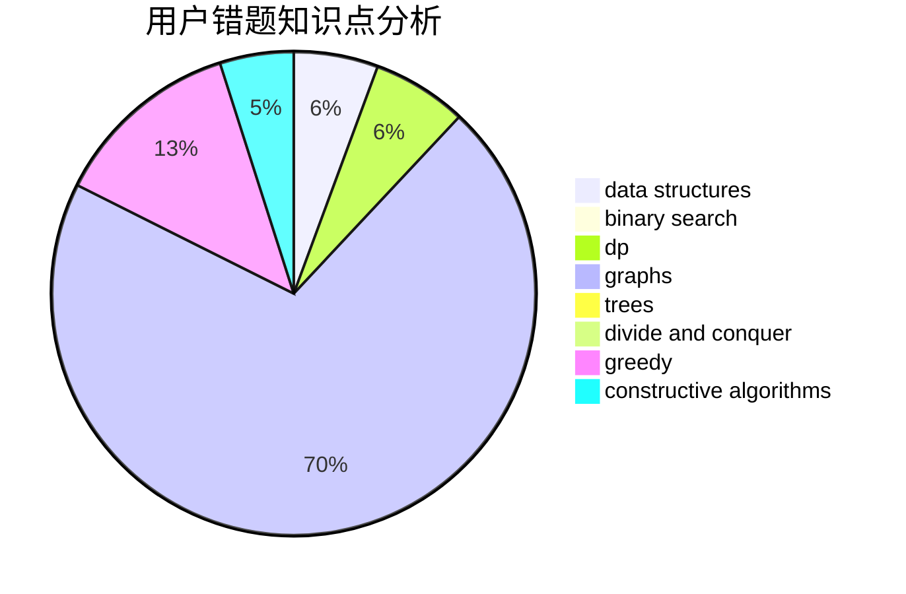

# void_basic_learner

<!-- tabs:start -->

#### **用户提交结果分析**

#### **用户做题类型偏好分析**

#### **用户错题知识点分析**

<!-- tabs:end -->
# 推荐题目
[979B](https://codeforces.com/contest/979/problem/B)		greedy		  
[27B](https://codeforces.com/contest/27/problem/B)		bitmasks,
                        brute force,
                        dfs and similar,
                        greedy		  
[369A](https://codeforces.com/contest/369/problem/A)		greedy,
                        implementation		  
[932B](https://codeforces.com/contest/932/problem/B)		binary search,
                        data structures,
                        dfs and similar		  
[314C](https://codeforces.com/contest/314/problem/C)		data structures,
                        dp		  
[959B](https://codeforces.com/contest/959/problem/B)		dsu,
                        greedy,
                        implementation		  
[426B](https://codeforces.com/contest/426/problem/B)		implementation		  
[260E](https://codeforces.com/contest/260/problem/E)		binary search,
                        brute force,
                        data structures		  
[1423J](https://codeforces.com/contest/1423/problem/J)		bitmasks,
                        constructive algorithms,
                        dp,
                        math		  
[269C](https://codeforces.com/contest/269/problem/C)		constructive algorithms,
                        flows,
                        graphs,
                        greedy		  
