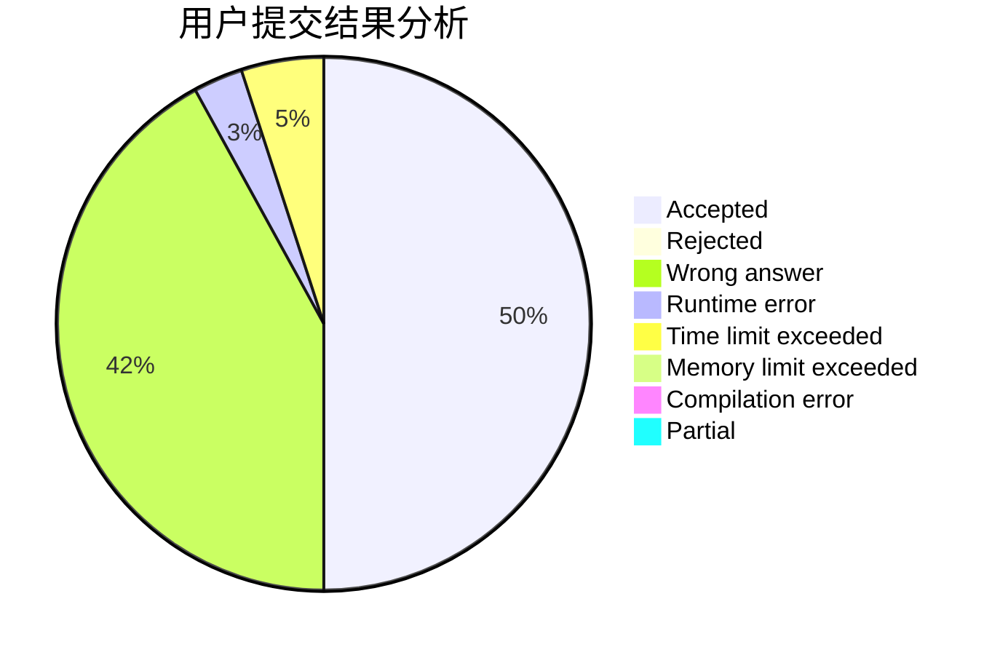
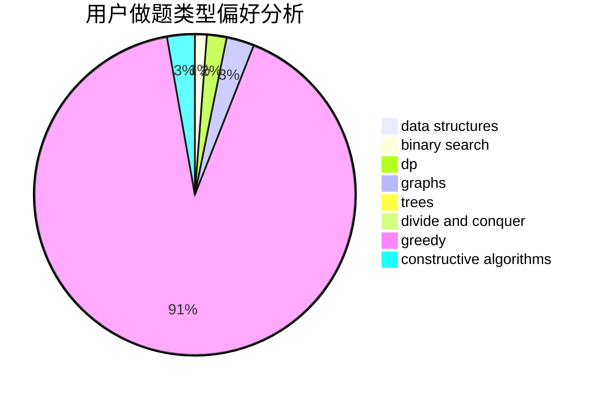

# void_f

<!-- tabs:start -->

#### **用户提交结果分析**

#### **用户做题类型偏好分析**

#### **用户错题知识点分析**

<!-- tabs:end -->
# 推荐题目
[508A](https://codeforces.com/contest/508/problem/A)		brute force		  
[1372F](https://codeforces.com/contest/1372/problem/F)		binary search,
                        divide and conquer,
                        interactive		  
[1053C](https://codeforces.com/contest/1053/problem/C)		dsu,graphs,sortings,trees		  
[797F](https://codeforces.com/contest/797/problem/F)		data structures,
                        dp,
                        greedy,
                        sortings		  
[920G](https://codeforces.com/contest/920/problem/G)		binary search,
                        bitmasks,
                        brute force,
                        combinatorics,
                        math,
                        number theory		  
[1276C](https://codeforces.com/contest/1276/problem/C)		brute force,
                        combinatorics,
                        constructive algorithms,
                        data structures,
                        greedy,
                        math		  
[1166E](https://codeforces.com/contest/1166/problem/E)		bitmasks,
                        brute force,
                        constructive algorithms,
                        math,
                        number theory		  
[125D](https://codeforces.com/contest/125/problem/D)		constructive algorithms,
                        greedy		  
[1283B](https://codeforces.com/contest/1283/problem/B)		math		  
[1475D](https://codeforces.com/contest/1475/problem/D)		binary search,
                        dp,
                        sortings,
                        two pointers		  
