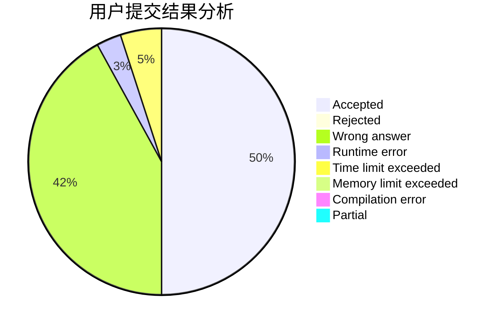
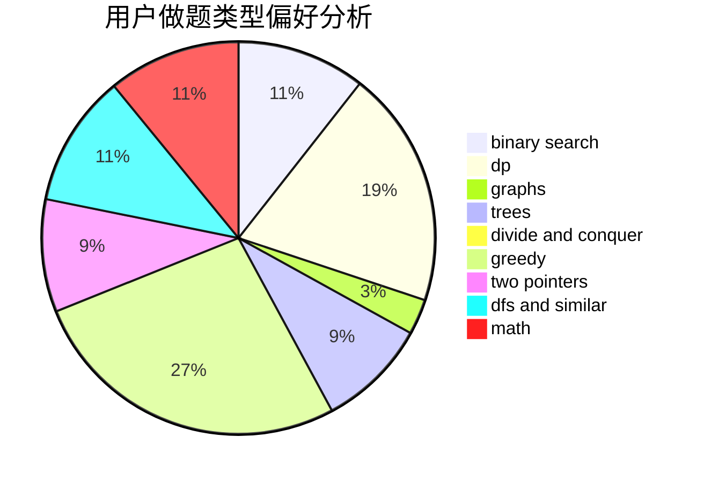

# void_f

<!-- tabs:start -->

#### **用户提交结果分析**

#### **用户做题类型偏好分析**

<!-- tabs:end -->
# 推荐题目
[508A](https://codeforces.com/contest/508/problem/A)
[1372F](https://codeforces.com/contest/1372/problem/F)
[1053C](https://codeforces.com/contest/1053/problem/C)
[797F](https://codeforces.com/contest/797/problem/F)
[920G](https://codeforces.com/contest/920/problem/G)
[1276C](https://codeforces.com/contest/1276/problem/C)
[1166E](https://codeforces.com/contest/1166/problem/E)
[125D](https://codeforces.com/contest/125/problem/D)
[1283B](https://codeforces.com/contest/1283/problem/B)
[1475D](https://codeforces.com/contest/1475/problem/D)
