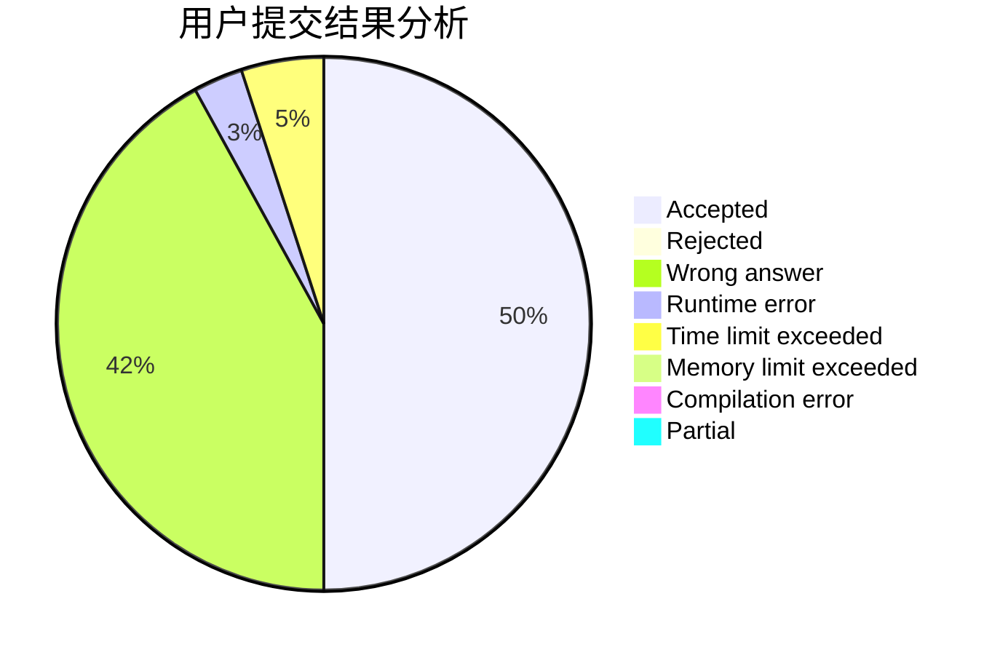
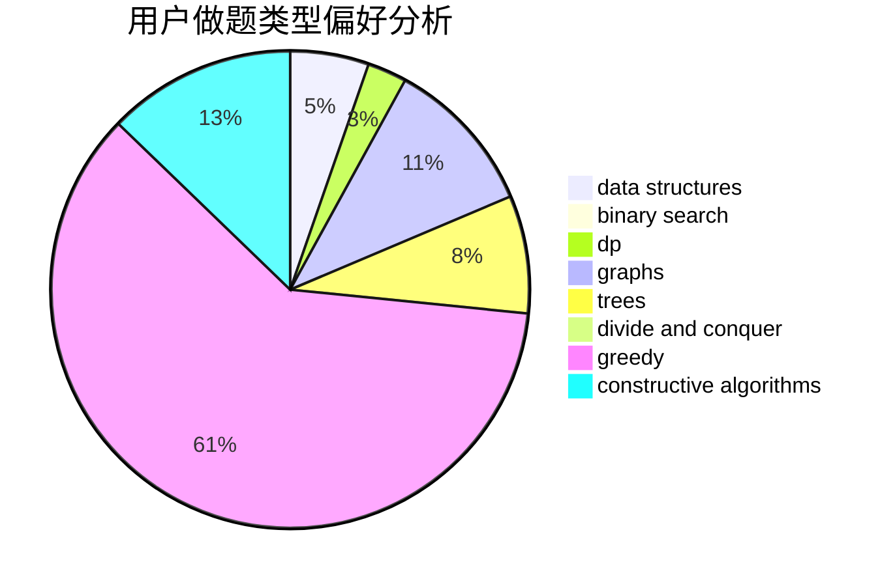

# void_f

<!-- tabs:start -->

#### **用户提交结果分析**

#### **用户做题类型偏好分析**

#### **用户错题知识点分析**

<!-- tabs:end -->
# 推荐题目
[487A](https://codeforces.com/contest/487/problem/A)		binary search,
                        brute force,
                        implementation		  
[1366A](https://codeforces.com/contest/1366/problem/A)		binary search,
                        greedy,
                        math		  
[1051G](https://codeforces.com/contest/1051/problem/G)		data structures,
                        dsu,
                        greedy		  
[779D](https://codeforces.com/contest/779/problem/D)		dsu,graphs,sortings,trees		  
[907C](https://codeforces.com/contest/907/problem/C)		dsu,graphs,sortings,trees		  
[1267G](https://codeforces.com/contest/1267/problem/G)		math,
                        probabilities		  
[1164N](https://codeforces.com/contest/1164/problem/N)		dsu,graphs,sortings,trees		  
[1252H](https://codeforces.com/contest/1252/problem/H)		greedy,
                        implementation		  
[1276F](https://codeforces.com/contest/1276/problem/F)		string suffix structures		  
[1468C](https://codeforces.com/contest/1468/problem/C)		data structures,
                        implementation		  
