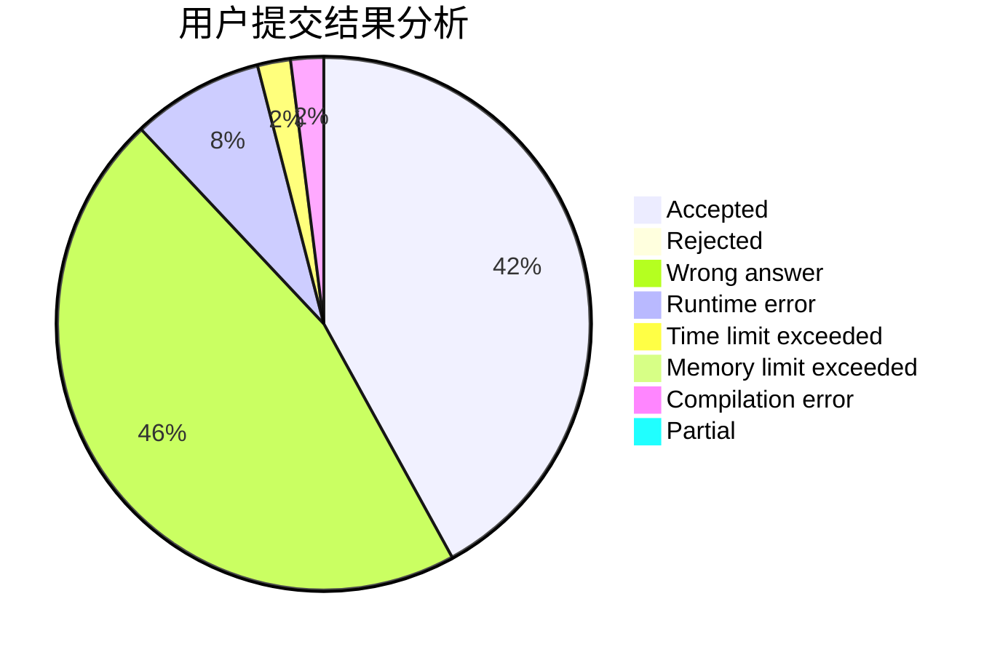
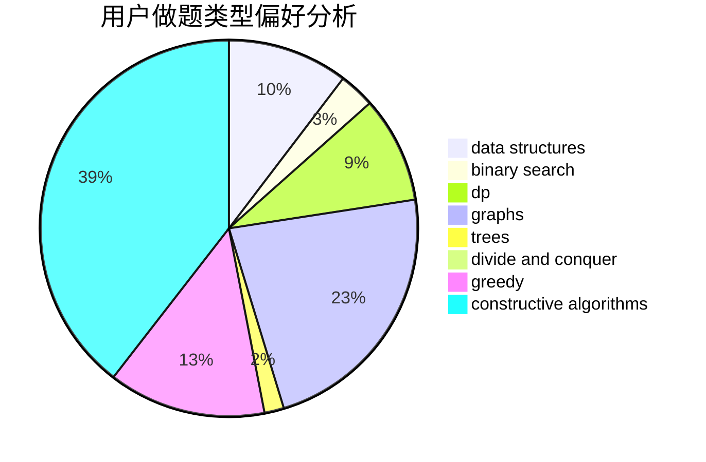
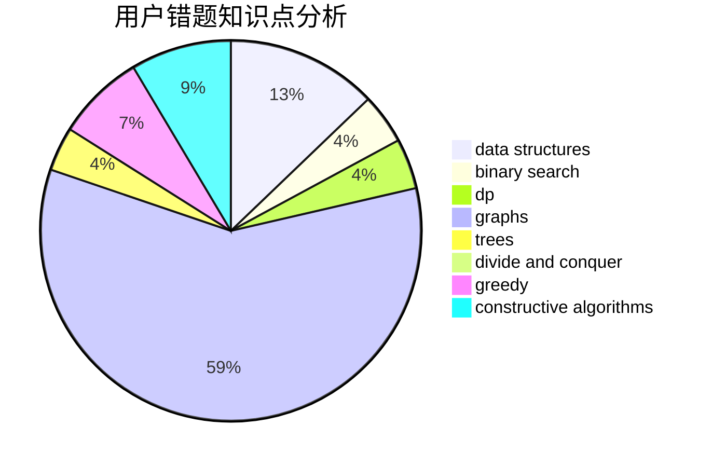

# vv1234

<!-- tabs:start -->

#### **用户提交结果分析**

#### **用户做题类型偏好分析**

#### **用户错题知识点分析**

<!-- tabs:end -->
# 推荐题目
[1114A](https://codeforces.com/contest/1114/problem/A)		brute force,
                        greedy,
                        implementation		  
[760B](https://codeforces.com/contest/760/problem/B)		binary search,
                        greedy		  
[704E](https://codeforces.com/contest/704/problem/E)		data structures,
                        geometry,
                        trees		  
[1223A](https://codeforces.com/contest/1223/problem/A)		math		  
[42C](https://codeforces.com/contest/42/problem/C)		brute force,
                        constructive algorithms		  
[220E](https://codeforces.com/contest/220/problem/E)		data structures,
                        two pointers		  
[875A](https://codeforces.com/contest/875/problem/A)		brute force,
                        math		  
[1129B](https://codeforces.com/contest/1129/problem/B)		constructive algorithms		  
[597B](https://codeforces.com/contest/597/problem/B)		dp,
                        greedy,
                        sortings		  
[421A](https://codeforces.com/contest/421/problem/A)		constructive algorithms,
                        implementation		  
