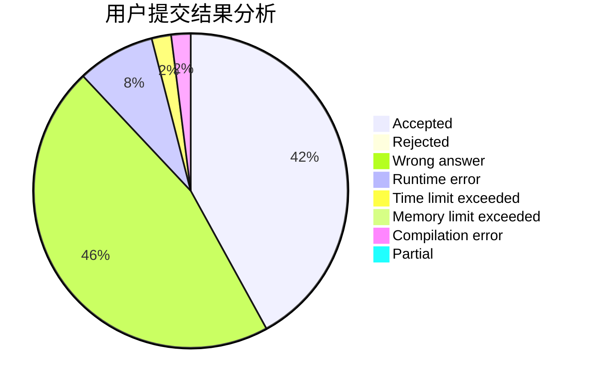
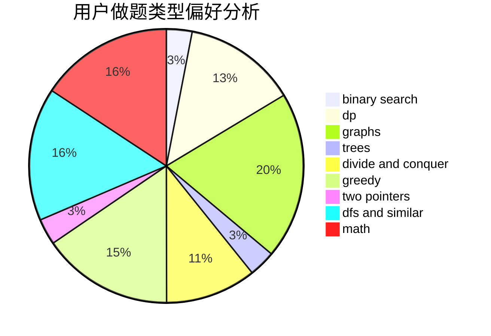

# vv1234

<!-- tabs:start -->

#### **用户提交结果分析**

#### **用户做题类型偏好分析**

<!-- tabs:end -->
# 推荐题目
[1114A](https://codeforces.com/contest/1114/problem/A)
[760B](https://codeforces.com/contest/760/problem/B)
[704E](https://codeforces.com/contest/704/problem/E)
[1223A](https://codeforces.com/contest/1223/problem/A)
[42C](https://codeforces.com/contest/42/problem/C)
[220E](https://codeforces.com/contest/220/problem/E)
[875A](https://codeforces.com/contest/875/problem/A)
[1129B](https://codeforces.com/contest/1129/problem/B)
[597B](https://codeforces.com/contest/597/problem/B)
[421A](https://codeforces.com/contest/421/problem/A)
