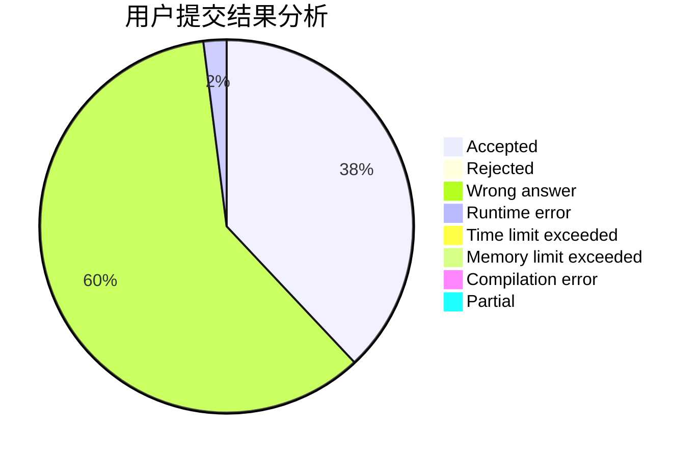
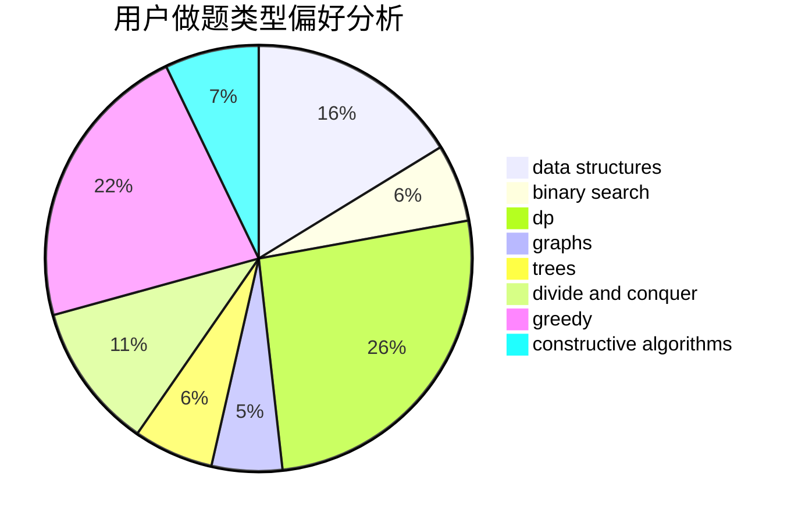
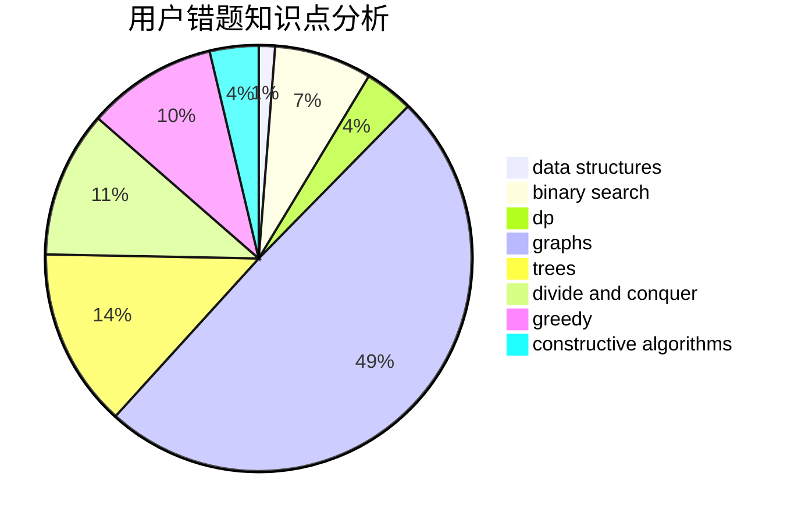

# CaCl2_6H2O

<!-- tabs:start -->

#### **用户提交结果分析**

#### **用户做题类型偏好分析**

#### **用户错题知识点分析**

<!-- tabs:end -->
# 推荐题目
[555C](https://codeforces.com/contest/555/problem/C)		data structures		  
[652E](https://codeforces.com/contest/652/problem/E)		dfs and similar,
                        dsu,
                        graphs,
                        trees		  
[651D](https://codeforces.com/contest/651/problem/D)		dsu,graphs,sortings,trees		  
[624A](https://codeforces.com/contest/624/problem/A)		math		  
[652D](https://codeforces.com/contest/652/problem/D)		data structures,
                        sortings		  
[592D](https://codeforces.com/contest/592/problem/D)		dfs and similar,
                        dp,
                        graphs,
                        trees		  
[652B](https://codeforces.com/contest/652/problem/B)		sortings		  
[1012B](https://codeforces.com/contest/1012/problem/B)		constructive algorithms,
                        dfs and similar,
                        dsu,
                        graphs,
                        matrices		  
[402E](https://codeforces.com/contest/402/problem/E)		graphs,
                        math		  
[651C](https://codeforces.com/contest/651/problem/C)		dsu,graphs,sortings,trees		  
