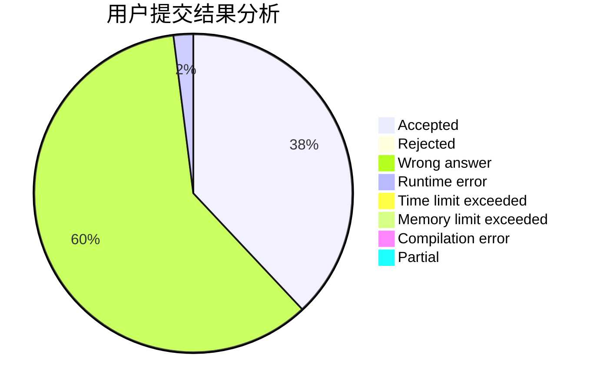
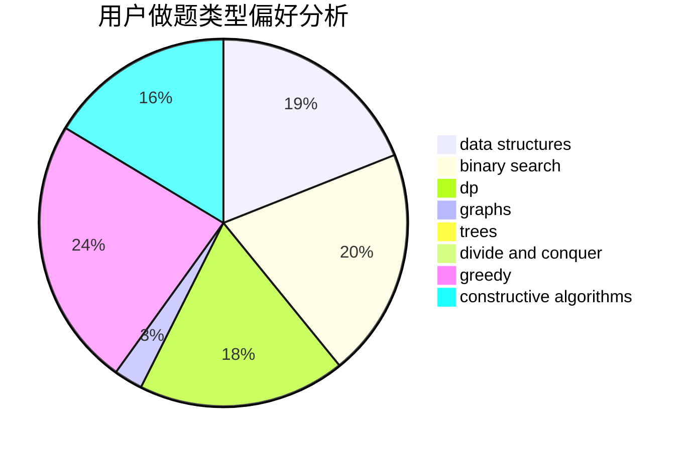
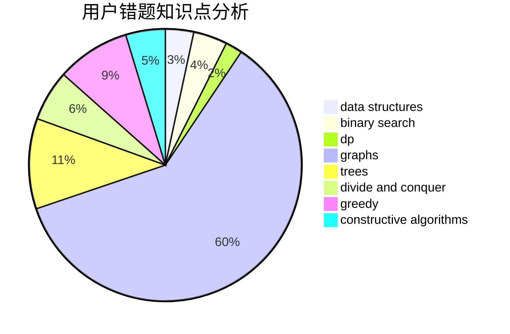

# CaCl2_6H2O

<!-- tabs:start -->

#### **用户提交结果分析**

#### **用户做题类型偏好分析**

#### **用户错题知识点分析**

<!-- tabs:end -->
# 推荐题目
[533E](https://codeforces.com/contest/533/problem/E)		constructive algorithms,
                        dp,
                        greedy,
                        hashing,
                        strings,
                        two pointers		  
[626D](https://codeforces.com/contest/626/problem/D)		brute force,
                        combinatorics,
                        dp,
                        probabilities		  
[623D](https://codeforces.com/contest/623/problem/D)		greedy,
                        math,
                        probabilities		  
[606A](https://codeforces.com/contest/606/problem/A)		implementation		  
[625E](https://codeforces.com/contest/625/problem/E)		data structures,
                        greedy		  
[573B](https://codeforces.com/contest/573/problem/B)		binary search,
                        data structures,
                        dp,
                        math		  
[624A](https://codeforces.com/contest/624/problem/A)		math		  
[1011E](https://codeforces.com/contest/1011/problem/E)		dsu,graphs,sortings,trees		  
[374A](https://codeforces.com/contest/374/problem/A)		greedy,
                        implementation		  
[623C](https://codeforces.com/contest/623/problem/C)		binary search,
                        dp		  
